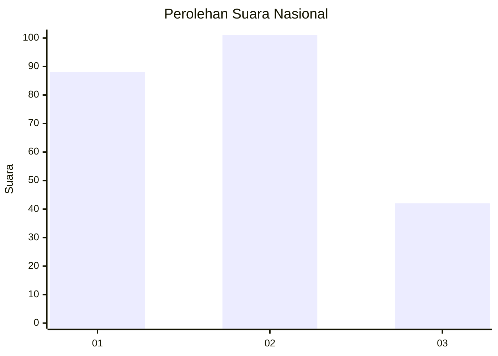
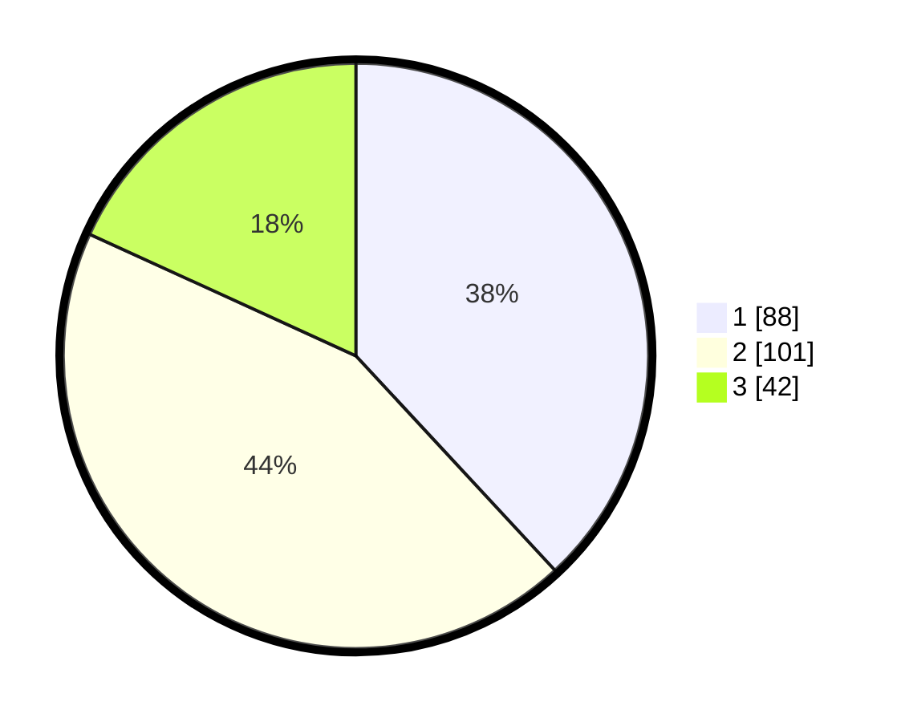

# Hasil

## Grafik

## Tabel

| No.    | Nama Paslon    | Suara | Suara (raw) | Persentase |
|:------ |:-------------- | -----:| -----------:| ----------:|
| 100025 | ANIES MUHAIMIN | 88    | [88][p-1]   | 38,10      |
| 100026 | PRABOWO GIBRAN | 101   | [101][p-2]  | 43,72      |
| 100027 | GANJAR MAHFUD  | 42    | [42][p-3]   | 18,18      |

[p-1]: https://github.com/gigit-pemilu/pemilu-2024/blob/main/pilpres/hitung-suara/sub/31-dki-jakarta/sub/73-jakarta-barat/sub/05-kebon-jeruk/sub/1006-kedoya-utara/sub/079-tps/sub/paslon-1.txt
[p-2]: https://github.com/gigit-pemilu/pemilu-2024/blob/main/pilpres/hitung-suara/sub/31-dki-jakarta/sub/73-jakarta-barat/sub/05-kebon-jeruk/sub/1006-kedoya-utara/sub/079-tps/sub/paslon-2.txt
[p-3]: https://github.com/gigit-pemilu/pemilu-2024/blob/main/pilpres/hitung-suara/sub/31-dki-jakarta/sub/73-jakarta-barat/sub/05-kebon-jeruk/sub/1006-kedoya-utara/sub/079-tps/sub/paslon-3.txt

## Foto C Plano

https://sirekap-obj-formc.kpu.go.id/a559/pemilu/ppwp/31/73/05/10/06/3173051006079-20240216-212445--524f2b94-1d51-4a79-9a62-98084e570569.jpg

https://sirekap-obj-formc.kpu.go.id/a559/pemilu/ppwp/31/73/05/10/06/3173051006079-20240214-193854--8357ce53-482a-43cc-9620-134689901470.jpg

https://sirekap-obj-formc.kpu.go.id/a559/pemilu/ppwp/31/73/05/10/06/3173051006079-20240215-015035--0d96b8f3-ecd8-4318-8303-26f24496cb45.jpg

## Metadata

| Key        | Value               |
| ---------- | ------------------- |
| Time Stamp | 2024-02-21 17:00:00 |

