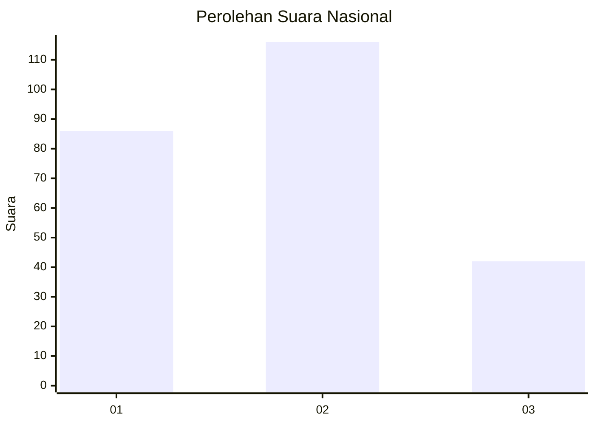
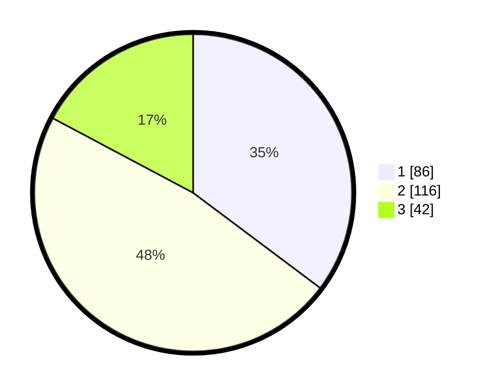

# Hasil

## Grafik

## Tabel

| No.    | Nama Paslon    | Suara | Suara (raw) | Persentase |
|:------ |:-------------- | -----:| -----------:| ----------:|
| 100025 | ANIES MUHAIMIN | 86    | [86][p-1]   | 35,25      |
| 100026 | PRABOWO GIBRAN | 116   | [116][p-2]  | 47,54      |
| 100027 | GANJAR MAHFUD  | 42    | [42][p-3]   | 17,21      |

[p-1]: https://github.com/gigit-pemilu/pemilu-2024/blob/main/pilpres/hitung-suara/sub/31-dki-jakarta/sub/73-jakarta-barat/sub/05-kebon-jeruk/sub/1006-kedoya-utara/sub/112-tps/sub/paslon-1.txt
[p-2]: https://github.com/gigit-pemilu/pemilu-2024/blob/main/pilpres/hitung-suara/sub/31-dki-jakarta/sub/73-jakarta-barat/sub/05-kebon-jeruk/sub/1006-kedoya-utara/sub/112-tps/sub/paslon-2.txt
[p-3]: https://github.com/gigit-pemilu/pemilu-2024/blob/main/pilpres/hitung-suara/sub/31-dki-jakarta/sub/73-jakarta-barat/sub/05-kebon-jeruk/sub/1006-kedoya-utara/sub/112-tps/sub/paslon-3.txt

## Foto C Plano

https://sirekap-obj-formc.kpu.go.id/a2e6/pemilu/ppwp/31/73/05/10/06/3173051006112-20240215-015116--777f3b61-48f0-4098-abb1-1c90add6d94e.jpg

https://sirekap-obj-formc.kpu.go.id/a2e6/pemilu/ppwp/31/73/05/10/06/3173051006112-20240215-015227--4550d1f3-d5f7-4191-8570-97abf4811d5e.jpg

https://sirekap-obj-formc.kpu.go.id/a2e6/pemilu/ppwp/31/73/05/10/06/3173051006112-20240215-013801--3ac6e602-1a1b-4589-a0ee-8bb21f3f17e0.jpg

## Metadata

| Key        | Value               |
| ---------- | ------------------- |
| Time Stamp | 2024-02-21 17:00:00 |

