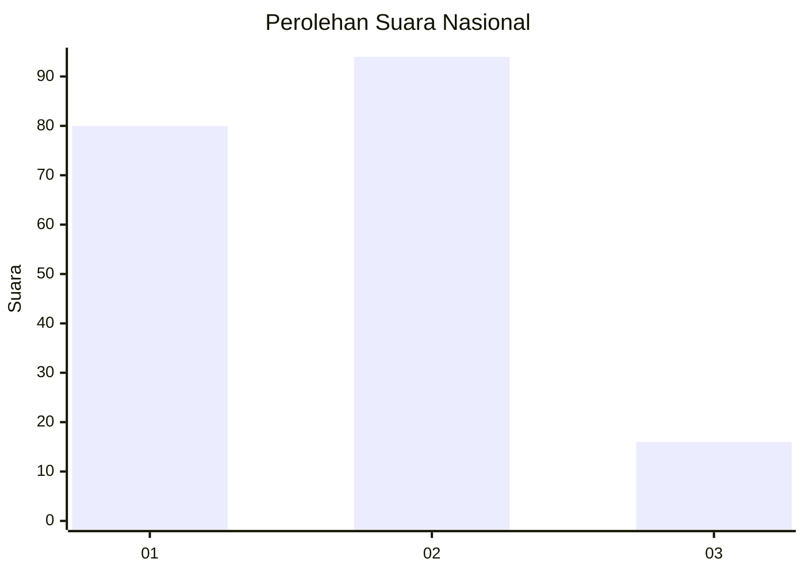
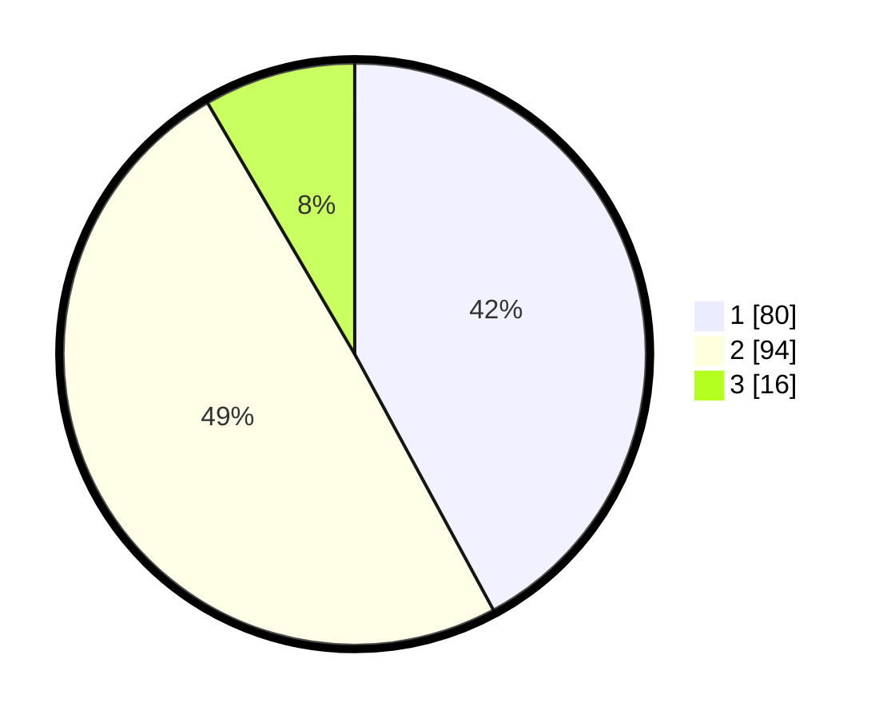

# Hasil

## Grafik

## Tabel

| No.    | Nama Paslon    | Suara | Suara (raw) | Persentase |
|:------ |:-------------- | -----:| -----------:| ----------:|
| 100025 | ANIES MUHAIMIN | 80    | [80][p-1]   | 42,11      |
| 100026 | PRABOWO GIBRAN | 94    | [94][p-2]   | 49,47      |
| 100027 | GANJAR MAHFUD  | 16    | [16][p-3]   | 8,42       |

[p-1]: https://github.com/gigit-pemilu/pemilu-2024/blob/main/pilpres/hitung-suara/sub/31-dki-jakarta/sub/73-jakarta-barat/sub/05-kebon-jeruk/sub/1006-kedoya-utara/sub/134-tps/sub/paslon-1.txt
[p-2]: https://github.com/gigit-pemilu/pemilu-2024/blob/main/pilpres/hitung-suara/sub/31-dki-jakarta/sub/73-jakarta-barat/sub/05-kebon-jeruk/sub/1006-kedoya-utara/sub/134-tps/sub/paslon-2.txt
[p-3]: https://github.com/gigit-pemilu/pemilu-2024/blob/main/pilpres/hitung-suara/sub/31-dki-jakarta/sub/73-jakarta-barat/sub/05-kebon-jeruk/sub/1006-kedoya-utara/sub/134-tps/sub/paslon-3.txt

## Foto C Plano

https://sirekap-obj-formc.kpu.go.id/6ec6/pemilu/ppwp/31/73/05/10/06/3173051006134-20240215-013145--83803c57-dfdb-4d8e-b58b-eb9815885c1a.jpg

https://sirekap-obj-formc.kpu.go.id/6ec6/pemilu/ppwp/31/73/05/10/06/3173051006134-20240215-033122--759ad001-fd9b-4061-ab8a-44c8a6855214.jpg

https://sirekap-obj-formc.kpu.go.id/6ec6/pemilu/ppwp/31/73/05/10/06/3173051006134-20240215-033252--e4bb309b-4fbb-49fb-a2df-7f263128b2ee.jpg

## Metadata

| Key        | Value               |
| ---------- | ------------------- |
| Time Stamp | 2024-02-19 14:00:00 |

