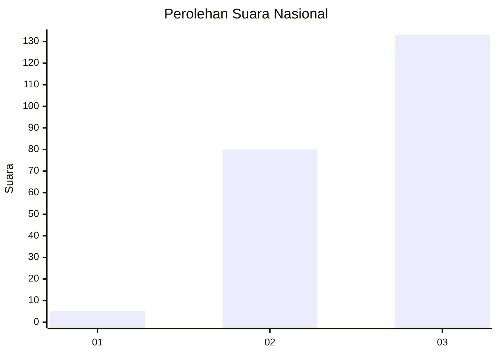
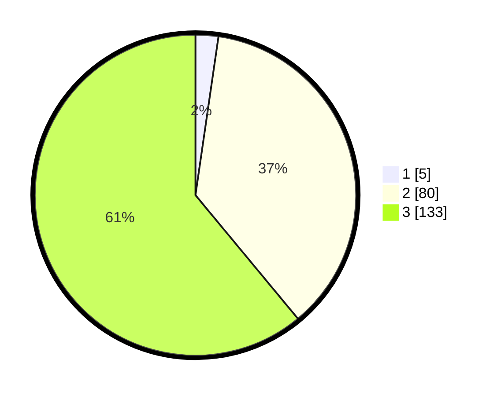

# Hasil

## Grafik

## Tabel

| No.    | Nama Paslon    | Suara | Suara (raw) | Persentase |
|:------ |:-------------- | -----:| -----------:| ----------:|
| 100025 | ANIES MUHAIMIN | 5     | [5][p-1]    | 2,29       |
| 100026 | PRABOWO GIBRAN | 80    | [80][p-2]   | 36,70      |
| 100027 | GANJAR MAHFUD  | 133   | [133][p-3]  | 61,01      |

[p-1]: https://github.com/gigit-pemilu/pemilu-2024/blob/main/pilpres/hitung-suara/sub/31-dki-jakarta/sub/73-jakarta-barat/sub/05-kebon-jeruk/sub/1006-kedoya-utara/sub/143-tps/sub/paslon-1.txt
[p-2]: https://github.com/gigit-pemilu/pemilu-2024/blob/main/pilpres/hitung-suara/sub/31-dki-jakarta/sub/73-jakarta-barat/sub/05-kebon-jeruk/sub/1006-kedoya-utara/sub/143-tps/sub/paslon-2.txt
[p-3]: https://github.com/gigit-pemilu/pemilu-2024/blob/main/pilpres/hitung-suara/sub/31-dki-jakarta/sub/73-jakarta-barat/sub/05-kebon-jeruk/sub/1006-kedoya-utara/sub/143-tps/sub/paslon-3.txt

## Foto C Plano

https://sirekap-obj-formc.kpu.go.id/c6b6/pemilu/ppwp/31/73/05/10/06/3173051006143-20240214-215800--2233a6cb-78a5-4668-9df9-9810fbe87823.jpg

https://sirekap-obj-formc.kpu.go.id/c6b6/pemilu/ppwp/31/73/05/10/06/3173051006143-20240214-215830--91b1a124-d134-41ab-99ef-17b62cc6aed1.jpg

https://sirekap-obj-formc.kpu.go.id/c6b6/pemilu/ppwp/31/73/05/10/06/3173051006143-20240214-215858--c798d653-9fb2-442c-b76e-35667fdeed56.jpg

## Metadata

| Key        | Value               |
| ---------- | ------------------- |
| Time Stamp | 2024-02-16 21:01:00 |

