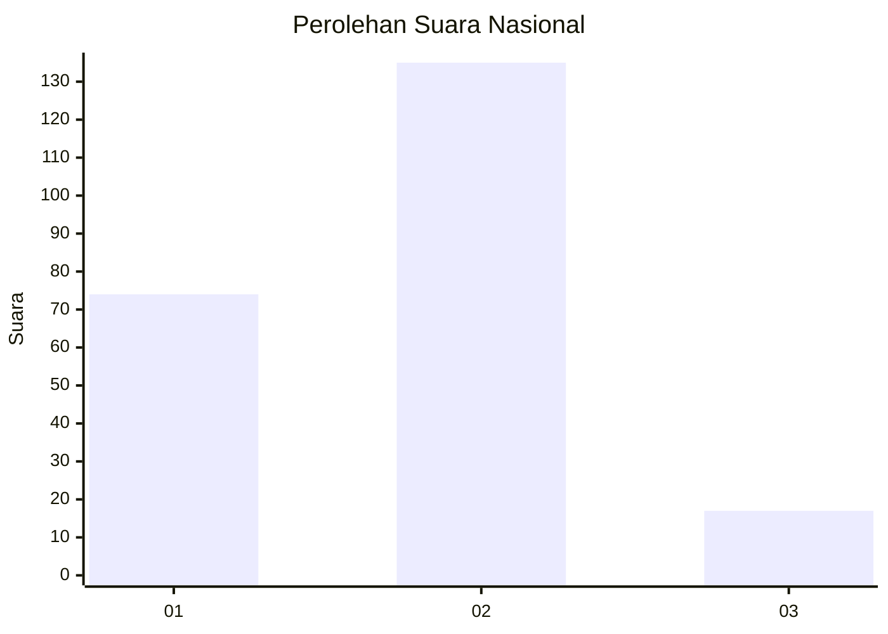
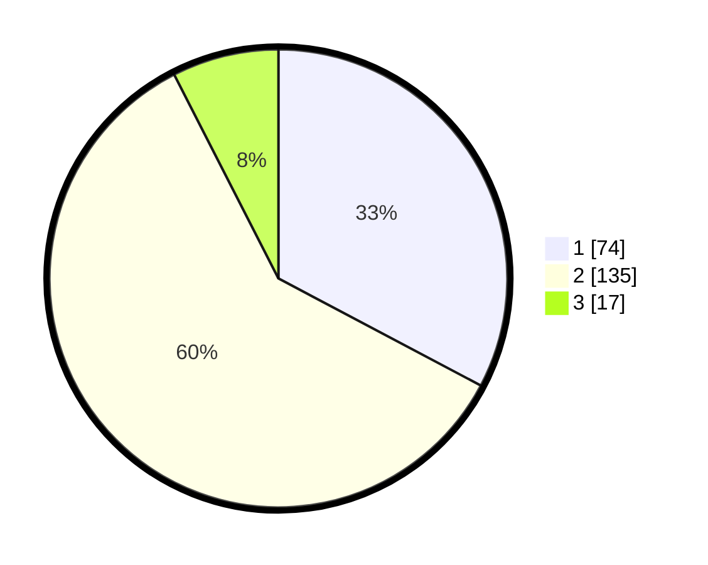

# Hasil

## Grafik

## Tabel

| No.    | Nama Paslon    | Suara | Suara (raw) | Persentase |
|:------ |:-------------- | -----:| -----------:| ----------:|
| 100025 | ANIES MUHAIMIN | 74    | [74][p-1]   | 32,74      |
| 100026 | PRABOWO GIBRAN | 135   | [135][p-2]  | 59,73      |
| 100027 | GANJAR MAHFUD  | 17    | [17][p-3]   | 7,52       |

[p-1]: https://github.com/gigit-pemilu/pemilu-2024/blob/main/pilpres/hitung-suara/sub/31-dki-jakarta/sub/73-jakarta-barat/sub/05-kebon-jeruk/sub/1006-kedoya-utara/sub/901-tps/sub/paslon-1.txt
[p-2]: https://github.com/gigit-pemilu/pemilu-2024/blob/main/pilpres/hitung-suara/sub/31-dki-jakarta/sub/73-jakarta-barat/sub/05-kebon-jeruk/sub/1006-kedoya-utara/sub/901-tps/sub/paslon-2.txt
[p-3]: https://github.com/gigit-pemilu/pemilu-2024/blob/main/pilpres/hitung-suara/sub/31-dki-jakarta/sub/73-jakarta-barat/sub/05-kebon-jeruk/sub/1006-kedoya-utara/sub/901-tps/sub/paslon-3.txt

## Foto C Plano

https://sirekap-obj-formc.kpu.go.id/5cb5/pemilu/ppwp/31/73/05/10/06/3173051006901-20240214-210836--d6497cf6-039a-42e3-a4ab-133017f44cda.jpg

https://sirekap-obj-formc.kpu.go.id/5cb5/pemilu/ppwp/31/73/05/10/06/3173051006901-20240214-210912--4dc5fa26-8038-4f70-8d25-e4461de7347f.jpg

https://sirekap-obj-formc.kpu.go.id/5cb5/pemilu/ppwp/31/73/05/10/06/3173051006901-20240214-201101--40216bfd-f918-4a56-b26f-273d0ca7c778.jpg

## Metadata

| Key        | Value               |
| ---------- | ------------------- |
| Time Stamp | 2024-02-19 14:00:00 |

