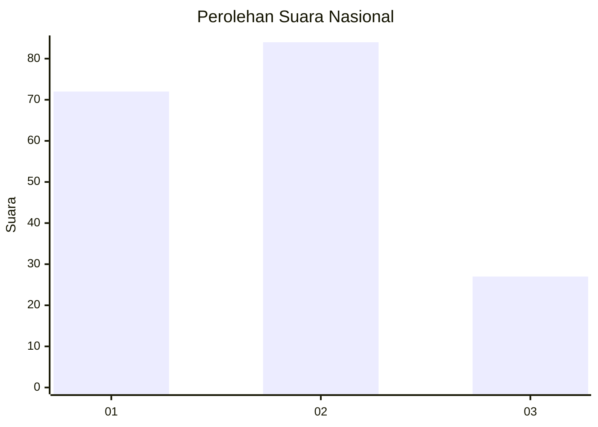
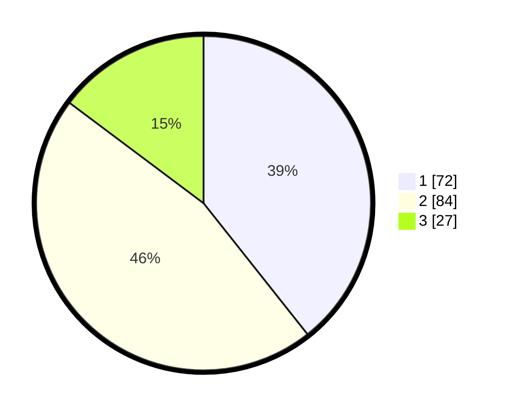

# Hasil

## Grafik

## Tabel

| No.    | Nama Paslon    | Suara | Suara (raw) | Persentase |
|:------ |:-------------- | -----:| -----------:| ----------:|
| 100025 | ANIES MUHAIMIN | 72    | [72][p-1]   | 39,34      |
| 100026 | PRABOWO GIBRAN | 84    | [84][p-2]   | 45,90      |
| 100027 | GANJAR MAHFUD  | 27    | [27][p-3]   | 14,75      |

[p-1]: https://github.com/gigit-pemilu/pemilu-2024/blob/main/pilpres/hitung-suara/sub/31-dki-jakarta/sub/73-jakarta-barat/sub/05-kebon-jeruk/sub/1007-kedoya-selatan/sub/003-tps/sub/paslon-1.txt
[p-2]: https://github.com/gigit-pemilu/pemilu-2024/blob/main/pilpres/hitung-suara/sub/31-dki-jakarta/sub/73-jakarta-barat/sub/05-kebon-jeruk/sub/1007-kedoya-selatan/sub/003-tps/sub/paslon-2.txt
[p-3]: https://github.com/gigit-pemilu/pemilu-2024/blob/main/pilpres/hitung-suara/sub/31-dki-jakarta/sub/73-jakarta-barat/sub/05-kebon-jeruk/sub/1007-kedoya-selatan/sub/003-tps/sub/paslon-3.txt

## Foto C Plano

https://sirekap-obj-formc.kpu.go.id/c628/pemilu/ppwp/31/73/05/10/07/3173051007003-20240214-233625--c369152d-9d8a-4e29-9a88-c98001a7eeb8.jpg

https://sirekap-obj-formc.kpu.go.id/c628/pemilu/ppwp/31/73/05/10/07/3173051007003-20240214-233209--27e97048-07de-45c0-9388-dad153ff3e57.jpg

https://sirekap-obj-formc.kpu.go.id/c628/pemilu/ppwp/31/73/05/10/07/3173051007003-20240214-233303--1dc0586d-49e8-442f-b8a1-472a436c1023.jpg

## Metadata

| Key        | Value               |
| ---------- | ------------------- |
| Time Stamp | 2024-02-15 22:30:27 |

