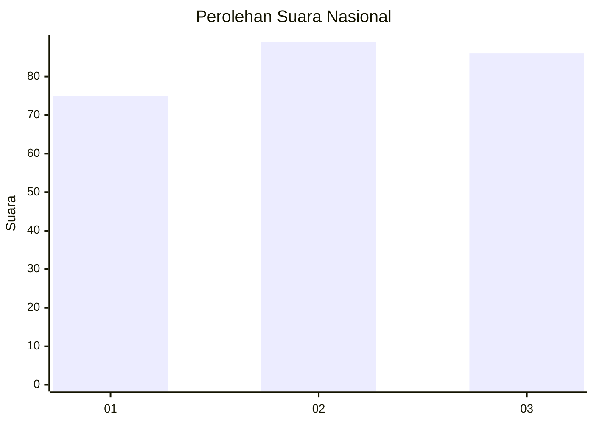
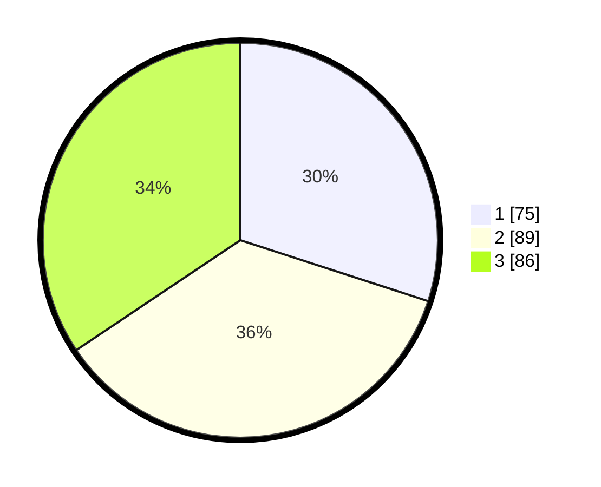

# Hasil

## Grafik

## Tabel

| No.    | Nama Paslon    | Suara | Suara (raw) | Persentase |
|:------ |:-------------- | -----:| -----------:| ----------:|
| 100025 | ANIES MUHAIMIN | 75    | [75][p-1]   | 30,00      |
| 100026 | PRABOWO GIBRAN | 89    | [89][p-2]   | 35,60      |
| 100027 | GANJAR MAHFUD  | 86    | [86][p-3]   | 34,40      |

[p-1]: https://github.com/gigit-pemilu/pemilu-2024/blob/main/pilpres/hitung-suara/sub/31-dki-jakarta/sub/73-jakarta-barat/sub/05-kebon-jeruk/sub/1007-kedoya-selatan/sub/055-tps/sub/paslon-1.txt
[p-2]: https://github.com/gigit-pemilu/pemilu-2024/blob/main/pilpres/hitung-suara/sub/31-dki-jakarta/sub/73-jakarta-barat/sub/05-kebon-jeruk/sub/1007-kedoya-selatan/sub/055-tps/sub/paslon-2.txt
[p-3]: https://github.com/gigit-pemilu/pemilu-2024/blob/main/pilpres/hitung-suara/sub/31-dki-jakarta/sub/73-jakarta-barat/sub/05-kebon-jeruk/sub/1007-kedoya-selatan/sub/055-tps/sub/paslon-3.txt

## Foto C Plano

https://sirekap-obj-formc.kpu.go.id/856c/pemilu/ppwp/31/73/05/10/07/3173051007055-20240220-102352--dfe64959-c863-4f09-93df-b278bba4b6b8.jpg

https://sirekap-obj-formc.kpu.go.id/856c/pemilu/ppwp/31/73/05/10/07/3173051007055-20240220-094446--a5756470-00a5-4e22-b3f6-2e0db889ab27.jpg

https://sirekap-obj-formc.kpu.go.id/856c/pemilu/ppwp/31/73/05/10/07/3173051007055-20240220-094627--52400af4-9e4f-4d07-8c98-f9cfabfec22f.jpg

## Metadata

| Key        | Value               |
| ---------- | ------------------- |
| Time Stamp | 2024-02-20 12:00:00 |

