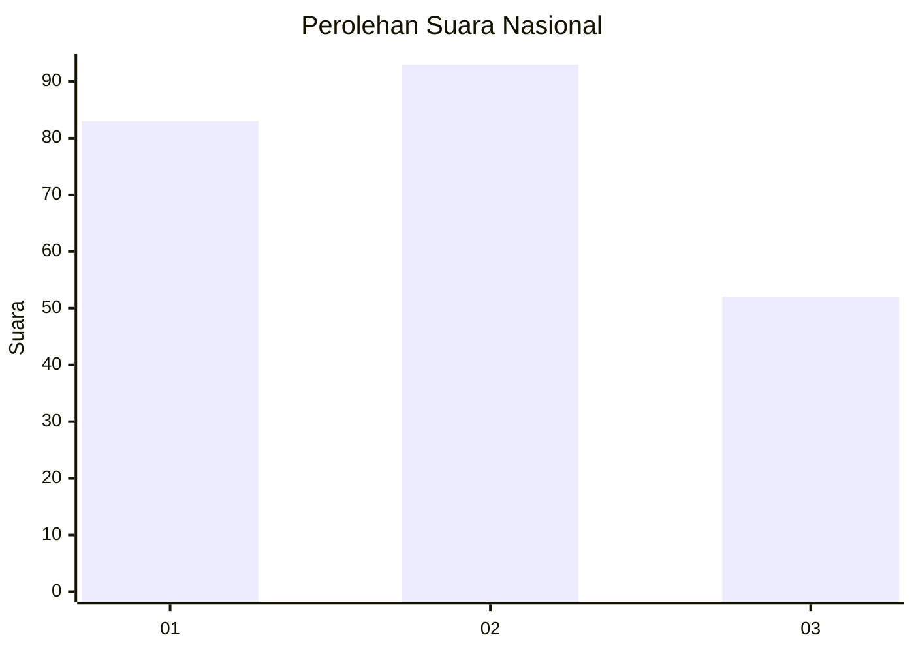
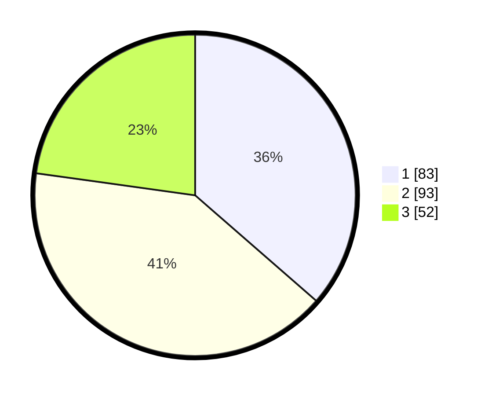

# Hasil

## Grafik

## Tabel

| No.    | Nama Paslon    | Suara | Suara (raw) | Persentase |
|:------ |:-------------- | -----:| -----------:| ----------:|
| 100025 | ANIES MUHAIMIN | 83    | [83][p-1]   | 36,40      |
| 100026 | PRABOWO GIBRAN | 93    | [93][p-2]   | 40,79      |
| 100027 | GANJAR MAHFUD  | 52    | [52][p-3]   | 22,81      |

[p-1]: https://github.com/gigit-pemilu/pemilu-2024/blob/main/pilpres/hitung-suara/sub/31-dki-jakarta/sub/73-jakarta-barat/sub/05-kebon-jeruk/sub/1007-kedoya-selatan/sub/056-tps/sub/paslon-1.txt
[p-2]: https://github.com/gigit-pemilu/pemilu-2024/blob/main/pilpres/hitung-suara/sub/31-dki-jakarta/sub/73-jakarta-barat/sub/05-kebon-jeruk/sub/1007-kedoya-selatan/sub/056-tps/sub/paslon-2.txt
[p-3]: https://github.com/gigit-pemilu/pemilu-2024/blob/main/pilpres/hitung-suara/sub/31-dki-jakarta/sub/73-jakarta-barat/sub/05-kebon-jeruk/sub/1007-kedoya-selatan/sub/056-tps/sub/paslon-3.txt

## Foto C Plano

https://sirekap-obj-formc.kpu.go.id/9769/pemilu/ppwp/31/73/05/10/07/3173051007056-20240214-230231--ce12a6c3-0979-4836-932c-f029f233b2ee.jpg

https://sirekap-obj-formc.kpu.go.id/9769/pemilu/ppwp/31/73/05/10/07/3173051007056-20240214-234423--8311f18b-c3df-457c-8a11-99d2f877677b.jpg

https://sirekap-obj-formc.kpu.go.id/9769/pemilu/ppwp/31/73/05/10/07/3173051007056-20240214-223905--af499870-abda-466a-ae1d-28d4ff4e4ffa.jpg

## Metadata

| Key        | Value               |
| ---------- | ------------------- |
| Time Stamp | 2024-02-19 14:00:00 |

