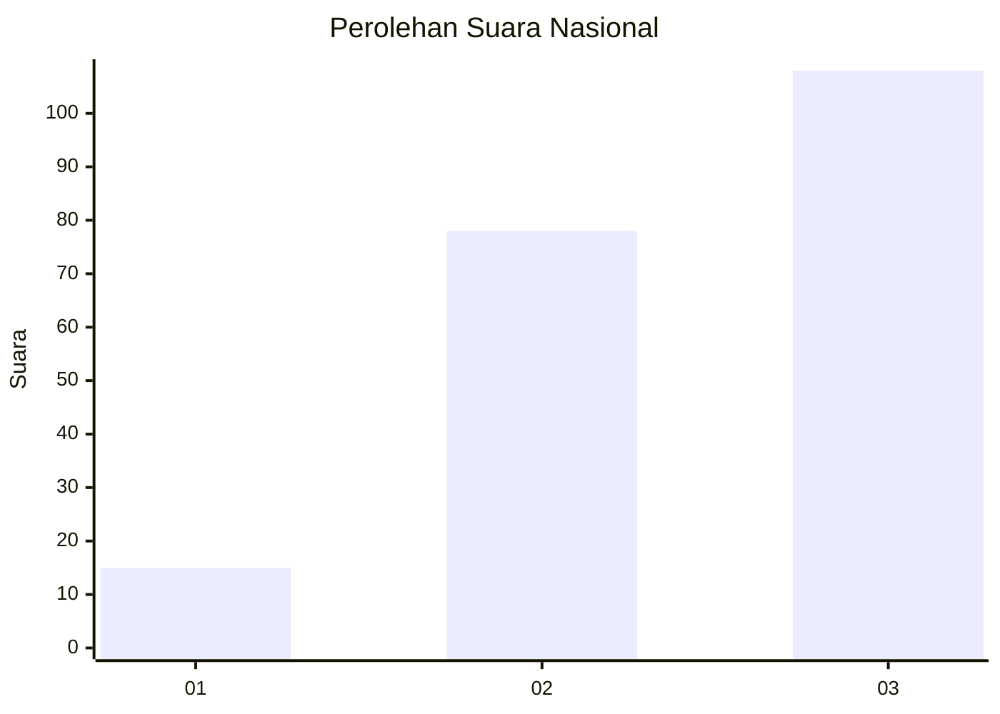
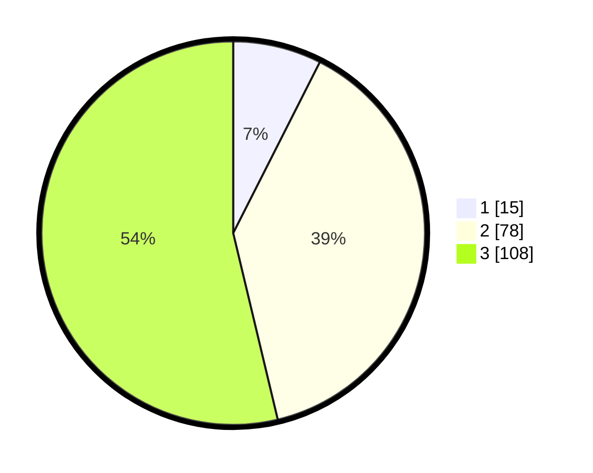

# Hasil

## Grafik

## Tabel

| No.    | Nama Paslon    | Suara | Suara (raw) | Persentase |
|:------ |:-------------- | -----:| -----------:| ----------:|
| 100025 | ANIES MUHAIMIN | 15    | [15][p-1]   | 7,46       |
| 100026 | PRABOWO GIBRAN | 78    | [78][p-2]   | 38,81      |
| 100027 | GANJAR MAHFUD  | 108   | [108][p-3]  | 53,73      |

[p-1]: https://github.com/gigit-pemilu/pemilu-2024/blob/main/pilpres/hitung-suara/sub/31-dki-jakarta/sub/73-jakarta-barat/sub/05-kebon-jeruk/sub/1007-kedoya-selatan/sub/074-tps/sub/paslon-1.txt
[p-2]: https://github.com/gigit-pemilu/pemilu-2024/blob/main/pilpres/hitung-suara/sub/31-dki-jakarta/sub/73-jakarta-barat/sub/05-kebon-jeruk/sub/1007-kedoya-selatan/sub/074-tps/sub/paslon-2.txt
[p-3]: https://github.com/gigit-pemilu/pemilu-2024/blob/main/pilpres/hitung-suara/sub/31-dki-jakarta/sub/73-jakarta-barat/sub/05-kebon-jeruk/sub/1007-kedoya-selatan/sub/074-tps/sub/paslon-3.txt

## Foto C Plano

https://sirekap-obj-formc.kpu.go.id/43a2/pemilu/ppwp/31/73/05/10/07/3173051007074-20240214-155926--1c8c5b18-49df-4193-ba16-199199b61258.jpg

https://sirekap-obj-formc.kpu.go.id/43a2/pemilu/ppwp/31/73/05/10/07/3173051007074-20240214-160056--1f932079-5d33-471e-be1e-eb3c9b6a3769.jpg

https://sirekap-obj-formc.kpu.go.id/43a2/pemilu/ppwp/31/73/05/10/07/3173051007074-20240214-160136--cf02f171-8c36-4423-a5a9-28f51588a2e1.jpg

## Metadata

| Key        | Value               |
| ---------- | ------------------- |
| Time Stamp | 2024-02-19 14:00:00 |

