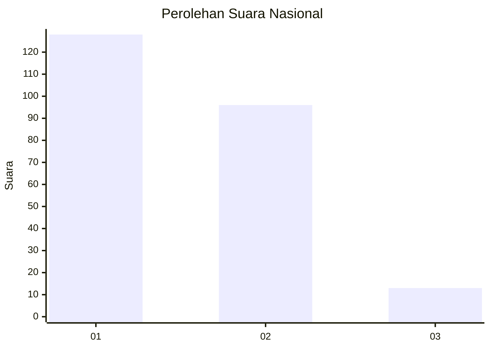
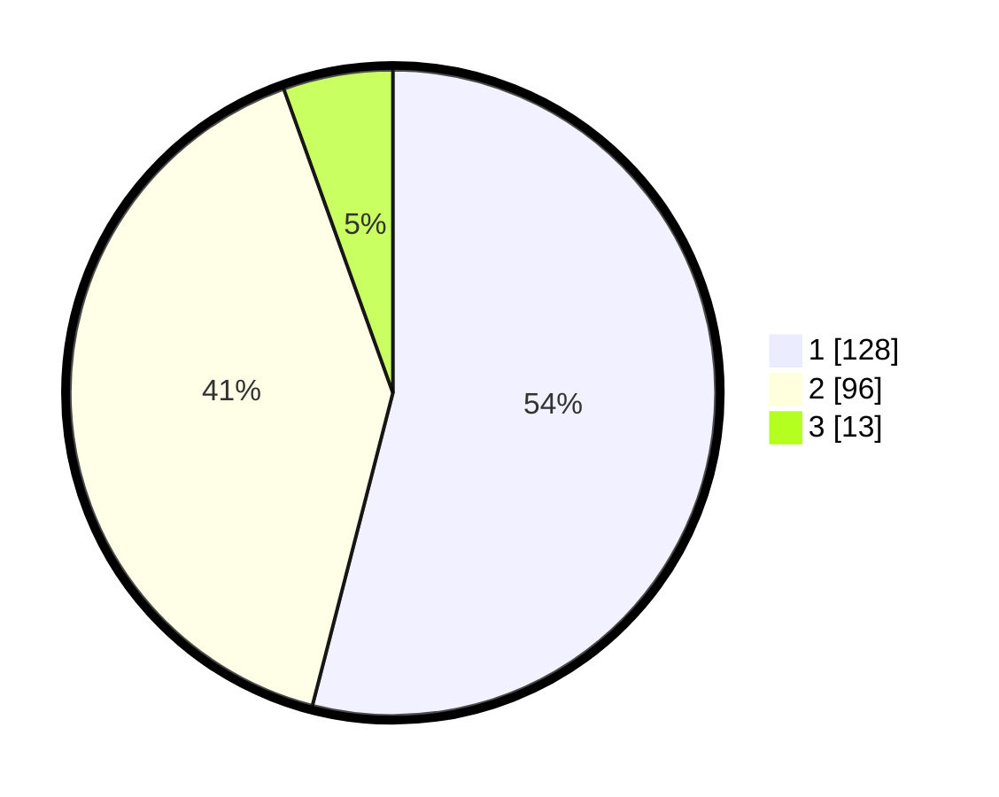

# Hasil

## Grafik

## Tabel

| No.    | Nama Paslon    | Suara | Suara (raw) | Persentase |
|:------ |:-------------- | -----:| -----------:| ----------:|
| 100025 | ANIES MUHAIMIN | 128   | [128][p-1]  | 54,01      |
| 100026 | PRABOWO GIBRAN | 96    | [96][p-2]   | 40,51      |
| 100027 | GANJAR MAHFUD  | 13    | [13][p-3]   | 5,49       |

[p-1]: https://github.com/gigit-pemilu/pemilu-2024/blob/main/pilpres/hitung-suara/sub/31-dki-jakarta/sub/73-jakarta-barat/sub/05-kebon-jeruk/sub/1007-kedoya-selatan/sub/077-tps/sub/paslon-1.txt
[p-2]: https://github.com/gigit-pemilu/pemilu-2024/blob/main/pilpres/hitung-suara/sub/31-dki-jakarta/sub/73-jakarta-barat/sub/05-kebon-jeruk/sub/1007-kedoya-selatan/sub/077-tps/sub/paslon-2.txt
[p-3]: https://github.com/gigit-pemilu/pemilu-2024/blob/main/pilpres/hitung-suara/sub/31-dki-jakarta/sub/73-jakarta-barat/sub/05-kebon-jeruk/sub/1007-kedoya-selatan/sub/077-tps/sub/paslon-3.txt

## Foto C Plano

https://sirekap-obj-formc.kpu.go.id/565e/pemilu/ppwp/31/73/05/10/07/3173051007077-20240214-234837--cf97b6c1-5803-41cf-8b90-077983a088a7.jpg

https://sirekap-obj-formc.kpu.go.id/565e/pemilu/ppwp/31/73/05/10/07/3173051007077-20240214-235033--5c818212-0535-4aec-a6bc-0183ceb873fd.jpg

https://sirekap-obj-formc.kpu.go.id/565e/pemilu/ppwp/31/73/05/10/07/3173051007077-20240214-231825--ae8acf91-a39a-444b-9834-787578cc9d11.jpg

## Metadata

| Key        | Value               |
| ---------- | ------------------- |
| Time Stamp | 2024-02-19 14:00:00 |

