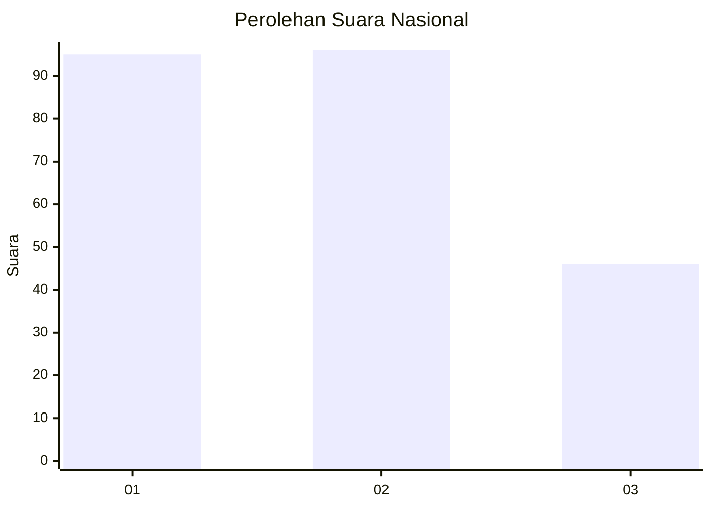
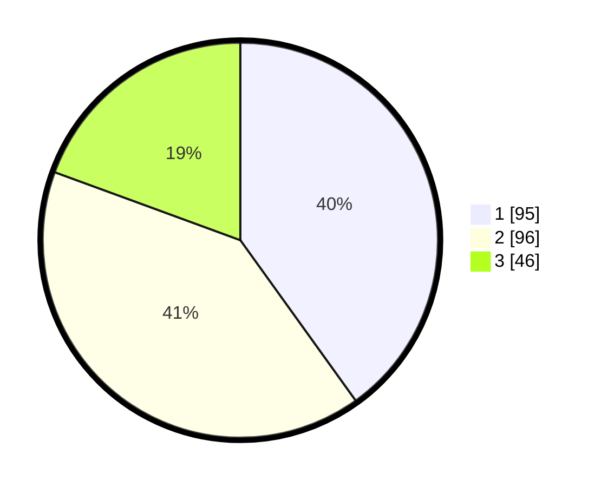

# Hasil

## Grafik

## Tabel

| No.    | Nama Paslon    | Suara | Suara (raw) | Persentase |
|:------ |:-------------- | -----:| -----------:| ----------:|
| 100025 | ANIES MUHAIMIN | 95    | [95][p-1]   | 40,08      |
| 100026 | PRABOWO GIBRAN | 96    | [96][p-2]   | 40,51      |
| 100027 | GANJAR MAHFUD  | 46    | [46][p-3]   | 19,41      |

[p-1]: https://github.com/gigit-pemilu/pemilu-2024/blob/main/pilpres/hitung-suara/sub/31-dki-jakarta/sub/73-jakarta-barat/sub/05-kebon-jeruk/sub/1007-kedoya-selatan/sub/082-tps/sub/paslon-1.txt
[p-2]: https://github.com/gigit-pemilu/pemilu-2024/blob/main/pilpres/hitung-suara/sub/31-dki-jakarta/sub/73-jakarta-barat/sub/05-kebon-jeruk/sub/1007-kedoya-selatan/sub/082-tps/sub/paslon-2.txt
[p-3]: https://github.com/gigit-pemilu/pemilu-2024/blob/main/pilpres/hitung-suara/sub/31-dki-jakarta/sub/73-jakarta-barat/sub/05-kebon-jeruk/sub/1007-kedoya-selatan/sub/082-tps/sub/paslon-3.txt

## Foto C Plano

https://sirekap-obj-formc.kpu.go.id/988a/pemilu/ppwp/31/73/05/10/07/3173051007082-20240214-215443--054de51f-e9c2-43f9-9dbd-35e0cfd1fb98.jpg

https://sirekap-obj-formc.kpu.go.id/988a/pemilu/ppwp/31/73/05/10/07/3173051007082-20240214-215652--05b97a7d-9342-4271-a766-1c011152b68c.jpg

https://sirekap-obj-formc.kpu.go.id/988a/pemilu/ppwp/31/73/05/10/07/3173051007082-20240214-215803--46f71ada-a92f-4e39-9820-12139727c37c.jpg

## Metadata

| Key        | Value               |
| ---------- | ------------------- |
| Time Stamp | 2024-02-19 14:00:00 |

