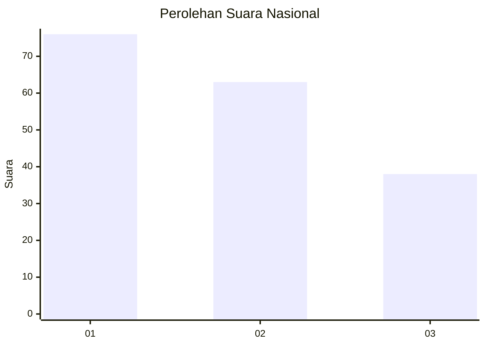
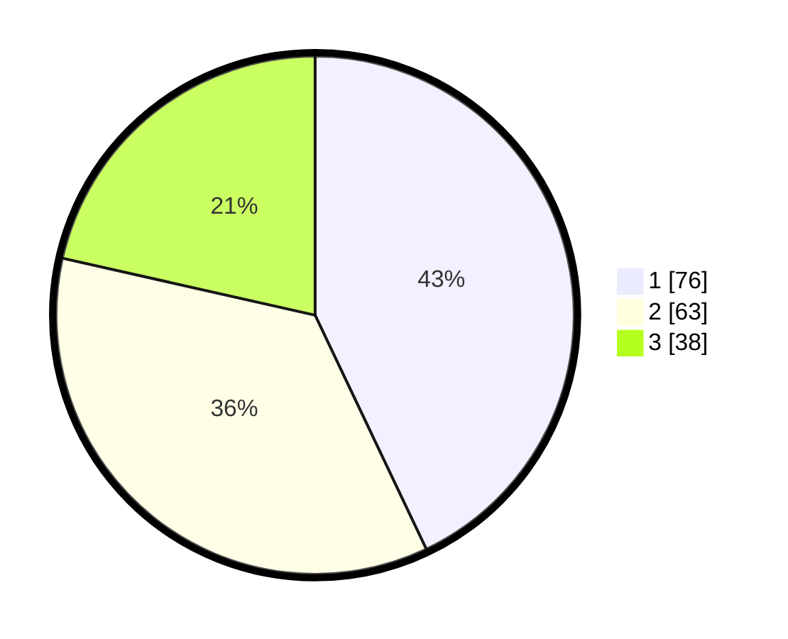

# Hasil

## Grafik

## Tabel

| No.    | Nama Paslon    | Suara | Suara (raw) | Persentase |
|:------ |:-------------- | -----:| -----------:| ----------:|
| 100025 | ANIES MUHAIMIN | 76    | [76][p-1]   | 42,94      |
| 100026 | PRABOWO GIBRAN | 63    | [63][p-2]   | 35,59      |
| 100027 | GANJAR MAHFUD  | 38    | [38][p-3]   | 21,47      |

[p-1]: https://github.com/gigit-pemilu/pemilu-2024/blob/main/pilpres/hitung-suara/sub/31-dki-jakarta/sub/73-jakarta-barat/sub/05-kebon-jeruk/sub/1007-kedoya-selatan/sub/086-tps/sub/paslon-1.txt
[p-2]: https://github.com/gigit-pemilu/pemilu-2024/blob/main/pilpres/hitung-suara/sub/31-dki-jakarta/sub/73-jakarta-barat/sub/05-kebon-jeruk/sub/1007-kedoya-selatan/sub/086-tps/sub/paslon-2.txt
[p-3]: https://github.com/gigit-pemilu/pemilu-2024/blob/main/pilpres/hitung-suara/sub/31-dki-jakarta/sub/73-jakarta-barat/sub/05-kebon-jeruk/sub/1007-kedoya-selatan/sub/086-tps/sub/paslon-3.txt

## Foto C Plano

https://sirekap-obj-formc.kpu.go.id/5cae/pemilu/ppwp/31/73/05/10/07/3173051007086-20240217-122232--cff9a476-e766-4d92-8f7a-44a0246be37b.jpg

https://sirekap-obj-formc.kpu.go.id/5cae/pemilu/ppwp/31/73/05/10/07/3173051007086-20240217-135603--c3b27e6e-39d1-4a41-b41c-1ba60be14760.jpg

https://sirekap-obj-formc.kpu.go.id/5cae/pemilu/ppwp/31/73/05/10/07/3173051007086-20240217-124517--5842ea03-127a-4c66-ae34-8bd0900f7672.jpg

## Metadata

| Key        | Value               |
| ---------- | ------------------- |
| Time Stamp | 2024-02-19 19:00:00 |

