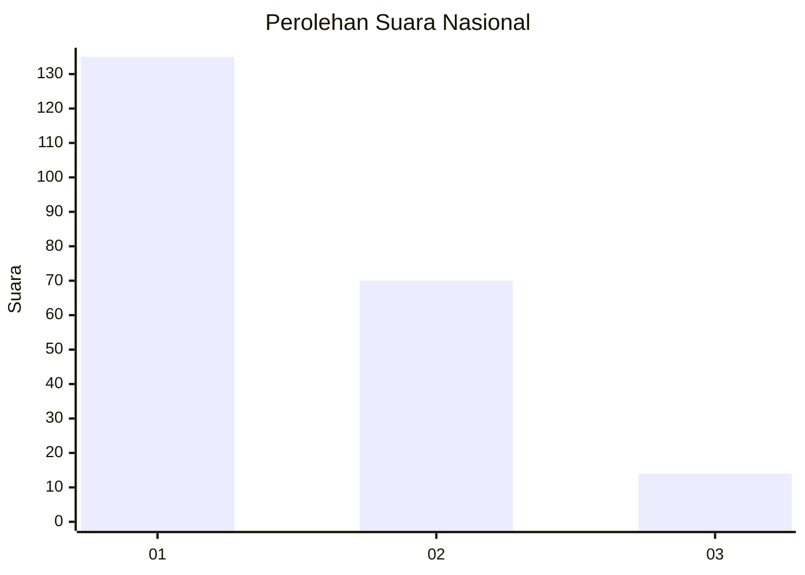
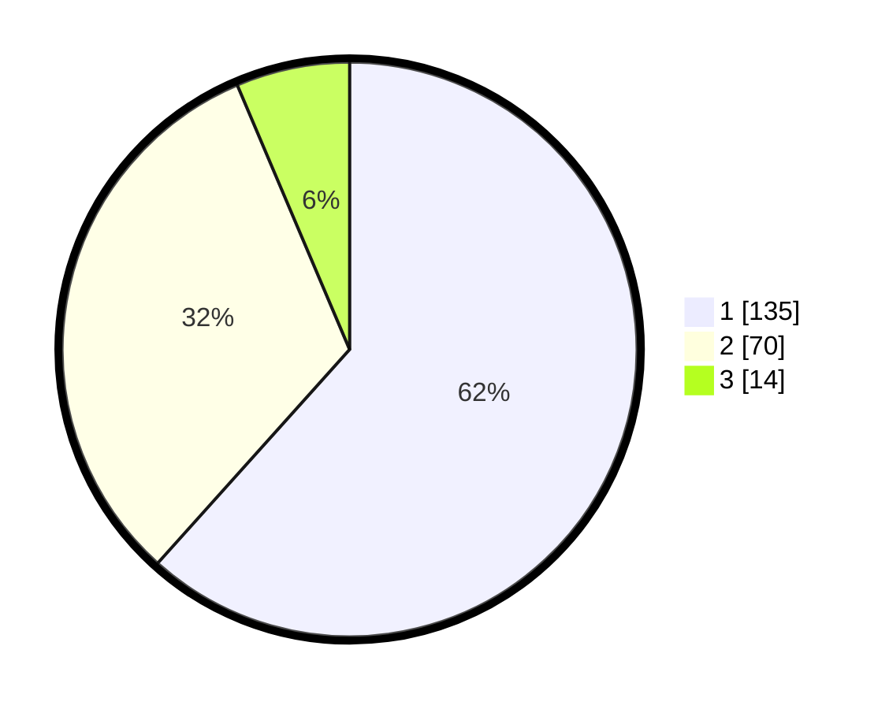

# Hasil

## Grafik

## Tabel

| No.    | Nama Paslon    | Suara | Suara (raw) | Persentase |
|:------ |:-------------- | -----:| -----------:| ----------:|
| 100025 | ANIES MUHAIMIN | 135   | [135][p-1]  | 61,64      |
| 100026 | PRABOWO GIBRAN | 70    | [70][p-2]   | 31,96      |
| 100027 | GANJAR MAHFUD  | 14    | [14][p-3]   | 6,39       |

[p-1]: https://github.com/gigit-pemilu/pemilu-2024/blob/main/pilpres/hitung-suara/sub/31-dki-jakarta/sub/73-jakarta-barat/sub/06-kalideres/sub/1001-kalideres/sub/010-tps/sub/paslon-1.txt
[p-2]: https://github.com/gigit-pemilu/pemilu-2024/blob/main/pilpres/hitung-suara/sub/31-dki-jakarta/sub/73-jakarta-barat/sub/06-kalideres/sub/1001-kalideres/sub/010-tps/sub/paslon-2.txt
[p-3]: https://github.com/gigit-pemilu/pemilu-2024/blob/main/pilpres/hitung-suara/sub/31-dki-jakarta/sub/73-jakarta-barat/sub/06-kalideres/sub/1001-kalideres/sub/010-tps/sub/paslon-3.txt

## Foto C Plano

https://sirekap-obj-formc.kpu.go.id/2855/pemilu/ppwp/31/73/06/10/01/3173061001010-20240215-011156--0c79ee25-ed0c-43a5-8e5b-c02c1f347b63.jpg

https://sirekap-obj-formc.kpu.go.id/2855/pemilu/ppwp/31/73/06/10/01/3173061001010-20240215-011401--8816ae98-df37-4fc2-9b80-d6b296e92f03.jpg

https://sirekap-obj-formc.kpu.go.id/2855/pemilu/ppwp/31/73/06/10/01/3173061001010-20240215-011606--cad32470-0363-43cd-adfb-ef385c4918b8.jpg

## Metadata

| Key        | Value               |
| ---------- | ------------------- |
| Time Stamp | 2024-02-16 21:01:00 |

