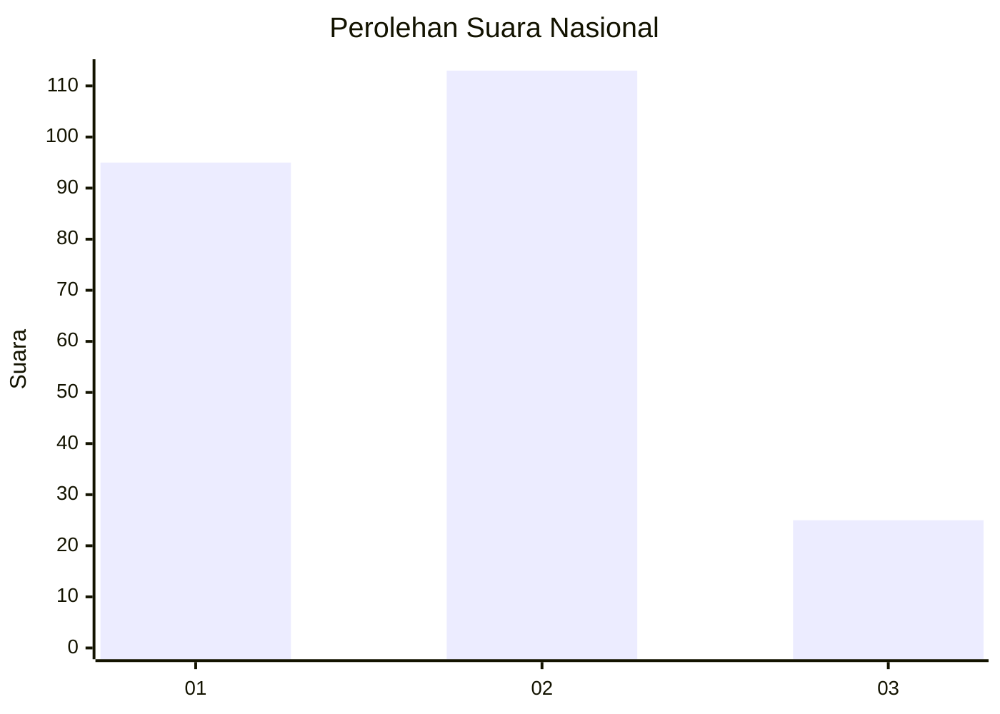
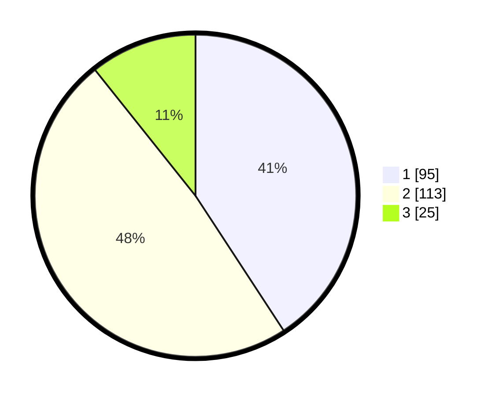

# Hasil

## Grafik

## Tabel

| No.    | Nama Paslon    | Suara | Suara (raw) | Persentase |
|:------ |:-------------- | -----:| -----------:| ----------:|
| 100025 | ANIES MUHAIMIN | 95    | [95][p-1]   | 40,77      |
| 100026 | PRABOWO GIBRAN | 113   | [113][p-2]  | 48,50      |
| 100027 | GANJAR MAHFUD  | 25    | [25][p-3]   | 10,73      |

[p-1]: https://github.com/gigit-pemilu/pemilu-2024/blob/main/pilpres/hitung-suara/sub/31-dki-jakarta/sub/73-jakarta-barat/sub/06-kalideres/sub/1001-kalideres/sub/042-tps/sub/paslon-1.txt
[p-2]: https://github.com/gigit-pemilu/pemilu-2024/blob/main/pilpres/hitung-suara/sub/31-dki-jakarta/sub/73-jakarta-barat/sub/06-kalideres/sub/1001-kalideres/sub/042-tps/sub/paslon-2.txt
[p-3]: https://github.com/gigit-pemilu/pemilu-2024/blob/main/pilpres/hitung-suara/sub/31-dki-jakarta/sub/73-jakarta-barat/sub/06-kalideres/sub/1001-kalideres/sub/042-tps/sub/paslon-3.txt

## Foto C Plano

https://sirekap-obj-formc.kpu.go.id/6e10/pemilu/ppwp/31/73/06/10/01/3173061001042-20240215-005610--71708234-52e1-474d-914b-fed68d61514c.jpg

https://sirekap-obj-formc.kpu.go.id/6e10/pemilu/ppwp/31/73/06/10/01/3173061001042-20240215-005731--188c9573-4114-444b-a7c6-d5450adc8655.jpg

https://sirekap-obj-formc.kpu.go.id/6e10/pemilu/ppwp/31/73/06/10/01/3173061001042-20240215-005814--698d128a-b2f5-4cf1-a64c-6e6ed6ff7cb3.jpg

## Metadata

| Key        | Value               |
| ---------- | ------------------- |
| Time Stamp | 2024-02-16 16:25:10 |

