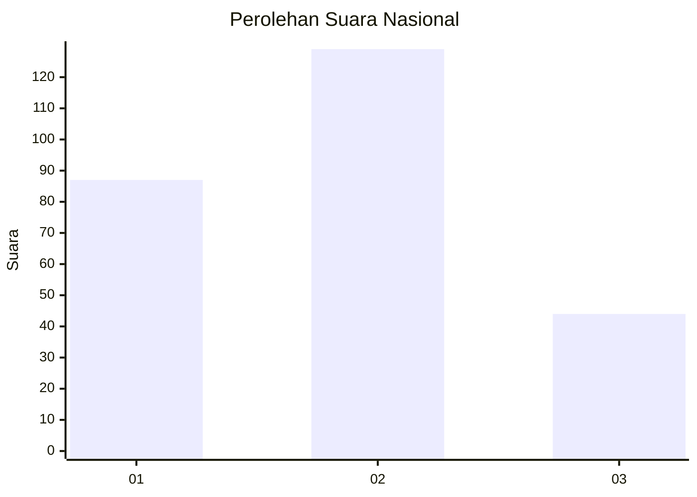
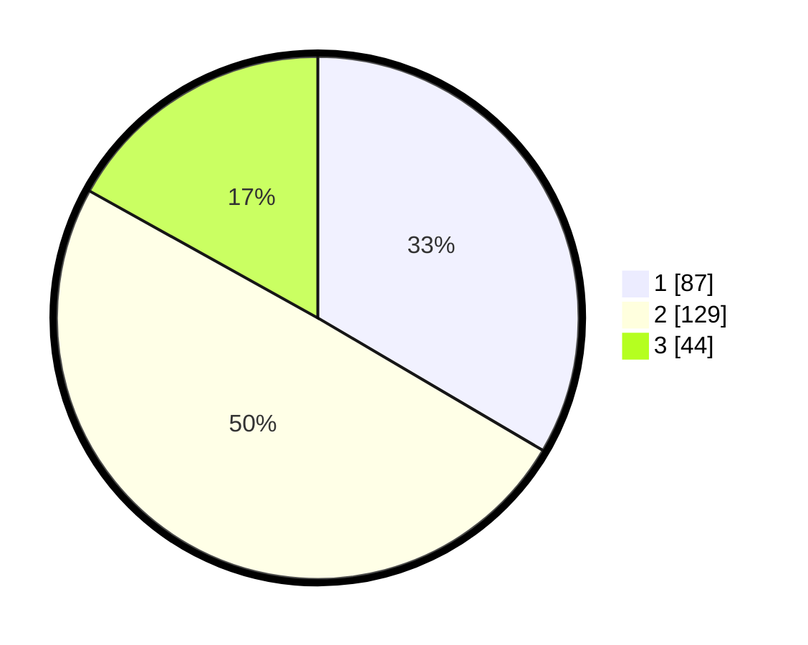

# Hasil

## Grafik

## Tabel

| No.    | Nama Paslon    | Suara | Suara (raw) | Persentase |
|:------ |:-------------- | -----:| -----------:| ----------:|
| 100025 | ANIES MUHAIMIN | 87    | [87][p-1]   | 33,46      |
| 100026 | PRABOWO GIBRAN | 129   | [129][p-2]  | 49,62      |
| 100027 | GANJAR MAHFUD  | 44    | [44][p-3]   | 16,92      |

[p-1]: https://github.com/gigit-pemilu/pemilu-2024/blob/main/pilpres/hitung-suara/sub/31-dki-jakarta/sub/73-jakarta-barat/sub/06-kalideres/sub/1001-kalideres/sub/060-tps/sub/paslon-1.txt
[p-2]: https://github.com/gigit-pemilu/pemilu-2024/blob/main/pilpres/hitung-suara/sub/31-dki-jakarta/sub/73-jakarta-barat/sub/06-kalideres/sub/1001-kalideres/sub/060-tps/sub/paslon-2.txt
[p-3]: https://github.com/gigit-pemilu/pemilu-2024/blob/main/pilpres/hitung-suara/sub/31-dki-jakarta/sub/73-jakarta-barat/sub/06-kalideres/sub/1001-kalideres/sub/060-tps/sub/paslon-3.txt

## Foto C Plano

https://sirekap-obj-formc.kpu.go.id/b05f/pemilu/ppwp/31/73/06/10/01/3173061001060-20240215-095415--3e2b1d99-28dd-4f0e-95d1-e31252a1d292.jpg

https://sirekap-obj-formc.kpu.go.id/b05f/pemilu/ppwp/31/73/06/10/01/3173061001060-20240215-095501--c3d46911-6b4e-47d4-951c-0f9a4ef8ca15.jpg

https://sirekap-obj-formc.kpu.go.id/b05f/pemilu/ppwp/31/73/06/10/01/3173061001060-20240215-095633--364f8cef-bead-46ea-94db-aa5737d7a01d.jpg

## Metadata

| Key        | Value               |
| ---------- | ------------------- |
| Time Stamp | 2024-02-16 21:01:00 |

