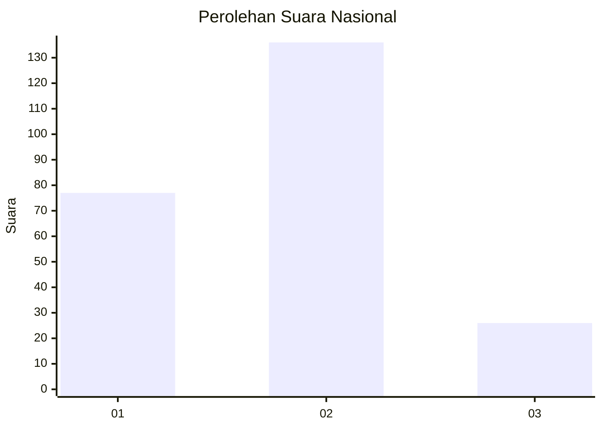
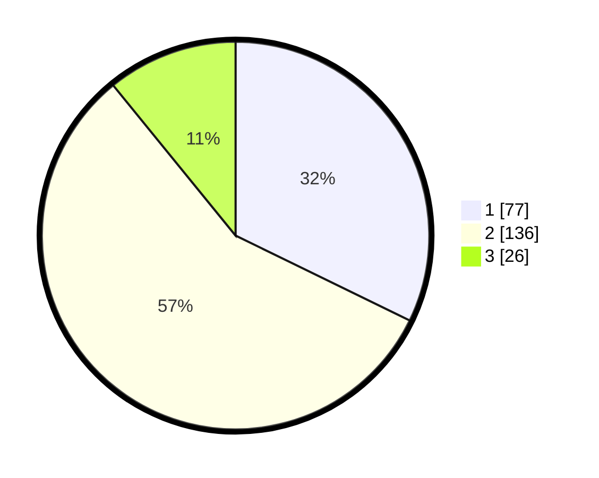

# Hasil

## Grafik

## Tabel

| No.    | Nama Paslon    | Suara | Suara (raw) | Persentase |
|:------ |:-------------- | -----:| -----------:| ----------:|
| 100025 | ANIES MUHAIMIN | 77    | [77][p-1]   | 32,22      |
| 100026 | PRABOWO GIBRAN | 136   | [136][p-2]  | 56,90      |
| 100027 | GANJAR MAHFUD  | 26    | [26][p-3]   | 10,88      |

[p-1]: https://github.com/gigit-pemilu/pemilu-2024/blob/main/pilpres/hitung-suara/sub/31-dki-jakarta/sub/73-jakarta-barat/sub/06-kalideres/sub/1001-kalideres/sub/072-tps/sub/paslon-1.txt
[p-2]: https://github.com/gigit-pemilu/pemilu-2024/blob/main/pilpres/hitung-suara/sub/31-dki-jakarta/sub/73-jakarta-barat/sub/06-kalideres/sub/1001-kalideres/sub/072-tps/sub/paslon-2.txt
[p-3]: https://github.com/gigit-pemilu/pemilu-2024/blob/main/pilpres/hitung-suara/sub/31-dki-jakarta/sub/73-jakarta-barat/sub/06-kalideres/sub/1001-kalideres/sub/072-tps/sub/paslon-3.txt

## Foto C Plano

https://sirekap-obj-formc.kpu.go.id/bb15/pemilu/ppwp/31/73/06/10/01/3173061001072-20240214-205905--56e09b78-5f39-4e68-9b6f-3e96e1f89f97.jpg

https://sirekap-obj-formc.kpu.go.id/bb15/pemilu/ppwp/31/73/06/10/01/3173061001072-20240214-210205--3f2ff829-b80d-4c0b-a348-cd62dede90cb.jpg

https://sirekap-obj-formc.kpu.go.id/bb15/pemilu/ppwp/31/73/06/10/01/3173061001072-20240214-210522--f9c4209c-735d-4d38-ac59-8a1eafb366a3.jpg

## Metadata

| Key        | Value               |
| ---------- | ------------------- |
| Time Stamp | 2024-02-17 14:45:18 |

