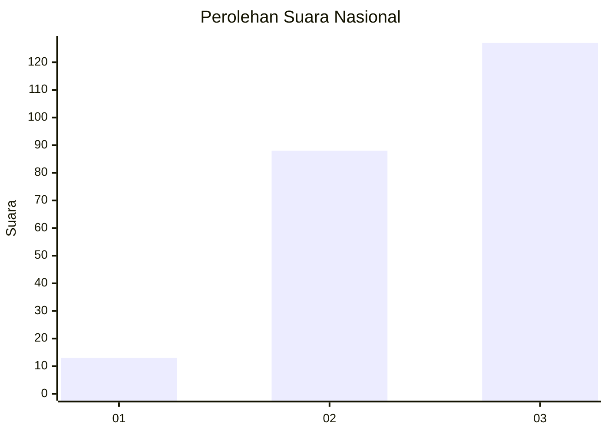
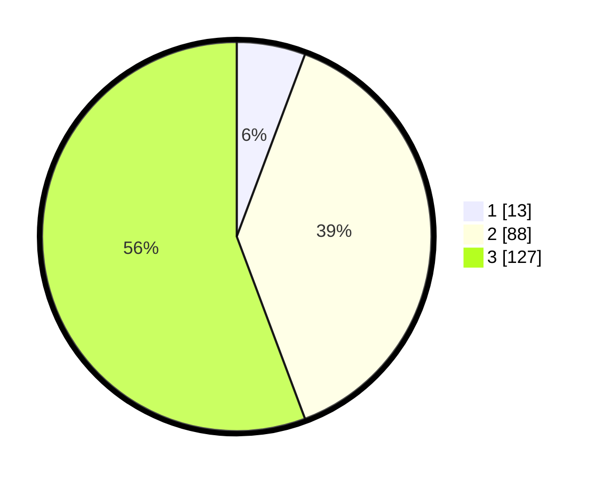

# Hasil

## Grafik

## Tabel

| No.    | Nama Paslon    | Suara | Suara (raw) | Persentase |
|:------ |:-------------- | -----:| -----------:| ----------:|
| 100025 | ANIES MUHAIMIN | 13    | [13][p-1]   | 5,70       |
| 100026 | PRABOWO GIBRAN | 88    | [88][p-2]   | 38,60      |
| 100027 | GANJAR MAHFUD  | 127   | [127][p-3]  | 55,70      |

[p-1]: https://github.com/gigit-pemilu/pemilu-2024/blob/main/pilpres/hitung-suara/sub/31-dki-jakarta/sub/73-jakarta-barat/sub/06-kalideres/sub/1001-kalideres/sub/120-tps/sub/paslon-1.txt
[p-2]: https://github.com/gigit-pemilu/pemilu-2024/blob/main/pilpres/hitung-suara/sub/31-dki-jakarta/sub/73-jakarta-barat/sub/06-kalideres/sub/1001-kalideres/sub/120-tps/sub/paslon-2.txt
[p-3]: https://github.com/gigit-pemilu/pemilu-2024/blob/main/pilpres/hitung-suara/sub/31-dki-jakarta/sub/73-jakarta-barat/sub/06-kalideres/sub/1001-kalideres/sub/120-tps/sub/paslon-3.txt

## Foto C Plano

https://sirekap-obj-formc.kpu.go.id/6ac3/pemilu/ppwp/31/73/06/10/01/3173061001120-20240215-121158--54f07309-7fe5-4c01-a991-181bfbbd6ecb.jpg

https://sirekap-obj-formc.kpu.go.id/6ac3/pemilu/ppwp/31/73/06/10/01/3173061001120-20240215-121201--caece296-8e35-4fb9-8476-bb081b4e53cb.jpg

https://sirekap-obj-formc.kpu.go.id/6ac3/pemilu/ppwp/31/73/06/10/01/3173061001120-20240215-121204--017f3852-3dac-47f8-9bce-314133c44426.jpg

## Metadata

| Key        | Value               |
| ---------- | ------------------- |
| Time Stamp | 2024-02-17 14:45:18 |

