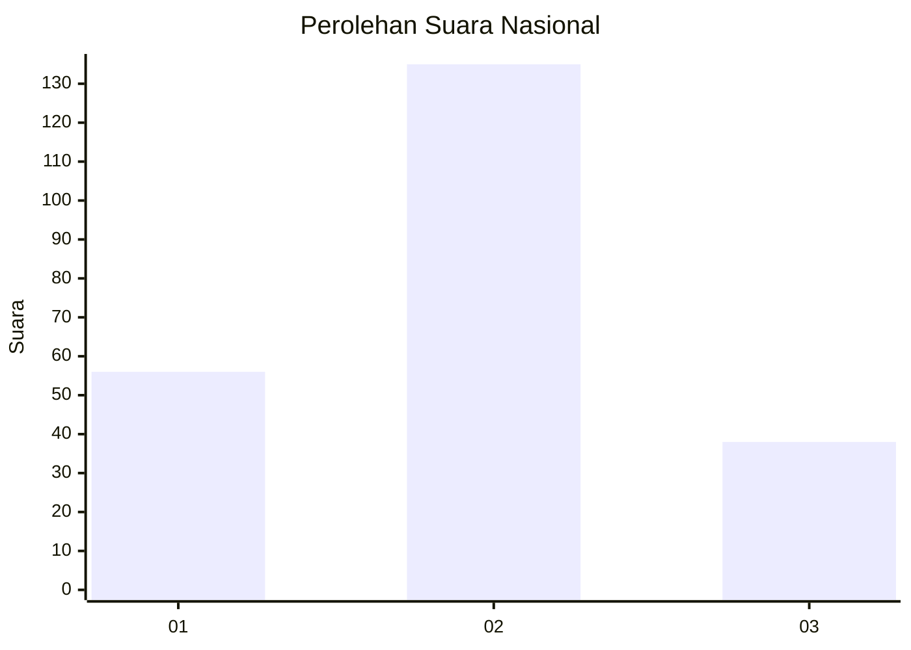

# Hasil

## Grafik

## Tabel

| No.    | Nama Paslon    | Suara | Suara (raw) | Persentase |
|:------ |:-------------- | -----:| -----------:| ----------:|
| 100025 | ANIES MUHAIMIN | 56    | [56][p-1]   | 24,45      |
| 100026 | PRABOWO GIBRAN | 135   | [135][p-2]  | 58,95      |
| 100027 | GANJAR MAHFUD  | 38    | [38][p-3]   | 16,59      |

[p-1]: https://github.com/gigit-pemilu/pemilu-2024/blob/main/pilpres/hitung-suara/sub/31-dki-jakarta/sub/73-jakarta-barat/sub/06-kalideres/sub/1001-kalideres/sub/140-tps/sub/paslon-1.txt
[p-2]: https://github.com/gigit-pemilu/pemilu-2024/blob/main/pilpres/hitung-suara/sub/31-dki-jakarta/sub/73-jakarta-barat/sub/06-kalideres/sub/1001-kalideres/sub/140-tps/sub/paslon-2.txt
[p-3]: https://github.com/gigit-pemilu/pemilu-2024/blob/main/pilpres/hitung-suara/sub/31-dki-jakarta/sub/73-jakarta-barat/sub/06-kalideres/sub/1001-kalideres/sub/140-tps/sub/paslon-3.txt

## Foto C Plano

https://sirekap-obj-formc.kpu.go.id/c013/pemilu/ppwp/31/73/06/10/01/3173061001140-20240214-155818--6ac4e6c5-daff-4eba-84f5-4f14b4d26ee3.jpg

https://sirekap-obj-formc.kpu.go.id/c013/pemilu/ppwp/31/73/06/10/01/3173061001140-20240214-155823--d43c3fdb-c0ca-48a7-908f-932e43df6882.jpg

https://sirekap-obj-formc.kpu.go.id/c013/pemilu/ppwp/31/73/06/10/01/3173061001140-20240214-160126--28994f80-84c6-4eb3-a61d-76ef1d822b6a.jpg

## Metadata

| Key        | Value               |
| ---------- | ------------------- |
| Time Stamp | 2024-02-17 14:45:18 |

