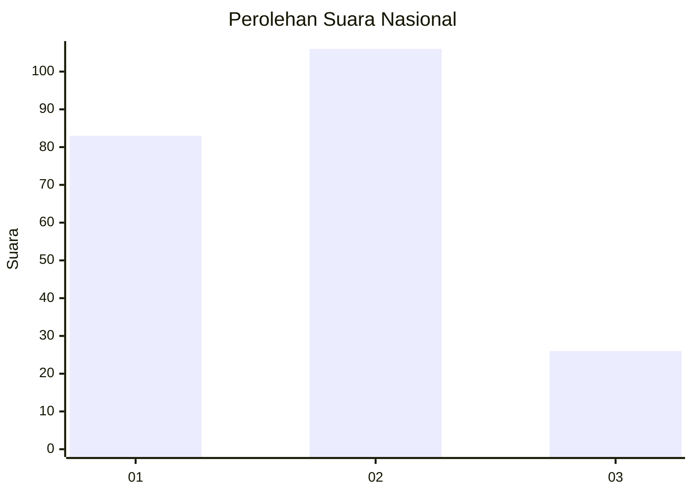
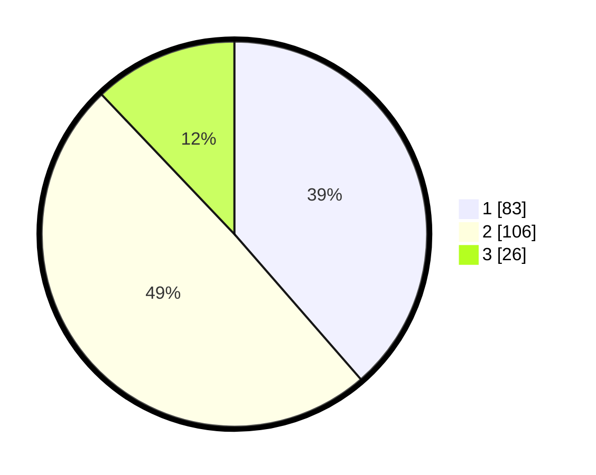

# Hasil

## Grafik

## Tabel

| No.    | Nama Paslon    | Suara | Suara (raw) | Persentase |
|:------ |:-------------- | -----:| -----------:| ----------:|
| 100025 | ANIES MUHAIMIN | 83    | [83][p-1]   | 38,60      |
| 100026 | PRABOWO GIBRAN | 106   | [106][p-2]  | 49,30      |
| 100027 | GANJAR MAHFUD  | 26    | [26][p-3]   | 12,09      |

[p-1]: https://github.com/gigit-pemilu/pemilu-2024/blob/main/pilpres/hitung-suara/sub/31-dki-jakarta/sub/73-jakarta-barat/sub/06-kalideres/sub/1001-kalideres/sub/150-tps/sub/paslon-1.txt
[p-2]: https://github.com/gigit-pemilu/pemilu-2024/blob/main/pilpres/hitung-suara/sub/31-dki-jakarta/sub/73-jakarta-barat/sub/06-kalideres/sub/1001-kalideres/sub/150-tps/sub/paslon-2.txt
[p-3]: https://github.com/gigit-pemilu/pemilu-2024/blob/main/pilpres/hitung-suara/sub/31-dki-jakarta/sub/73-jakarta-barat/sub/06-kalideres/sub/1001-kalideres/sub/150-tps/sub/paslon-3.txt

## Foto C Plano

https://sirekap-obj-formc.kpu.go.id/2632/pemilu/ppwp/31/73/06/10/01/3173061001150-20240214-200601--8357c75c-05a2-4d94-b53d-11e5b864c4d9.jpg

https://sirekap-obj-formc.kpu.go.id/2632/pemilu/ppwp/31/73/06/10/01/3173061001150-20240214-212654--1be81d5f-21db-4baf-8c57-444c3935e36a.jpg

https://sirekap-obj-formc.kpu.go.id/2632/pemilu/ppwp/31/73/06/10/01/3173061001150-20240214-212907--e81cf2f5-e744-41b8-a7ed-8ae15319117e.jpg

## Metadata

| Key        | Value               |
| ---------- | ------------------- |
| Time Stamp | 2024-02-16 21:01:00 |

