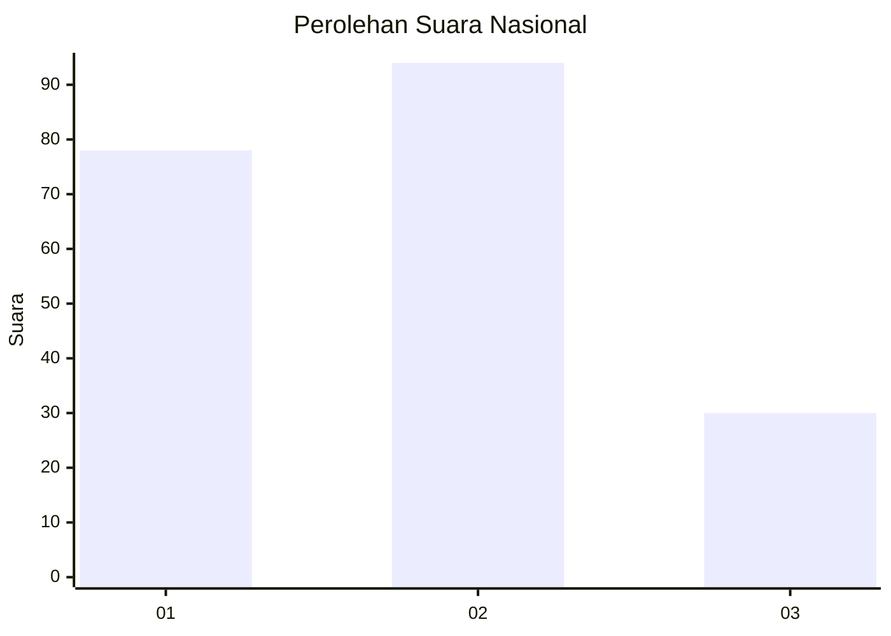
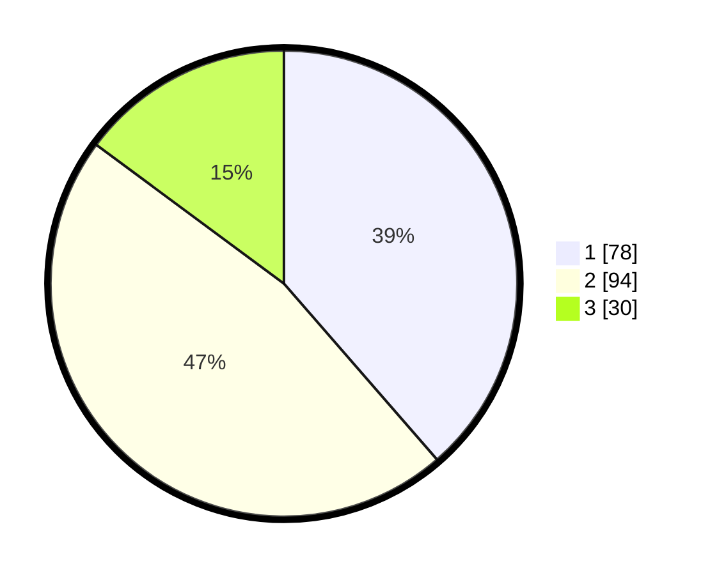

# Hasil

## Grafik

## Tabel

| No.    | Nama Paslon    | Suara | Suara (raw) | Persentase |
|:------ |:-------------- | -----:| -----------:| ----------:|
| 100025 | ANIES MUHAIMIN | 78    | [78][p-1]   | 38,61      |
| 100026 | PRABOWO GIBRAN | 94    | [94][p-2]   | 46,53      |
| 100027 | GANJAR MAHFUD  | 30    | [30][p-3]   | 14,85      |

[p-1]: https://github.com/gigit-pemilu/pemilu-2024/blob/main/pilpres/hitung-suara/sub/31-dki-jakarta/sub/73-jakarta-barat/sub/06-kalideres/sub/1001-kalideres/sub/152-tps/sub/paslon-1.txt
[p-2]: https://github.com/gigit-pemilu/pemilu-2024/blob/main/pilpres/hitung-suara/sub/31-dki-jakarta/sub/73-jakarta-barat/sub/06-kalideres/sub/1001-kalideres/sub/152-tps/sub/paslon-2.txt
[p-3]: https://github.com/gigit-pemilu/pemilu-2024/blob/main/pilpres/hitung-suara/sub/31-dki-jakarta/sub/73-jakarta-barat/sub/06-kalideres/sub/1001-kalideres/sub/152-tps/sub/paslon-3.txt

## Foto C Plano

https://sirekap-obj-formc.kpu.go.id/d1ea/pemilu/ppwp/31/73/06/10/01/3173061001152-20240216-065212--0977d807-fedf-499c-b656-2d1bf98dcd4b.jpg

https://sirekap-obj-formc.kpu.go.id/d1ea/pemilu/ppwp/31/73/06/10/01/3173061001152-20240215-144343--d6e31c88-fbab-4fde-ae4a-42e7cffac2b8.jpg

https://sirekap-obj-formc.kpu.go.id/d1ea/pemilu/ppwp/31/73/06/10/01/3173061001152-20240216-065055--81145c75-6339-4eb8-b7d8-54ada22d028c.jpg

## Metadata

| Key        | Value               |
| ---------- | ------------------- |
| Time Stamp | 2024-02-16 08:00:28 |

