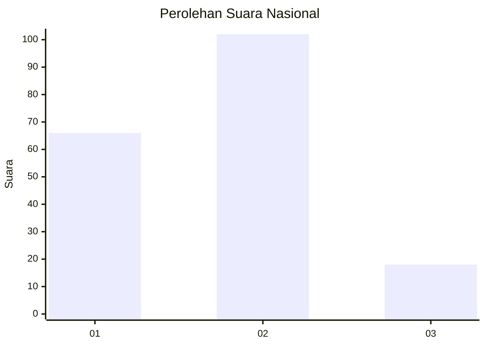

# Hasil

## Grafik

## Tabel

| No.    | Nama Paslon    | Suara | Suara (raw) | Persentase |
|:------ |:-------------- | -----:| -----------:| ----------:|
| 100025 | ANIES MUHAIMIN | 66    | [66][p-1]   | 35,48      |
| 100026 | PRABOWO GIBRAN | 102   | [102][p-2]  | 54,84      |
| 100027 | GANJAR MAHFUD  | 18    | [18][p-3]   | 9,68       |

[p-1]: https://github.com/gigit-pemilu/pemilu-2024/blob/main/pilpres/hitung-suara/sub/31-dki-jakarta/sub/73-jakarta-barat/sub/06-kalideres/sub/1001-kalideres/sub/155-tps/sub/paslon-1.txt
[p-2]: https://github.com/gigit-pemilu/pemilu-2024/blob/main/pilpres/hitung-suara/sub/31-dki-jakarta/sub/73-jakarta-barat/sub/06-kalideres/sub/1001-kalideres/sub/155-tps/sub/paslon-2.txt
[p-3]: https://github.com/gigit-pemilu/pemilu-2024/blob/main/pilpres/hitung-suara/sub/31-dki-jakarta/sub/73-jakarta-barat/sub/06-kalideres/sub/1001-kalideres/sub/155-tps/sub/paslon-3.txt

## Foto C Plano

https://sirekap-obj-formc.kpu.go.id/cda4/pemilu/ppwp/31/73/06/10/01/3173061001155-20240214-224303--63aa5b07-4c91-4bcf-b276-88ebe9a0f970.jpg

https://sirekap-obj-formc.kpu.go.id/cda4/pemilu/ppwp/31/73/06/10/01/3173061001155-20240214-224517--dc23d27c-e11f-40e5-b586-5aa7f93c738d.jpg

https://sirekap-obj-formc.kpu.go.id/cda4/pemilu/ppwp/31/73/06/10/01/3173061001155-20240214-224655--0124d440-5053-4d0a-9ffd-fcb0c911f18d.jpg

## Metadata

| Key        | Value               |
| ---------- | ------------------- |
| Time Stamp | 2024-02-15 19:00:26 |

