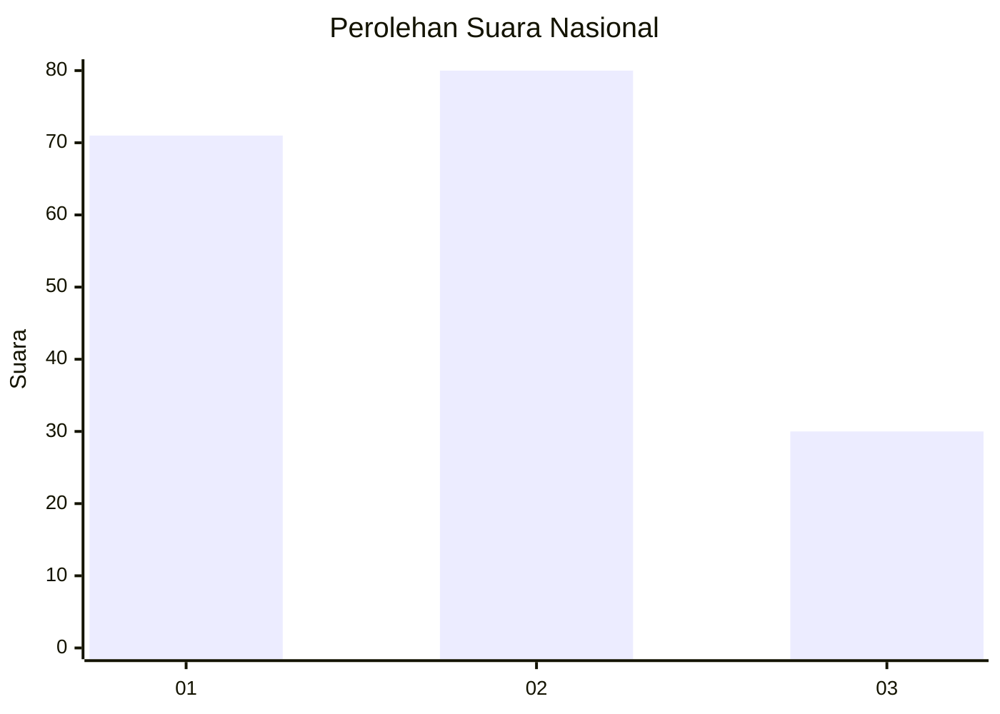
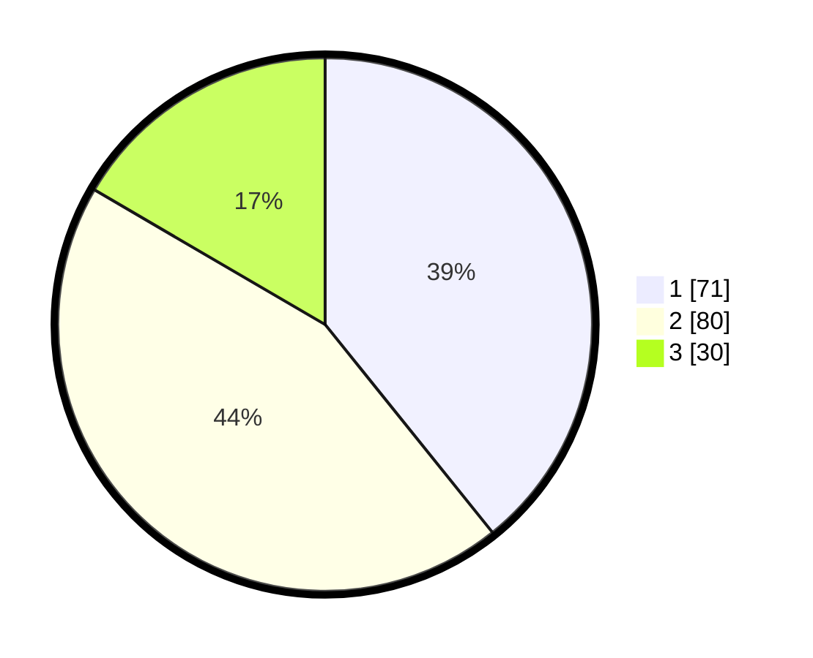

# Hasil

## Grafik

## Tabel

| No.    | Nama Paslon    | Suara | Suara (raw) | Persentase |
|:------ |:-------------- | -----:| -----------:| ----------:|
| 100025 | ANIES MUHAIMIN | 71    | [71][p-1]   | 39,23      |
| 100026 | PRABOWO GIBRAN | 80    | [80][p-2]   | 44,20      |
| 100027 | GANJAR MAHFUD  | 30    | [30][p-3]   | 16,57      |

[p-1]: https://github.com/gigit-pemilu/pemilu-2024/blob/main/pilpres/hitung-suara/sub/31-dki-jakarta/sub/73-jakarta-barat/sub/06-kalideres/sub/1001-kalideres/sub/177-tps/sub/paslon-1.txt
[p-2]: https://github.com/gigit-pemilu/pemilu-2024/blob/main/pilpres/hitung-suara/sub/31-dki-jakarta/sub/73-jakarta-barat/sub/06-kalideres/sub/1001-kalideres/sub/177-tps/sub/paslon-2.txt
[p-3]: https://github.com/gigit-pemilu/pemilu-2024/blob/main/pilpres/hitung-suara/sub/31-dki-jakarta/sub/73-jakarta-barat/sub/06-kalideres/sub/1001-kalideres/sub/177-tps/sub/paslon-3.txt

## Foto C Plano

https://sirekap-obj-formc.kpu.go.id/2654/pemilu/ppwp/31/73/06/10/01/3173061001177-20240214-231216--1577c6db-3d6d-4a35-9d63-3fd180b8a337.jpg

https://sirekap-obj-formc.kpu.go.id/2654/pemilu/ppwp/31/73/06/10/01/3173061001177-20240214-231305--c456d180-e3dd-47bb-8fd5-ee2e4715f829.jpg

https://sirekap-obj-formc.kpu.go.id/2654/pemilu/ppwp/31/73/06/10/01/3173061001177-20240214-231350--bb7d5080-9d5b-4105-b5b9-e07b02f7004f.jpg

## Metadata

| Key        | Value               |
| ---------- | ------------------- |
| Time Stamp | 2024-02-16 21:01:00 |

