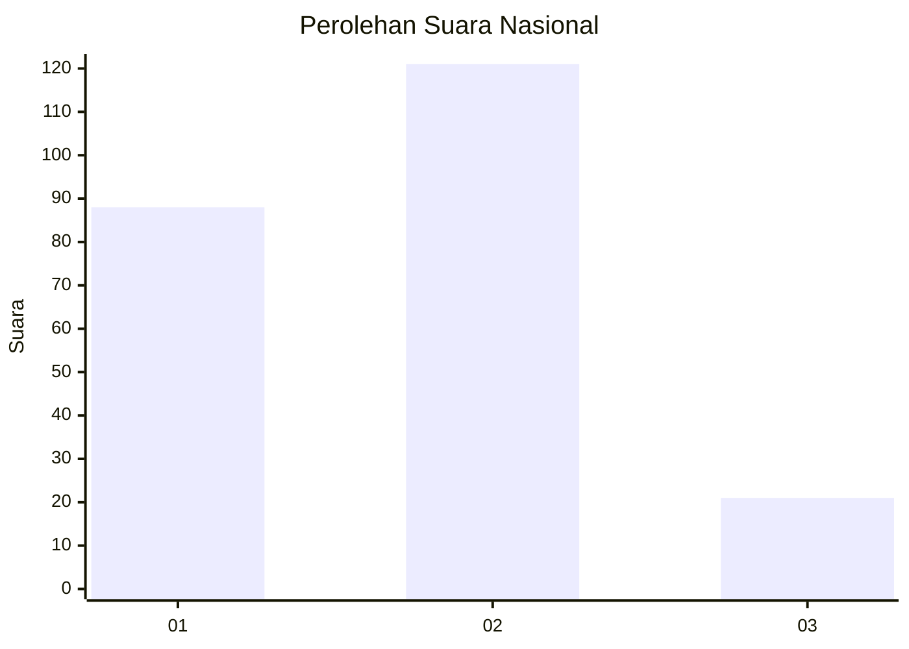
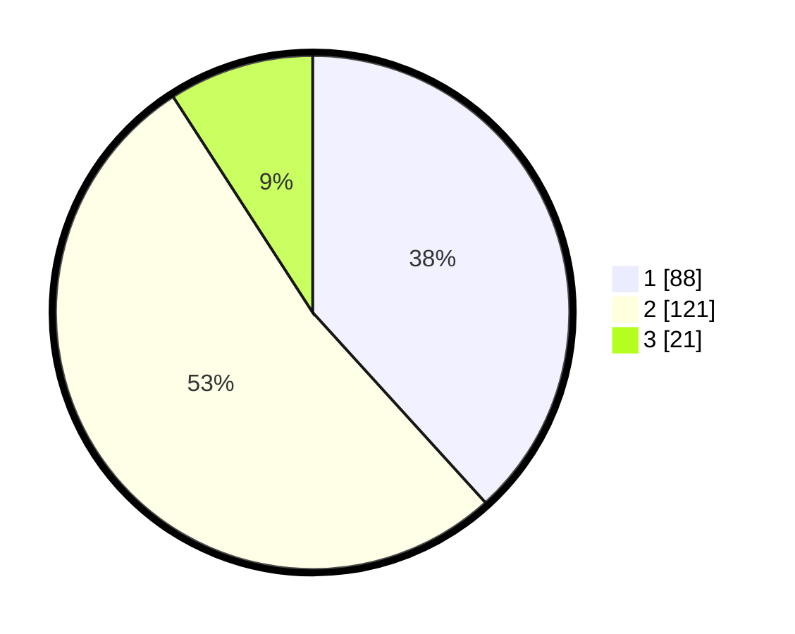

# Hasil

## Grafik

## Tabel

| No.    | Nama Paslon    | Suara | Suara (raw) | Persentase |
|:------ |:-------------- | -----:| -----------:| ----------:|
| 100025 | ANIES MUHAIMIN | 88    | [88][p-1]   | 38,26      |
| 100026 | PRABOWO GIBRAN | 121   | [121][p-2]  | 52,61      |
| 100027 | GANJAR MAHFUD  | 21    | [21][p-3]   | 9,13       |

[p-1]: https://github.com/gigit-pemilu/pemilu-2024/blob/main/pilpres/hitung-suara/sub/31-dki-jakarta/sub/73-jakarta-barat/sub/06-kalideres/sub/1001-kalideres/sub/207-tps/sub/paslon-1.txt
[p-2]: https://github.com/gigit-pemilu/pemilu-2024/blob/main/pilpres/hitung-suara/sub/31-dki-jakarta/sub/73-jakarta-barat/sub/06-kalideres/sub/1001-kalideres/sub/207-tps/sub/paslon-2.txt
[p-3]: https://github.com/gigit-pemilu/pemilu-2024/blob/main/pilpres/hitung-suara/sub/31-dki-jakarta/sub/73-jakarta-barat/sub/06-kalideres/sub/1001-kalideres/sub/207-tps/sub/paslon-3.txt

## Foto C Plano

https://sirekap-obj-formc.kpu.go.id/eaf9/pemilu/ppwp/31/73/06/10/01/3173061001207-20240215-174030--f0dc540d-0160-4f40-abb7-968607f18014.jpg

https://sirekap-obj-formc.kpu.go.id/eaf9/pemilu/ppwp/31/73/06/10/01/3173061001207-20240214-232014--d56d44b1-e2c6-4f5f-8e14-6ab5805b4bb4.jpg

https://sirekap-obj-formc.kpu.go.id/eaf9/pemilu/ppwp/31/73/06/10/01/3173061001207-20240214-232214--a83ce98c-db7a-4afe-a9c3-78ee112e4ad1.jpg

## Metadata

| Key        | Value               |
| ---------- | ------------------- |
| Time Stamp | 2024-02-16 21:01:00 |

