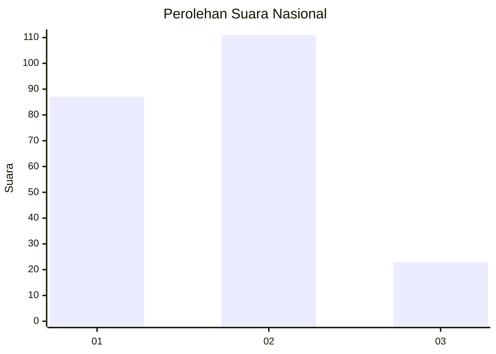
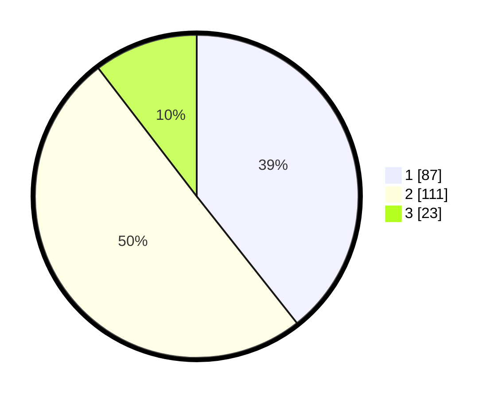

# Hasil

## Grafik

## Tabel

| No.    | Nama Paslon    | Suara | Suara (raw) | Persentase |
|:------ |:-------------- | -----:| -----------:| ----------:|
| 100025 | ANIES MUHAIMIN | 87    | [87][p-1]   | 39,37      |
| 100026 | PRABOWO GIBRAN | 111   | [111][p-2]  | 50,23      |
| 100027 | GANJAR MAHFUD  | 23    | [23][p-3]   | 10,41      |

[p-1]: https://github.com/gigit-pemilu/pemilu-2024/blob/main/pilpres/hitung-suara/sub/31-dki-jakarta/sub/73-jakarta-barat/sub/06-kalideres/sub/1001-kalideres/sub/208-tps/sub/paslon-1.txt
[p-2]: https://github.com/gigit-pemilu/pemilu-2024/blob/main/pilpres/hitung-suara/sub/31-dki-jakarta/sub/73-jakarta-barat/sub/06-kalideres/sub/1001-kalideres/sub/208-tps/sub/paslon-2.txt
[p-3]: https://github.com/gigit-pemilu/pemilu-2024/blob/main/pilpres/hitung-suara/sub/31-dki-jakarta/sub/73-jakarta-barat/sub/06-kalideres/sub/1001-kalideres/sub/208-tps/sub/paslon-3.txt

## Foto C Plano

https://sirekap-obj-formc.kpu.go.id/27ee/pemilu/ppwp/31/73/06/10/01/3173061001208-20240214-212206--7cdaa94c-fed8-4d09-b591-a6ec4eccf9be.jpg

https://sirekap-obj-formc.kpu.go.id/27ee/pemilu/ppwp/31/73/06/10/01/3173061001208-20240215-003445--e785abc6-24a1-41cf-ae00-1e32629b3912.jpg

https://sirekap-obj-formc.kpu.go.id/27ee/pemilu/ppwp/31/73/06/10/01/3173061001208-20240214-212508--68151a98-8d8a-44c6-8b74-0afcaca535e4.jpg

## Metadata

| Key        | Value               |
| ---------- | ------------------- |
| Time Stamp | 2024-02-16 21:01:00 |

