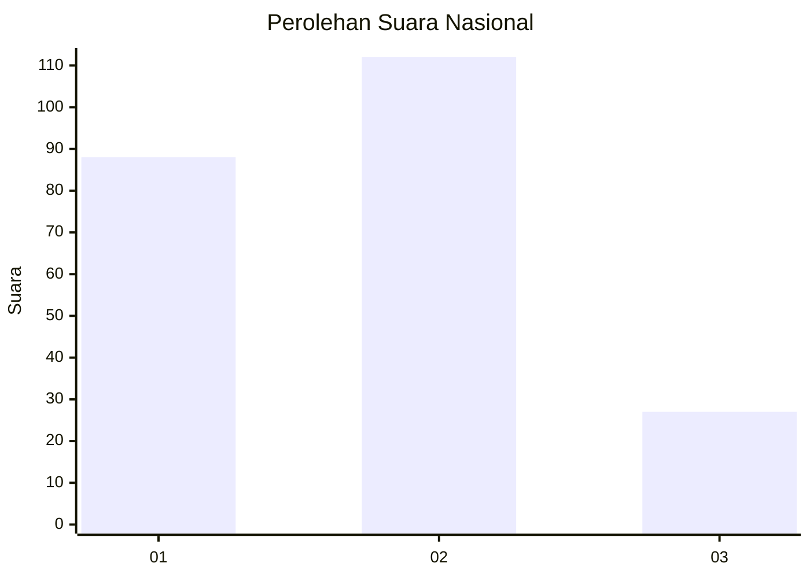
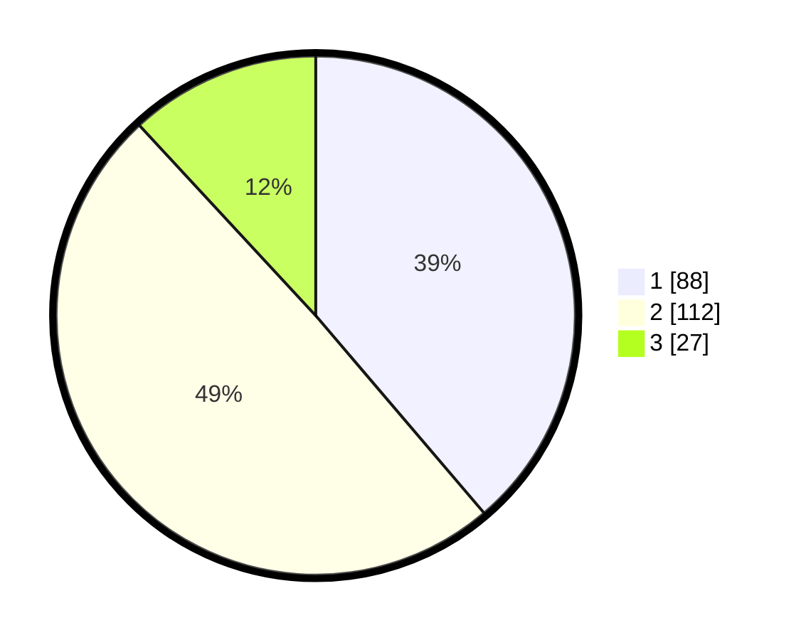

# Hasil

## Grafik

## Tabel

| No.    | Nama Paslon    | Suara | Suara (raw) | Persentase |
|:------ |:-------------- | -----:| -----------:| ----------:|
| 100025 | ANIES MUHAIMIN | 88    | [88][p-1]   | 38,77      |
| 100026 | PRABOWO GIBRAN | 112   | [112][p-2]  | 49,34      |
| 100027 | GANJAR MAHFUD  | 27    | [27][p-3]   | 11,89      |

[p-1]: https://github.com/gigit-pemilu/pemilu-2024/blob/main/pilpres/hitung-suara/sub/31-dki-jakarta/sub/73-jakarta-barat/sub/06-kalideres/sub/1001-kalideres/sub/213-tps/sub/paslon-1.txt
[p-2]: https://github.com/gigit-pemilu/pemilu-2024/blob/main/pilpres/hitung-suara/sub/31-dki-jakarta/sub/73-jakarta-barat/sub/06-kalideres/sub/1001-kalideres/sub/213-tps/sub/paslon-2.txt
[p-3]: https://github.com/gigit-pemilu/pemilu-2024/blob/main/pilpres/hitung-suara/sub/31-dki-jakarta/sub/73-jakarta-barat/sub/06-kalideres/sub/1001-kalideres/sub/213-tps/sub/paslon-3.txt

## Foto C Plano

https://sirekap-obj-formc.kpu.go.id/d99b/pemilu/ppwp/31/73/06/10/01/3173061001213-20240214-232012--c72fb740-378a-43e8-a0b1-7e202d6cd65c.jpg

https://sirekap-obj-formc.kpu.go.id/d99b/pemilu/ppwp/31/73/06/10/01/3173061001213-20240214-231649--81eab785-55d1-4d29-a50c-fa12aa9fadd4.jpg

https://sirekap-obj-formc.kpu.go.id/d99b/pemilu/ppwp/31/73/06/10/01/3173061001213-20240214-232117--b540d1ac-7c1d-40e4-be12-cf78254e0b36.jpg

## Metadata

| Key        | Value               |
| ---------- | ------------------- |
| Time Stamp | 2024-02-17 14:45:18 |

