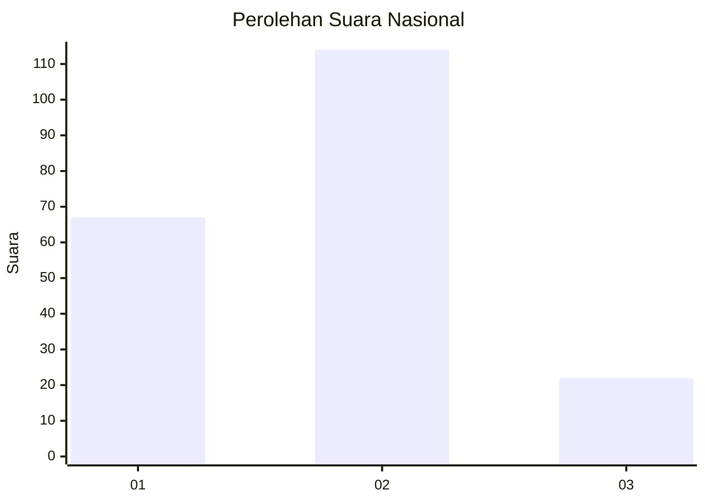
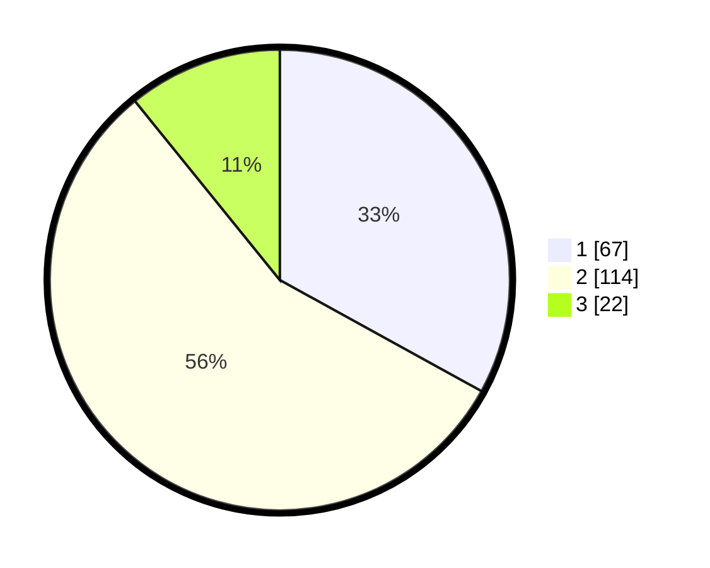

# Hasil

## Grafik

## Tabel

| No.    | Nama Paslon    | Suara | Suara (raw) | Persentase |
|:------ |:-------------- | -----:| -----------:| ----------:|
| 100025 | ANIES MUHAIMIN | 67    | [67][p-1]   | 33,00      |
| 100026 | PRABOWO GIBRAN | 114   | [114][p-2]  | 56,16      |
| 100027 | GANJAR MAHFUD  | 22    | [22][p-3]   | 10,84      |

[p-1]: https://github.com/gigit-pemilu/pemilu-2024/blob/main/pilpres/hitung-suara/sub/31-dki-jakarta/sub/73-jakarta-barat/sub/06-kalideres/sub/1001-kalideres/sub/214-tps/sub/paslon-1.txt
[p-2]: https://github.com/gigit-pemilu/pemilu-2024/blob/main/pilpres/hitung-suara/sub/31-dki-jakarta/sub/73-jakarta-barat/sub/06-kalideres/sub/1001-kalideres/sub/214-tps/sub/paslon-2.txt
[p-3]: https://github.com/gigit-pemilu/pemilu-2024/blob/main/pilpres/hitung-suara/sub/31-dki-jakarta/sub/73-jakarta-barat/sub/06-kalideres/sub/1001-kalideres/sub/214-tps/sub/paslon-3.txt

## Foto C Plano

https://sirekap-obj-formc.kpu.go.id/1bf4/pemilu/ppwp/31/73/06/10/01/3173061001214-20240215-011235--14428539-4c21-4e41-a2c6-7e05a114fb8b.jpg

https://sirekap-obj-formc.kpu.go.id/1bf4/pemilu/ppwp/31/73/06/10/01/3173061001214-20240215-011414--763b22b0-cd19-4657-8a2c-02f63e5ec336.jpg

https://sirekap-obj-formc.kpu.go.id/1bf4/pemilu/ppwp/31/73/06/10/01/3173061001214-20240215-011719--addc15fd-2970-4407-a4b2-7798ed32df52.jpg

## Metadata

| Key        | Value               |
| ---------- | ------------------- |
| Time Stamp | 2024-02-16 21:01:00 |

