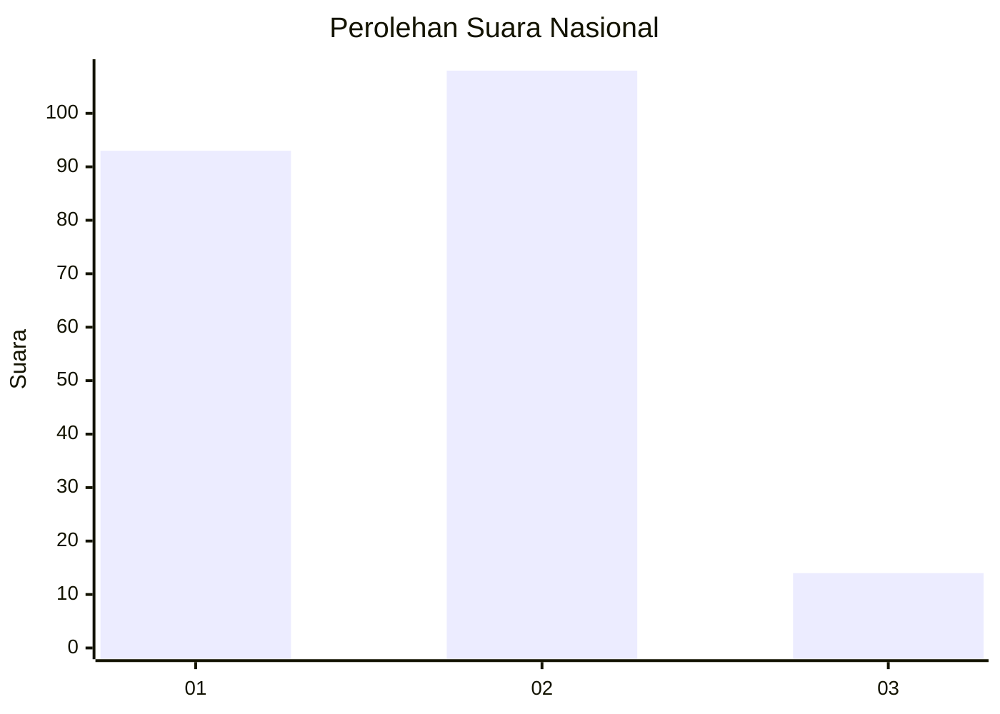
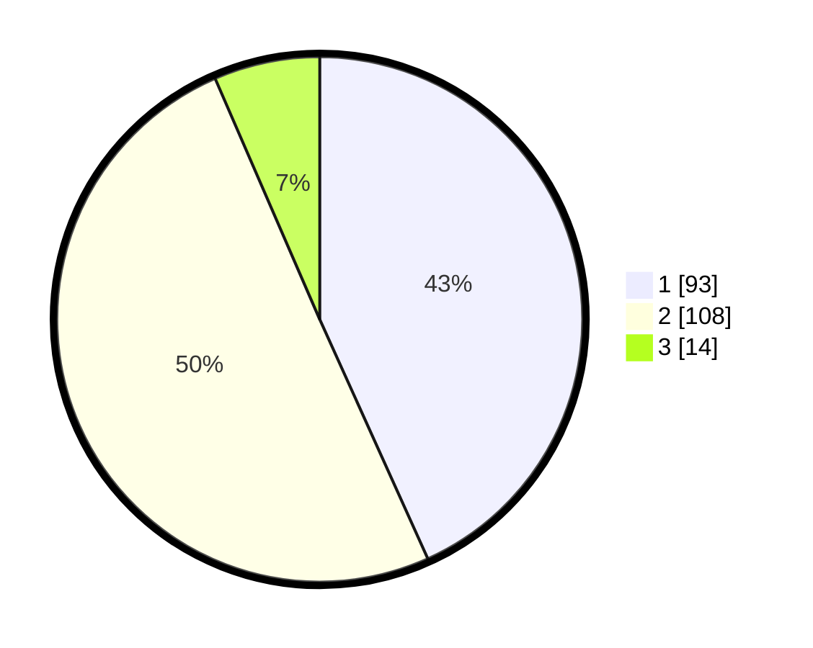

# Hasil

## Grafik

## Tabel

| No.    | Nama Paslon    | Suara | Suara (raw) | Persentase |
|:------ |:-------------- | -----:| -----------:| ----------:|
| 100025 | ANIES MUHAIMIN | 93    | [93][p-1]   | 43,26      |
| 100026 | PRABOWO GIBRAN | 108   | [108][p-2]  | 50,23      |
| 100027 | GANJAR MAHFUD  | 14    | [14][p-3]   | 6,51       |

[p-1]: https://github.com/gigit-pemilu/pemilu-2024/blob/main/pilpres/hitung-suara/sub/31-dki-jakarta/sub/73-jakarta-barat/sub/06-kalideres/sub/1002-semanan/sub/036-tps/sub/paslon-1.txt
[p-2]: https://github.com/gigit-pemilu/pemilu-2024/blob/main/pilpres/hitung-suara/sub/31-dki-jakarta/sub/73-jakarta-barat/sub/06-kalideres/sub/1002-semanan/sub/036-tps/sub/paslon-2.txt
[p-3]: https://github.com/gigit-pemilu/pemilu-2024/blob/main/pilpres/hitung-suara/sub/31-dki-jakarta/sub/73-jakarta-barat/sub/06-kalideres/sub/1002-semanan/sub/036-tps/sub/paslon-3.txt

## Foto C Plano

https://sirekap-obj-formc.kpu.go.id/e688/pemilu/ppwp/31/73/06/10/02/3173061002036-20240214-215201--583703c7-fbb6-4654-88ac-189d8f4450eb.jpg

https://sirekap-obj-formc.kpu.go.id/e688/pemilu/ppwp/31/73/06/10/02/3173061002036-20240214-224822--f82cebba-40e3-4ee4-a7f1-090cdb547aa5.jpg

https://sirekap-obj-formc.kpu.go.id/e688/pemilu/ppwp/31/73/06/10/02/3173061002036-20240214-224902--14082d1c-acd0-4822-b10a-98b48156f99d.jpg

## Metadata

| Key        | Value               |
| ---------- | ------------------- |
| Time Stamp | 2024-02-17 14:45:18 |

