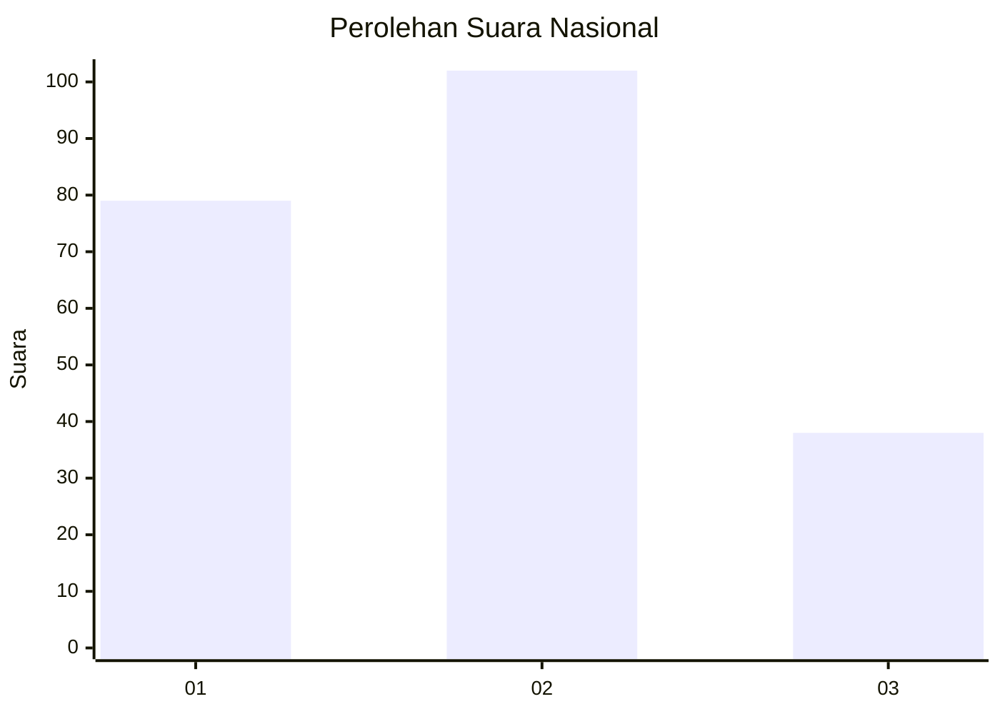
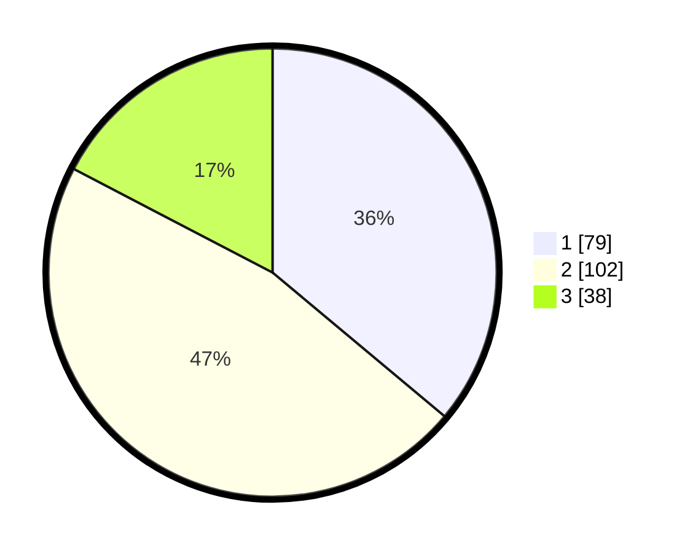

# Hasil

## Grafik

## Tabel

| No.    | Nama Paslon    | Suara | Suara (raw) | Persentase |
|:------ |:-------------- | -----:| -----------:| ----------:|
| 100025 | ANIES MUHAIMIN | 79    | [79][p-1]   | 36,07      |
| 100026 | PRABOWO GIBRAN | 102   | [102][p-2]  | 46,58      |
| 100027 | GANJAR MAHFUD  | 38    | [38][p-3]   | 17,35      |

[p-1]: https://github.com/gigit-pemilu/pemilu-2024/blob/main/pilpres/hitung-suara/sub/31-dki-jakarta/sub/73-jakarta-barat/sub/06-kalideres/sub/1002-semanan/sub/039-tps/sub/paslon-1.txt
[p-2]: https://github.com/gigit-pemilu/pemilu-2024/blob/main/pilpres/hitung-suara/sub/31-dki-jakarta/sub/73-jakarta-barat/sub/06-kalideres/sub/1002-semanan/sub/039-tps/sub/paslon-2.txt
[p-3]: https://github.com/gigit-pemilu/pemilu-2024/blob/main/pilpres/hitung-suara/sub/31-dki-jakarta/sub/73-jakarta-barat/sub/06-kalideres/sub/1002-semanan/sub/039-tps/sub/paslon-3.txt

## Foto C Plano

https://sirekap-obj-formc.kpu.go.id/e188/pemilu/ppwp/31/73/06/10/02/3173061002039-20240214-221155--122d36b5-1146-4a9f-8f4f-beba989d1fd3.jpg

https://sirekap-obj-formc.kpu.go.id/e188/pemilu/ppwp/31/73/06/10/02/3173061002039-20240214-221222--7ae5a52d-46fa-46eb-b127-76a700e7ca5c.jpg

https://sirekap-obj-formc.kpu.go.id/e188/pemilu/ppwp/31/73/06/10/02/3173061002039-20240214-221241--3e1de8be-80ff-4b0f-a519-4ae403a03ed9.jpg

## Metadata

| Key        | Value               |
| ---------- | ------------------- |
| Time Stamp | 2024-02-17 14:45:18 |

