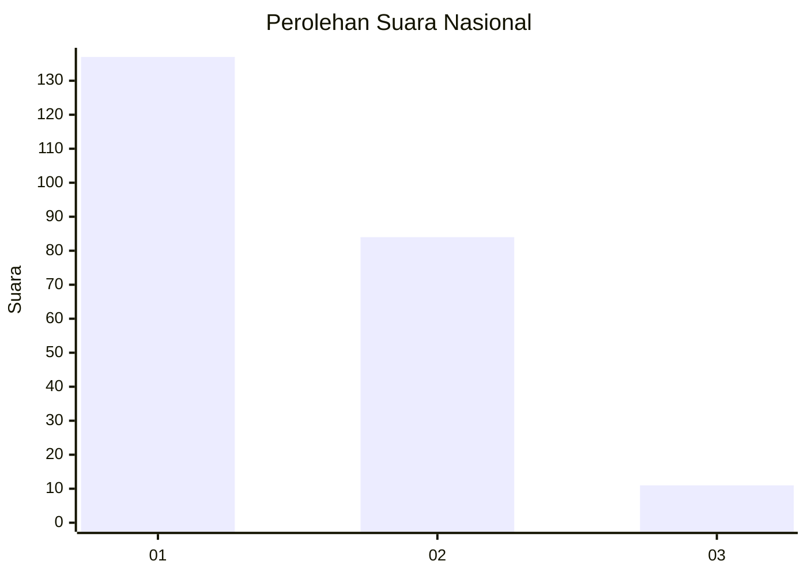
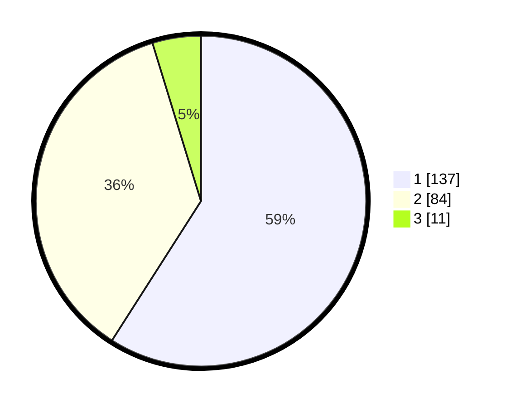

# Hasil

## Grafik

## Tabel

| No.    | Nama Paslon    | Suara | Suara (raw) | Persentase |
|:------ |:-------------- | -----:| -----------:| ----------:|
| 100025 | ANIES MUHAIMIN | 137   | [137][p-1]  | 59,05      |
| 100026 | PRABOWO GIBRAN | 84    | [84][p-2]   | 36,21      |
| 100027 | GANJAR MAHFUD  | 11    | [11][p-3]   | 4,74       |

[p-1]: https://github.com/gigit-pemilu/pemilu-2024/blob/main/pilpres/hitung-suara/sub/31-dki-jakarta/sub/73-jakarta-barat/sub/06-kalideres/sub/1002-semanan/sub/071-tps/sub/paslon-1.txt
[p-2]: https://github.com/gigit-pemilu/pemilu-2024/blob/main/pilpres/hitung-suara/sub/31-dki-jakarta/sub/73-jakarta-barat/sub/06-kalideres/sub/1002-semanan/sub/071-tps/sub/paslon-2.txt
[p-3]: https://github.com/gigit-pemilu/pemilu-2024/blob/main/pilpres/hitung-suara/sub/31-dki-jakarta/sub/73-jakarta-barat/sub/06-kalideres/sub/1002-semanan/sub/071-tps/sub/paslon-3.txt

## Foto C Plano

https://sirekap-obj-formc.kpu.go.id/5f6f/pemilu/ppwp/31/73/06/10/02/3173061002071-20240214-210439--04c96fda-edf3-4936-8f47-cf8eca01d7e0.jpg

https://sirekap-obj-formc.kpu.go.id/5f6f/pemilu/ppwp/31/73/06/10/02/3173061002071-20240214-210549--b835856d-3351-4e1b-88fb-da263a3fc5b6.jpg

https://sirekap-obj-formc.kpu.go.id/5f6f/pemilu/ppwp/31/73/06/10/02/3173061002071-20240214-211443--4fe46f70-8800-475c-85db-b88f8f7ae5b8.jpg

## Metadata

| Key        | Value               |
| ---------- | ------------------- |
| Time Stamp | 2024-02-17 14:56:33 |

