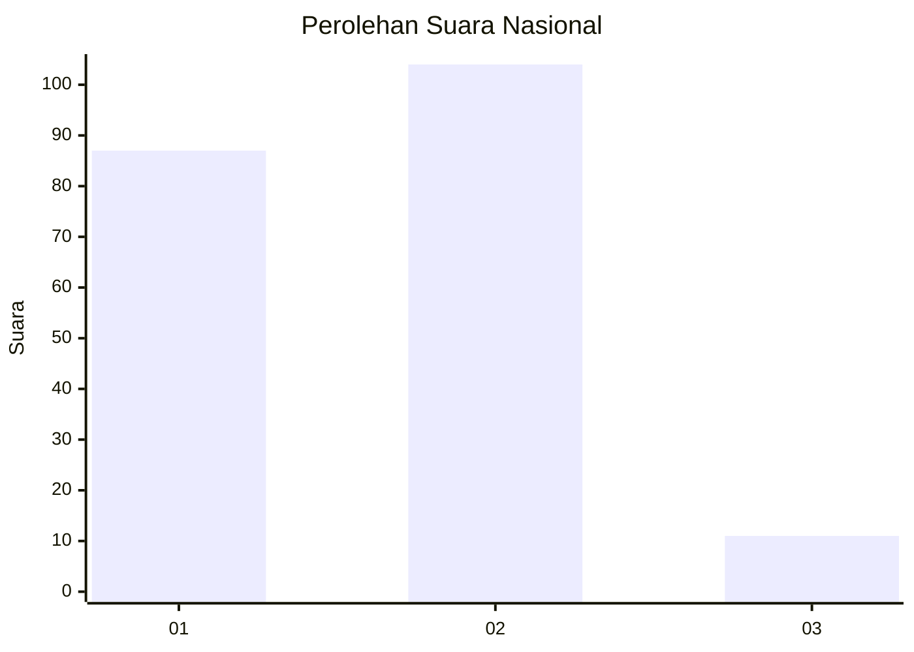
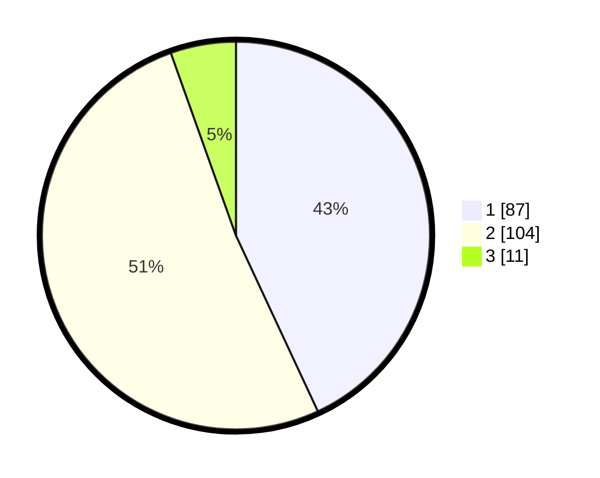

# Hasil

## Grafik

## Tabel

| No.    | Nama Paslon    | Suara | Suara (raw) | Persentase |
|:------ |:-------------- | -----:| -----------:| ----------:|
| 100025 | ANIES MUHAIMIN | 87    | [87][p-1]   | 43,07      |
| 100026 | PRABOWO GIBRAN | 104   | [104][p-2]  | 51,49      |
| 100027 | GANJAR MAHFUD  | 11    | [11][p-3]   | 5,45       |

[p-1]: https://github.com/gigit-pemilu/pemilu-2024/blob/main/pilpres/hitung-suara/sub/31-dki-jakarta/sub/73-jakarta-barat/sub/06-kalideres/sub/1002-semanan/sub/072-tps/sub/paslon-1.txt
[p-2]: https://github.com/gigit-pemilu/pemilu-2024/blob/main/pilpres/hitung-suara/sub/31-dki-jakarta/sub/73-jakarta-barat/sub/06-kalideres/sub/1002-semanan/sub/072-tps/sub/paslon-2.txt
[p-3]: https://github.com/gigit-pemilu/pemilu-2024/blob/main/pilpres/hitung-suara/sub/31-dki-jakarta/sub/73-jakarta-barat/sub/06-kalideres/sub/1002-semanan/sub/072-tps/sub/paslon-3.txt

## Foto C Plano

https://sirekap-obj-formc.kpu.go.id/2534/pemilu/ppwp/31/73/06/10/02/3173061002072-20240214-210238--10a77135-9b2c-4679-b3c0-5fd5ab1e6d14.jpg

https://sirekap-obj-formc.kpu.go.id/2534/pemilu/ppwp/31/73/06/10/02/3173061002072-20240214-210347--fa7c870f-a2a3-45a8-aba2-1849a71ea320.jpg

https://sirekap-obj-formc.kpu.go.id/2534/pemilu/ppwp/31/73/06/10/02/3173061002072-20240214-210454--35b102a9-0dea-49a2-adbf-560d90c40ce3.jpg

## Metadata

| Key        | Value               |
| ---------- | ------------------- |
| Time Stamp | 2024-02-15 20:30:46 |

