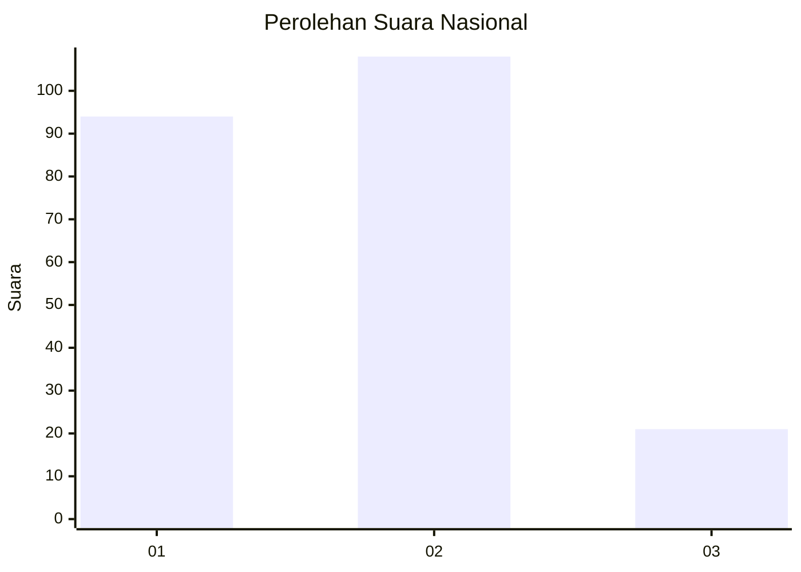
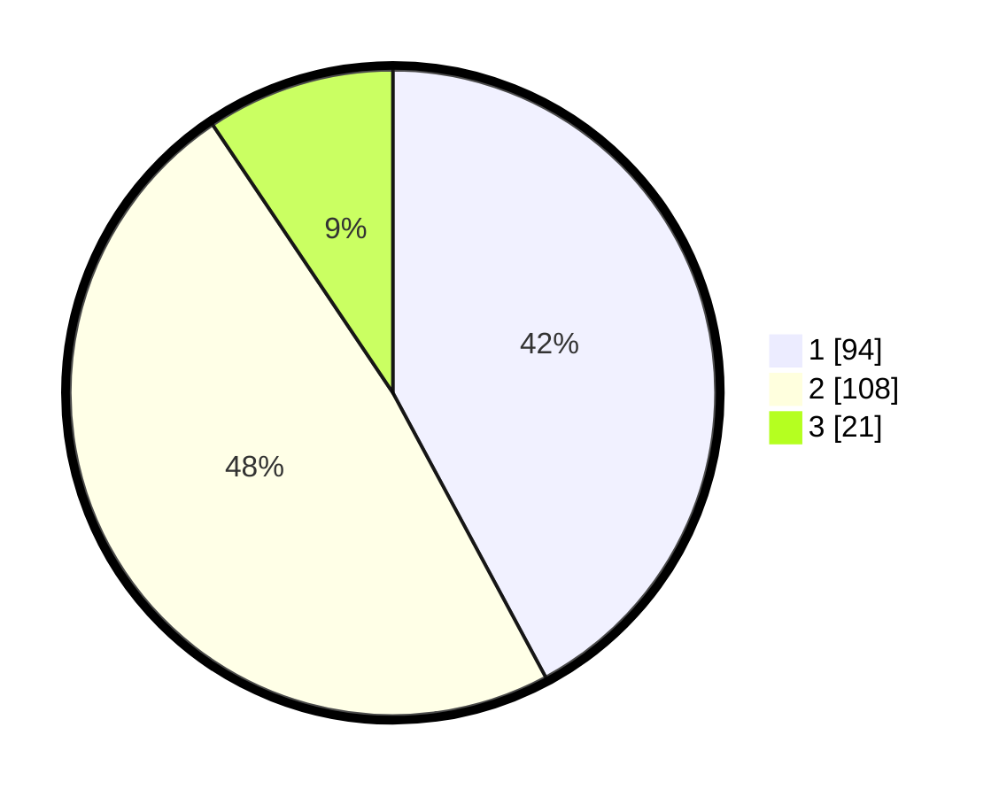

# Hasil

## Grafik

## Tabel

| No.    | Nama Paslon    | Suara | Suara (raw) | Persentase |
|:------ |:-------------- | -----:| -----------:| ----------:|
| 100025 | ANIES MUHAIMIN | 94    | [94][p-1]   | 42,15      |
| 100026 | PRABOWO GIBRAN | 108   | [108][p-2]  | 48,43      |
| 100027 | GANJAR MAHFUD  | 21    | [21][p-3]   | 9,42       |

[p-1]: https://github.com/gigit-pemilu/pemilu-2024/blob/main/pilpres/hitung-suara/sub/31-dki-jakarta/sub/73-jakarta-barat/sub/06-kalideres/sub/1002-semanan/sub/073-tps/sub/paslon-1.txt
[p-2]: https://github.com/gigit-pemilu/pemilu-2024/blob/main/pilpres/hitung-suara/sub/31-dki-jakarta/sub/73-jakarta-barat/sub/06-kalideres/sub/1002-semanan/sub/073-tps/sub/paslon-2.txt
[p-3]: https://github.com/gigit-pemilu/pemilu-2024/blob/main/pilpres/hitung-suara/sub/31-dki-jakarta/sub/73-jakarta-barat/sub/06-kalideres/sub/1002-semanan/sub/073-tps/sub/paslon-3.txt

## Foto C Plano

https://sirekap-obj-formc.kpu.go.id/becb/pemilu/ppwp/31/73/06/10/02/3173061002073-20240214-224957--ebe898e6-5ffc-4c2a-b644-9a94eebbbd03.jpg

https://sirekap-obj-formc.kpu.go.id/becb/pemilu/ppwp/31/73/06/10/02/3173061002073-20240214-212623--004d1a3f-8f5c-4adb-ad8f-c669de8e72b9.jpg

https://sirekap-obj-formc.kpu.go.id/becb/pemilu/ppwp/31/73/06/10/02/3173061002073-20240214-212848--ee6ef367-5fbb-428d-9218-a2a287bebc48.jpg

## Metadata

| Key        | Value               |
| ---------- | ------------------- |
| Time Stamp | 2024-02-16 22:01:00 |

