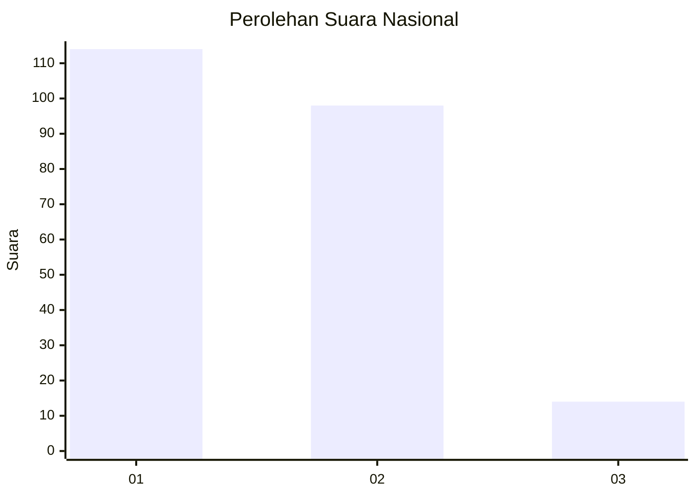
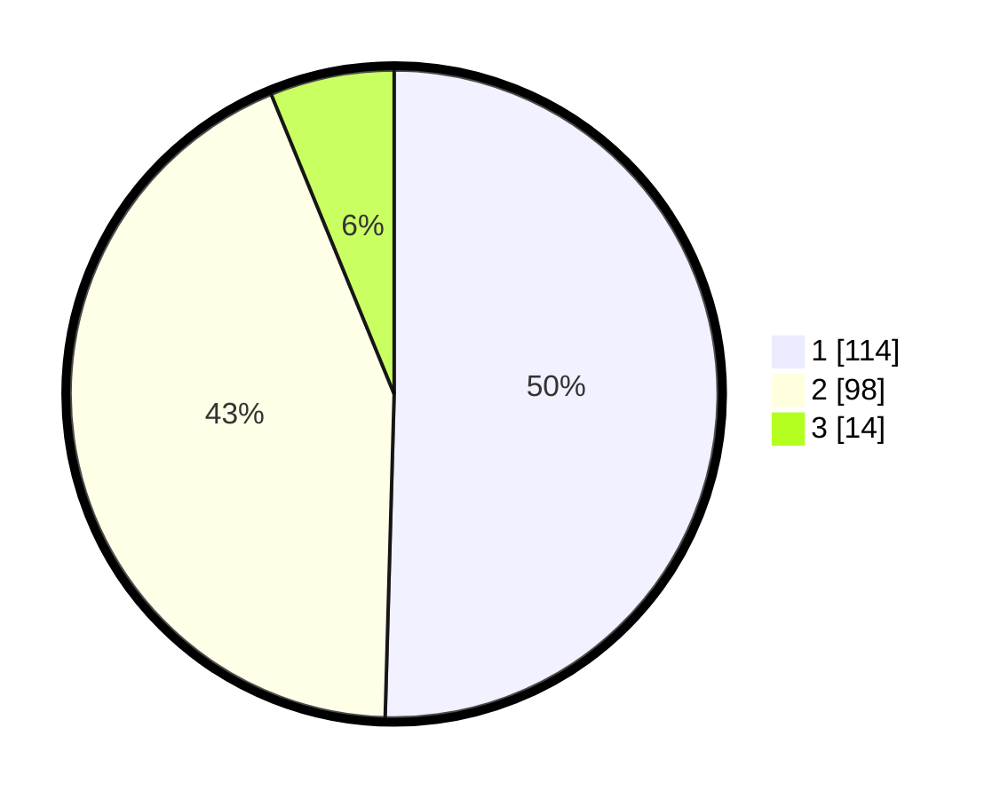

# Hasil

## Grafik

## Tabel

| No.    | Nama Paslon    | Suara | Suara (raw) | Persentase |
|:------ |:-------------- | -----:| -----------:| ----------:|
| 100025 | ANIES MUHAIMIN | 114   | [114][p-1]  | 50,44      |
| 100026 | PRABOWO GIBRAN | 98    | [98][p-2]   | 43,36      |
| 100027 | GANJAR MAHFUD  | 14    | [14][p-3]   | 6,19       |

[p-1]: https://github.com/gigit-pemilu/pemilu-2024/blob/main/pilpres/hitung-suara/sub/31-dki-jakarta/sub/73-jakarta-barat/sub/06-kalideres/sub/1002-semanan/sub/078-tps/sub/paslon-1.txt
[p-2]: https://github.com/gigit-pemilu/pemilu-2024/blob/main/pilpres/hitung-suara/sub/31-dki-jakarta/sub/73-jakarta-barat/sub/06-kalideres/sub/1002-semanan/sub/078-tps/sub/paslon-2.txt
[p-3]: https://github.com/gigit-pemilu/pemilu-2024/blob/main/pilpres/hitung-suara/sub/31-dki-jakarta/sub/73-jakarta-barat/sub/06-kalideres/sub/1002-semanan/sub/078-tps/sub/paslon-3.txt

## Foto C Plano

https://sirekap-obj-formc.kpu.go.id/f1ab/pemilu/ppwp/31/73/06/10/02/3173061002078-20240214-221324--6864a928-413c-4c8e-93cb-b3571c9b0d56.jpg

https://sirekap-obj-formc.kpu.go.id/f1ab/pemilu/ppwp/31/73/06/10/02/3173061002078-20240214-211145--bd3a84b4-aa4a-409e-b244-1772d2d42aa7.jpg

https://sirekap-obj-formc.kpu.go.id/f1ab/pemilu/ppwp/31/73/06/10/02/3173061002078-20240214-211434--769ccc7a-4fca-439e-9c67-24baacee53e6.jpg

## Metadata

| Key        | Value               |
| ---------- | ------------------- |
| Time Stamp | 2024-02-17 16:00:02 |

