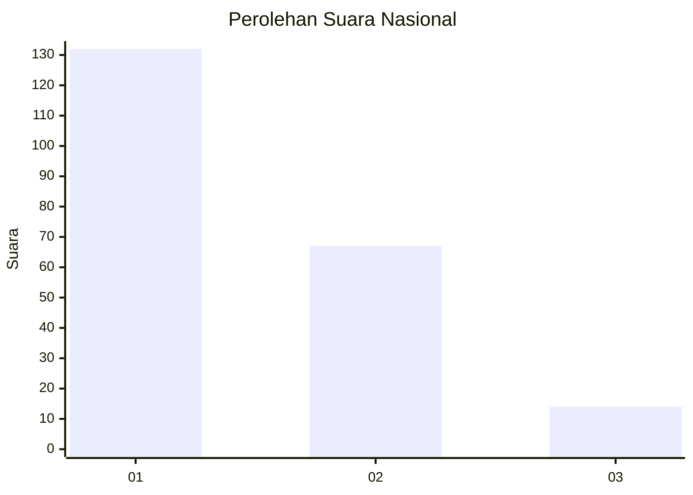
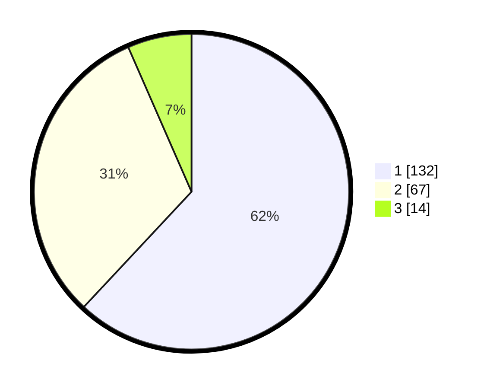

# Hasil

## Grafik

## Tabel

| No.    | Nama Paslon    | Suara | Suara (raw) | Persentase |
|:------ |:-------------- | -----:| -----------:| ----------:|
| 100025 | ANIES MUHAIMIN | 132   | [132][p-1]  | 61,97      |
| 100026 | PRABOWO GIBRAN | 67    | [67][p-2]   | 31,46      |
| 100027 | GANJAR MAHFUD  | 14    | [14][p-3]   | 6,57       |

[p-1]: https://github.com/gigit-pemilu/pemilu-2024/blob/main/pilpres/hitung-suara/sub/31-dki-jakarta/sub/73-jakarta-barat/sub/06-kalideres/sub/1002-semanan/sub/085-tps/sub/paslon-1.txt
[p-2]: https://github.com/gigit-pemilu/pemilu-2024/blob/main/pilpres/hitung-suara/sub/31-dki-jakarta/sub/73-jakarta-barat/sub/06-kalideres/sub/1002-semanan/sub/085-tps/sub/paslon-2.txt
[p-3]: https://github.com/gigit-pemilu/pemilu-2024/blob/main/pilpres/hitung-suara/sub/31-dki-jakarta/sub/73-jakarta-barat/sub/06-kalideres/sub/1002-semanan/sub/085-tps/sub/paslon-3.txt

## Foto C Plano

https://sirekap-obj-formc.kpu.go.id/6a95/pemilu/ppwp/31/73/06/10/02/3173061002085-20240214-155238--b83d4514-46d6-4404-8431-250b885e63b3.jpg

https://sirekap-obj-formc.kpu.go.id/6a95/pemilu/ppwp/31/73/06/10/02/3173061002085-20240214-155246--49d69e27-b083-4bb4-a1df-9a8b4f648873.jpg

https://sirekap-obj-formc.kpu.go.id/6a95/pemilu/ppwp/31/73/06/10/02/3173061002085-20240214-155252--983fdcaa-30ae-4e5d-98a3-ee46860d3b1e.jpg

## Metadata

| Key        | Value               |
| ---------- | ------------------- |
| Time Stamp | 2024-02-17 16:00:02 |

