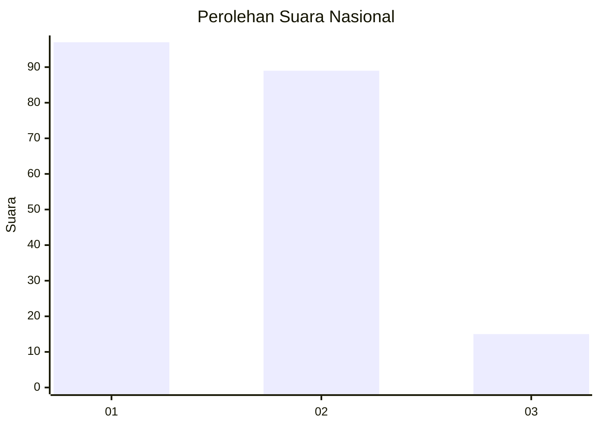
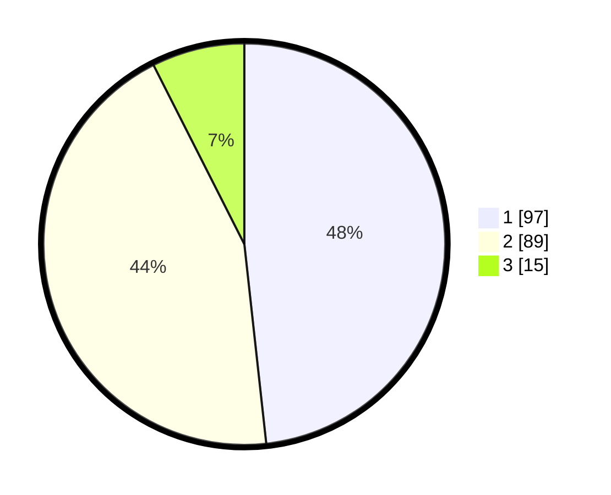

# Hasil

## Grafik

## Tabel

| No.    | Nama Paslon    | Suara | Suara (raw) | Persentase |
|:------ |:-------------- | -----:| -----------:| ----------:|
| 100025 | ANIES MUHAIMIN | 97    | [97][p-1]   | 48,26      |
| 100026 | PRABOWO GIBRAN | 89    | [89][p-2]   | 44,28      |
| 100027 | GANJAR MAHFUD  | 15    | [15][p-3]   | 7,46       |

[p-1]: https://github.com/gigit-pemilu/pemilu-2024/blob/main/pilpres/hitung-suara/sub/31-dki-jakarta/sub/73-jakarta-barat/sub/06-kalideres/sub/1002-semanan/sub/089-tps/sub/paslon-1.txt
[p-2]: https://github.com/gigit-pemilu/pemilu-2024/blob/main/pilpres/hitung-suara/sub/31-dki-jakarta/sub/73-jakarta-barat/sub/06-kalideres/sub/1002-semanan/sub/089-tps/sub/paslon-2.txt
[p-3]: https://github.com/gigit-pemilu/pemilu-2024/blob/main/pilpres/hitung-suara/sub/31-dki-jakarta/sub/73-jakarta-barat/sub/06-kalideres/sub/1002-semanan/sub/089-tps/sub/paslon-3.txt

## Foto C Plano

https://sirekap-obj-formc.kpu.go.id/c697/pemilu/ppwp/31/73/06/10/02/3173061002089-20240214-212958--6b451938-b0e1-4491-85dc-5e31d837d57f.jpg

https://sirekap-obj-formc.kpu.go.id/c697/pemilu/ppwp/31/73/06/10/02/3173061002089-20240214-213700--4ba4421a-f619-4f65-8af9-1d8676e36541.jpg

https://sirekap-obj-formc.kpu.go.id/c697/pemilu/ppwp/31/73/06/10/02/3173061002089-20240214-213331--477b24c8-2b63-41fd-bbc2-31eac9164271.jpg

## Metadata

| Key        | Value               |
| ---------- | ------------------- |
| Time Stamp | 2024-02-17 16:00:02 |

