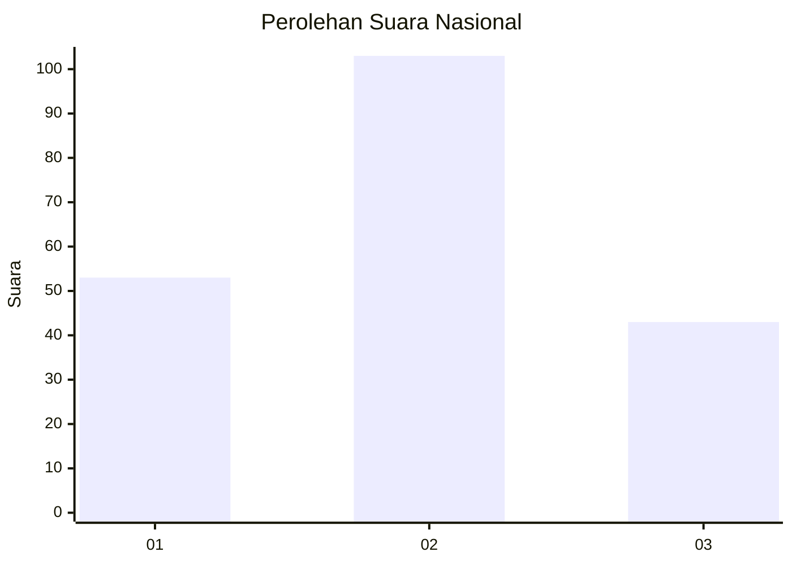
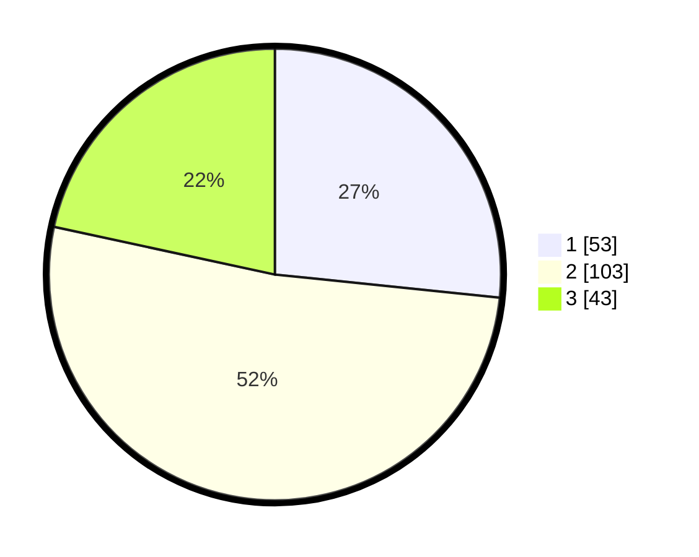

# Hasil

## Grafik

## Tabel

| No.    | Nama Paslon    | Suara | Suara (raw) | Persentase |
|:------ |:-------------- | -----:| -----------:| ----------:|
| 100025 | ANIES MUHAIMIN | 53    | [53][p-1]   | 26,63      |
| 100026 | PRABOWO GIBRAN | 103   | [103][p-2]  | 51,76      |
| 100027 | GANJAR MAHFUD  | 43    | [43][p-3]   | 21,61      |

[p-1]: https://github.com/gigit-pemilu/pemilu-2024/blob/main/pilpres/hitung-suara/sub/31-dki-jakarta/sub/73-jakarta-barat/sub/06-kalideres/sub/1002-semanan/sub/110-tps/sub/paslon-1.txt
[p-2]: https://github.com/gigit-pemilu/pemilu-2024/blob/main/pilpres/hitung-suara/sub/31-dki-jakarta/sub/73-jakarta-barat/sub/06-kalideres/sub/1002-semanan/sub/110-tps/sub/paslon-2.txt
[p-3]: https://github.com/gigit-pemilu/pemilu-2024/blob/main/pilpres/hitung-suara/sub/31-dki-jakarta/sub/73-jakarta-barat/sub/06-kalideres/sub/1002-semanan/sub/110-tps/sub/paslon-3.txt

## Foto C Plano

https://sirekap-obj-formc.kpu.go.id/72be/pemilu/ppwp/31/73/06/10/02/3173061002110-20240214-222127--b68870ac-81ae-48f0-b80e-56acd12d7e29.jpg

https://sirekap-obj-formc.kpu.go.id/72be/pemilu/ppwp/31/73/06/10/02/3173061002110-20240214-222255--dd24edc2-5bf9-4bef-af22-6328df94a416.jpg

https://sirekap-obj-formc.kpu.go.id/72be/pemilu/ppwp/31/73/06/10/02/3173061002110-20240214-230113--cf8f5caf-c165-4b85-96b2-32de6d45a130.jpg

## Metadata

| Key        | Value               |
| ---------- | ------------------- |
| Time Stamp | 2024-02-17 16:00:02 |

