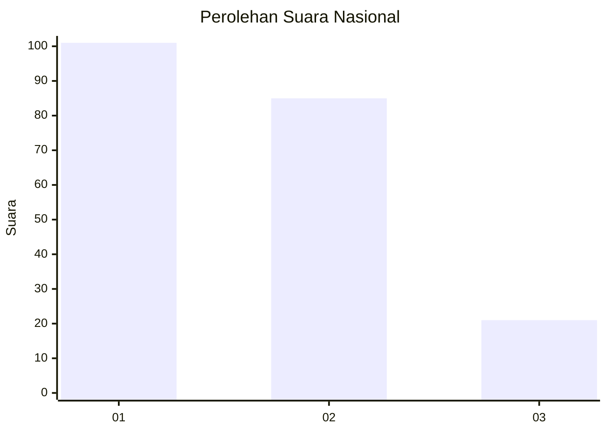
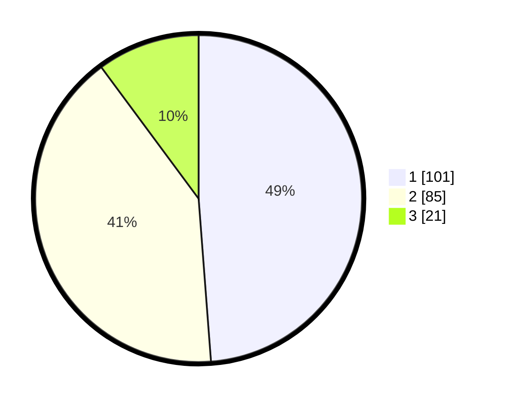

# Hasil

## Grafik

## Tabel

| No.    | Nama Paslon    | Suara | Suara (raw) | Persentase |
|:------ |:-------------- | -----:| -----------:| ----------:|
| 100025 | ANIES MUHAIMIN | 101   | [101][p-1]  | 48,79      |
| 100026 | PRABOWO GIBRAN | 85    | [85][p-2]   | 41,06      |
| 100027 | GANJAR MAHFUD  | 21    | [21][p-3]   | 10,14      |

[p-1]: https://github.com/gigit-pemilu/pemilu-2024/blob/main/pilpres/hitung-suara/sub/31-dki-jakarta/sub/73-jakarta-barat/sub/06-kalideres/sub/1002-semanan/sub/117-tps/sub/paslon-1.txt
[p-2]: https://github.com/gigit-pemilu/pemilu-2024/blob/main/pilpres/hitung-suara/sub/31-dki-jakarta/sub/73-jakarta-barat/sub/06-kalideres/sub/1002-semanan/sub/117-tps/sub/paslon-2.txt
[p-3]: https://github.com/gigit-pemilu/pemilu-2024/blob/main/pilpres/hitung-suara/sub/31-dki-jakarta/sub/73-jakarta-barat/sub/06-kalideres/sub/1002-semanan/sub/117-tps/sub/paslon-3.txt

## Foto C Plano

https://sirekap-obj-formc.kpu.go.id/5627/pemilu/ppwp/31/73/06/10/02/3173061002117-20240214-214531--166dbf8e-be28-4a80-b507-99870dfddd07.jpg

https://sirekap-obj-formc.kpu.go.id/5627/pemilu/ppwp/31/73/06/10/02/3173061002117-20240214-214812--36666199-f0ca-4763-ade1-b5a23f64d3a6.jpg

https://sirekap-obj-formc.kpu.go.id/5627/pemilu/ppwp/31/73/06/10/02/3173061002117-20240214-214846--2c1f8153-ab8e-43ca-9877-b7ef4145e9d0.jpg

## Metadata

| Key        | Value               |
| ---------- | ------------------- |
| Time Stamp | 2024-02-16 22:01:00 |

