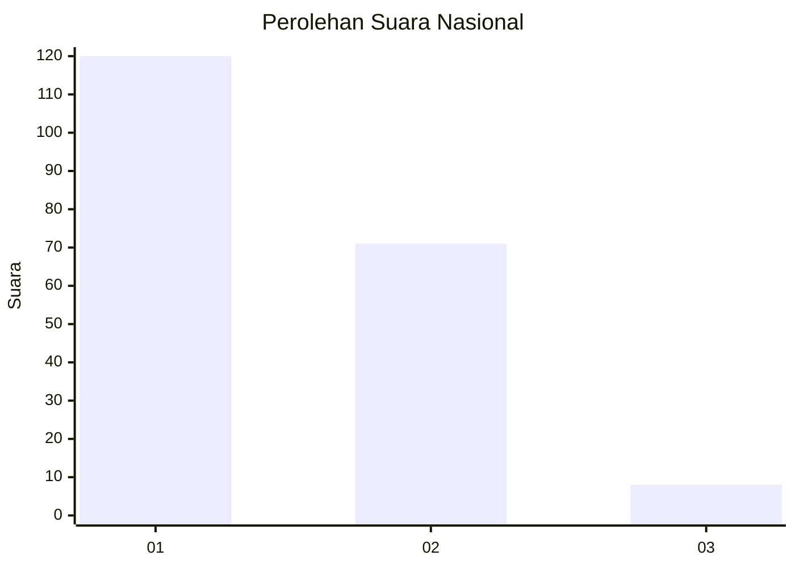
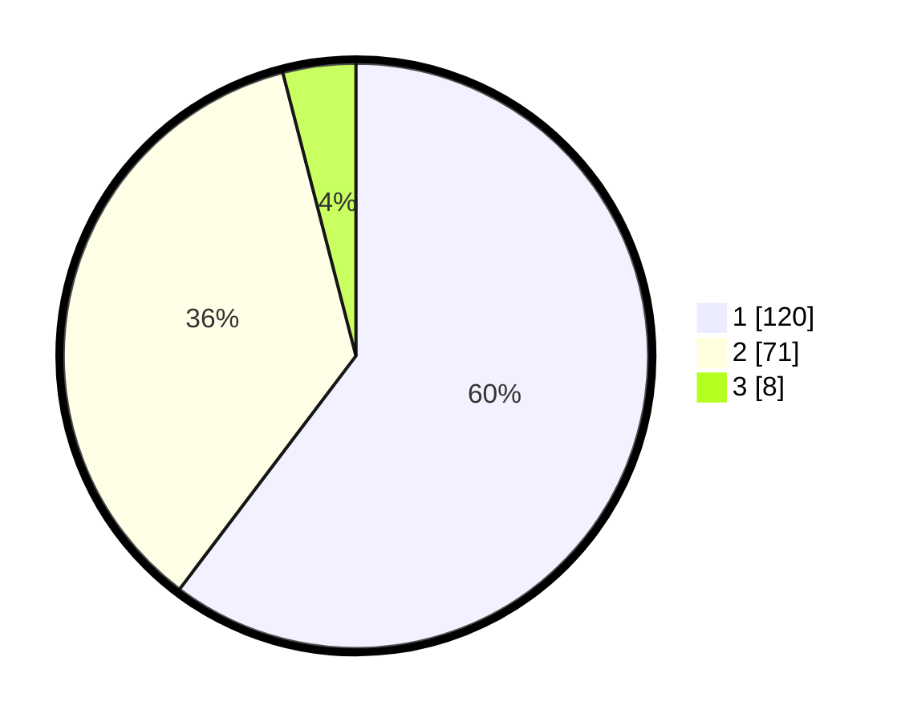

# Hasil

## Grafik

## Tabel

| No.    | Nama Paslon    | Suara | Suara (raw) | Persentase |
|:------ |:-------------- | -----:| -----------:| ----------:|
| 100025 | ANIES MUHAIMIN | 120   | [120][p-1]  | 60,30      |
| 100026 | PRABOWO GIBRAN | 71    | [71][p-2]   | 35,68      |
| 100027 | GANJAR MAHFUD  | 8     | [8][p-3]    | 4,02       |

[p-1]: https://github.com/gigit-pemilu/pemilu-2024/blob/main/pilpres/hitung-suara/sub/31-dki-jakarta/sub/73-jakarta-barat/sub/06-kalideres/sub/1002-semanan/sub/123-tps/sub/paslon-1.txt
[p-2]: https://github.com/gigit-pemilu/pemilu-2024/blob/main/pilpres/hitung-suara/sub/31-dki-jakarta/sub/73-jakarta-barat/sub/06-kalideres/sub/1002-semanan/sub/123-tps/sub/paslon-2.txt
[p-3]: https://github.com/gigit-pemilu/pemilu-2024/blob/main/pilpres/hitung-suara/sub/31-dki-jakarta/sub/73-jakarta-barat/sub/06-kalideres/sub/1002-semanan/sub/123-tps/sub/paslon-3.txt

## Foto C Plano

https://sirekap-obj-formc.kpu.go.id/8ec2/pemilu/ppwp/31/73/06/10/02/3173061002123-20240215-042104--e2f5a4f8-8529-40b9-b3ae-a7ff4cfdc3dd.jpg

https://sirekap-obj-formc.kpu.go.id/8ec2/pemilu/ppwp/31/73/06/10/02/3173061002123-20240215-042208--6efcac27-6b6d-46b0-aa03-7e54eda42673.jpg

https://sirekap-obj-formc.kpu.go.id/8ec2/pemilu/ppwp/31/73/06/10/02/3173061002123-20240215-042401--6fc616f1-744b-40a6-b7b3-6b9ac680f91c.jpg

## Metadata

| Key        | Value               |
| ---------- | ------------------- |
| Time Stamp | 2024-02-17 16:36:25 |

