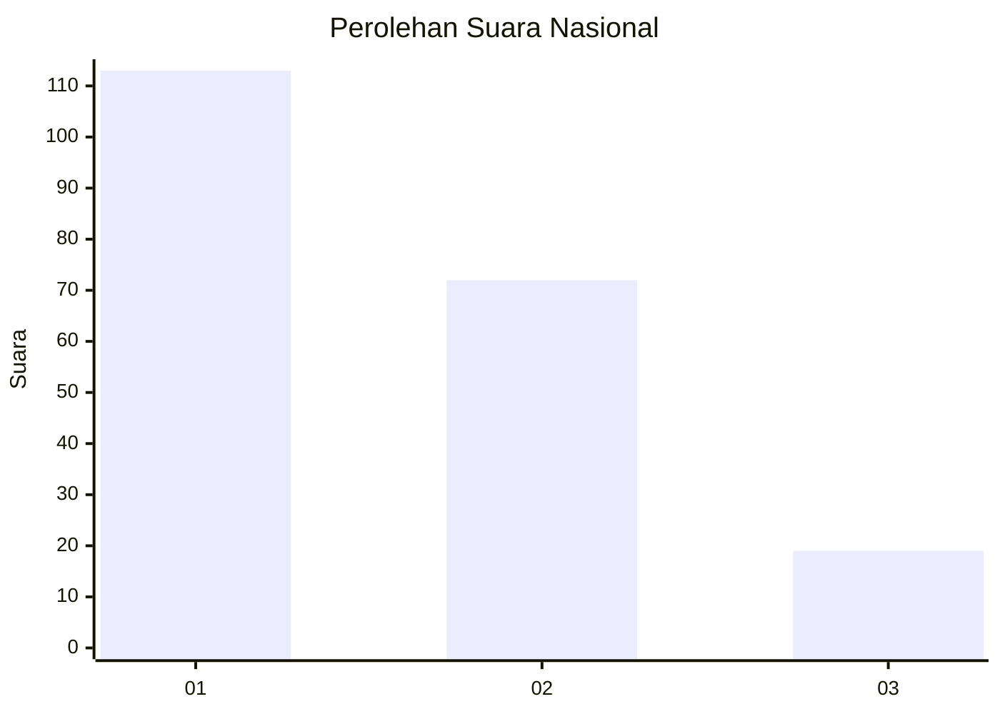
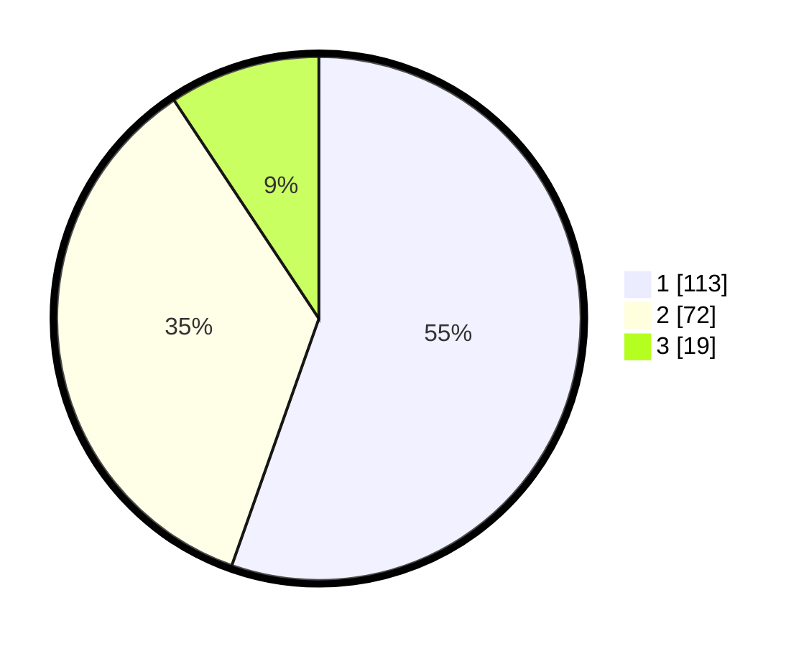

# Hasil

## Grafik

## Tabel

| No.    | Nama Paslon    | Suara | Suara (raw) | Persentase |
|:------ |:-------------- | -----:| -----------:| ----------:|
| 100025 | ANIES MUHAIMIN | 113   | [113][p-1]  | 55,39      |
| 100026 | PRABOWO GIBRAN | 72    | [72][p-2]   | 35,29      |
| 100027 | GANJAR MAHFUD  | 19    | [19][p-3]   | 9,31       |

[p-1]: https://github.com/gigit-pemilu/pemilu-2024/blob/main/pilpres/hitung-suara/sub/31-dki-jakarta/sub/73-jakarta-barat/sub/06-kalideres/sub/1002-semanan/sub/125-tps/sub/paslon-1.txt
[p-2]: https://github.com/gigit-pemilu/pemilu-2024/blob/main/pilpres/hitung-suara/sub/31-dki-jakarta/sub/73-jakarta-barat/sub/06-kalideres/sub/1002-semanan/sub/125-tps/sub/paslon-2.txt
[p-3]: https://github.com/gigit-pemilu/pemilu-2024/blob/main/pilpres/hitung-suara/sub/31-dki-jakarta/sub/73-jakarta-barat/sub/06-kalideres/sub/1002-semanan/sub/125-tps/sub/paslon-3.txt

## Foto C Plano

https://sirekap-obj-formc.kpu.go.id/7fcb/pemilu/ppwp/31/73/06/10/02/3173061002125-20240215-043153--113216c0-82d4-4d2e-bd24-b75347f68bc6.jpg

https://sirekap-obj-formc.kpu.go.id/7fcb/pemilu/ppwp/31/73/06/10/02/3173061002125-20240215-043242--f54c0ccf-f18a-4bda-909b-ee21ae8d3ab7.jpg

https://sirekap-obj-formc.kpu.go.id/7fcb/pemilu/ppwp/31/73/06/10/02/3173061002125-20240215-043602--e4ad621d-a3a9-4de0-b082-40b4f7d49405.jpg

## Metadata

| Key        | Value               |
| ---------- | ------------------- |
| Time Stamp | 2024-02-16 22:01:00 |

