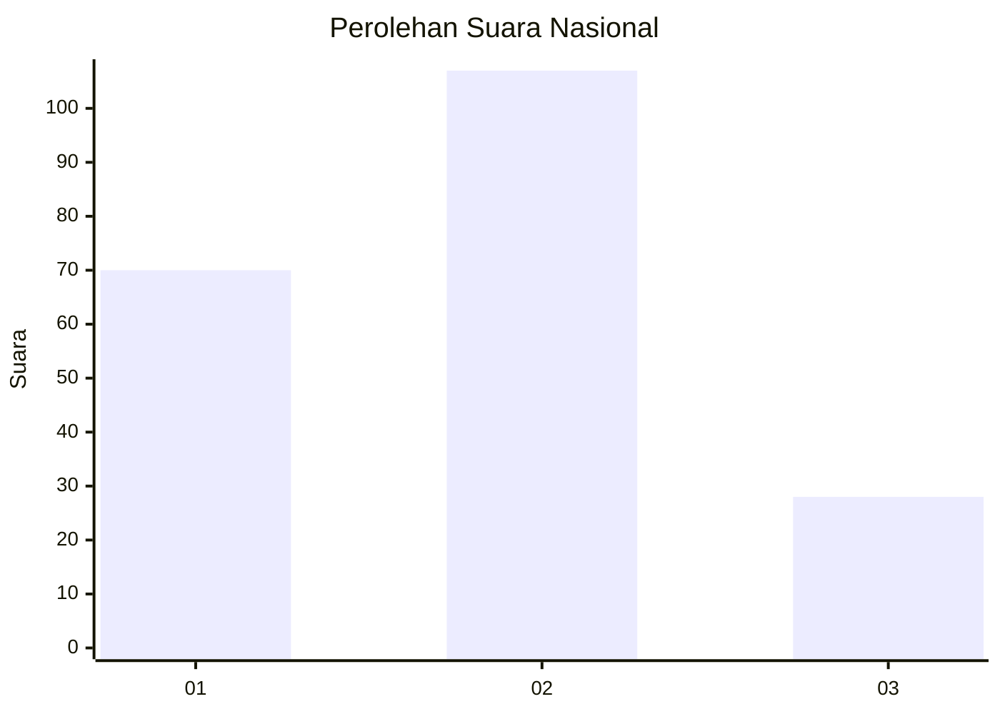
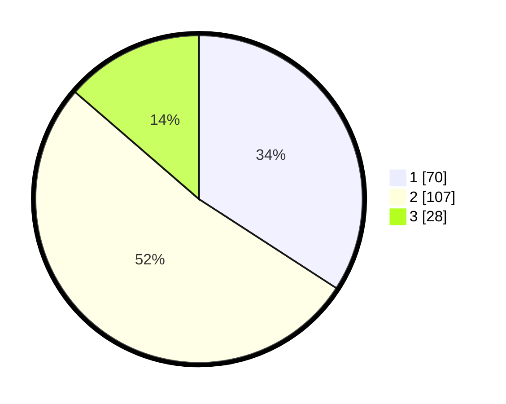

# Hasil

## Grafik

## Tabel

| No.    | Nama Paslon    | Suara | Suara (raw) | Persentase |
|:------ |:-------------- | -----:| -----------:| ----------:|
| 100025 | ANIES MUHAIMIN | 70    | [70][p-1]   | 34,15      |
| 100026 | PRABOWO GIBRAN | 107   | [107][p-2]  | 52,20      |
| 100027 | GANJAR MAHFUD  | 28    | [28][p-3]   | 13,66      |

[p-1]: https://github.com/gigit-pemilu/pemilu-2024/blob/main/pilpres/hitung-suara/sub/31-dki-jakarta/sub/73-jakarta-barat/sub/06-kalideres/sub/1002-semanan/sub/132-tps/sub/paslon-1.txt
[p-2]: https://github.com/gigit-pemilu/pemilu-2024/blob/main/pilpres/hitung-suara/sub/31-dki-jakarta/sub/73-jakarta-barat/sub/06-kalideres/sub/1002-semanan/sub/132-tps/sub/paslon-2.txt
[p-3]: https://github.com/gigit-pemilu/pemilu-2024/blob/main/pilpres/hitung-suara/sub/31-dki-jakarta/sub/73-jakarta-barat/sub/06-kalideres/sub/1002-semanan/sub/132-tps/sub/paslon-3.txt

## Foto C Plano

https://sirekap-obj-formc.kpu.go.id/7b16/pemilu/ppwp/31/73/06/10/02/3173061002132-20240215-031003--a08a4614-6d4c-443e-964c-307c36100728.jpg

https://sirekap-obj-formc.kpu.go.id/7b16/pemilu/ppwp/31/73/06/10/02/3173061002132-20240215-003001--204ef20e-852e-4ce9-bb99-22cbecf523e5.jpg

https://sirekap-obj-formc.kpu.go.id/7b16/pemilu/ppwp/31/73/06/10/02/3173061002132-20240215-031717--19235da7-77b3-484e-b61d-1b77e004ba0a.jpg

## Metadata

| Key        | Value               |
| ---------- | ------------------- |
| Time Stamp | 2024-02-16 22:01:00 |

