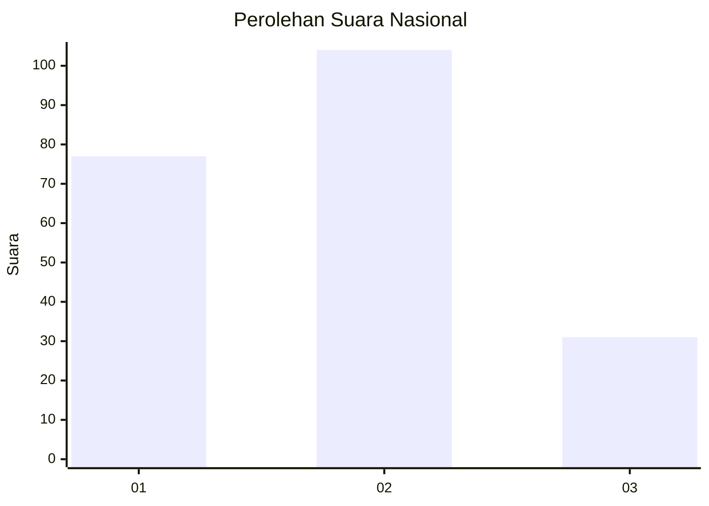
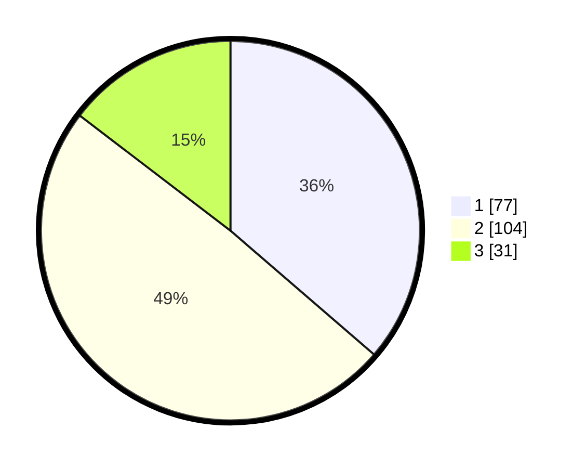

# Hasil

## Grafik

## Tabel

| No.    | Nama Paslon    | Suara | Suara (raw) | Persentase |
|:------ |:-------------- | -----:| -----------:| ----------:|
| 100025 | ANIES MUHAIMIN | 77    | [77][p-1]   | 36,32      |
| 100026 | PRABOWO GIBRAN | 104   | [104][p-2]  | 49,06      |
| 100027 | GANJAR MAHFUD  | 31    | [31][p-3]   | 14,62      |

[p-1]: https://github.com/gigit-pemilu/pemilu-2024/blob/main/pilpres/hitung-suara/sub/31-dki-jakarta/sub/73-jakarta-barat/sub/06-kalideres/sub/1002-semanan/sub/138-tps/sub/paslon-1.txt
[p-2]: https://github.com/gigit-pemilu/pemilu-2024/blob/main/pilpres/hitung-suara/sub/31-dki-jakarta/sub/73-jakarta-barat/sub/06-kalideres/sub/1002-semanan/sub/138-tps/sub/paslon-2.txt
[p-3]: https://github.com/gigit-pemilu/pemilu-2024/blob/main/pilpres/hitung-suara/sub/31-dki-jakarta/sub/73-jakarta-barat/sub/06-kalideres/sub/1002-semanan/sub/138-tps/sub/paslon-3.txt

## Foto C Plano

https://sirekap-obj-formc.kpu.go.id/23df/pemilu/ppwp/31/73/06/10/02/3173061002138-20240215-004354--ce57fd48-f162-4845-a553-5c7ea566263c.jpg

https://sirekap-obj-formc.kpu.go.id/23df/pemilu/ppwp/31/73/06/10/02/3173061002138-20240215-004528--c022cfb0-279c-457c-a8cd-8d1e3267e189.jpg

https://sirekap-obj-formc.kpu.go.id/23df/pemilu/ppwp/31/73/06/10/02/3173061002138-20240215-004629--6f0d2e7a-1a28-44ca-8977-2d14bcb43e3f.jpg

## Metadata

| Key        | Value               |
| ---------- | ------------------- |
| Time Stamp | 2024-02-17 17:00:04 |

