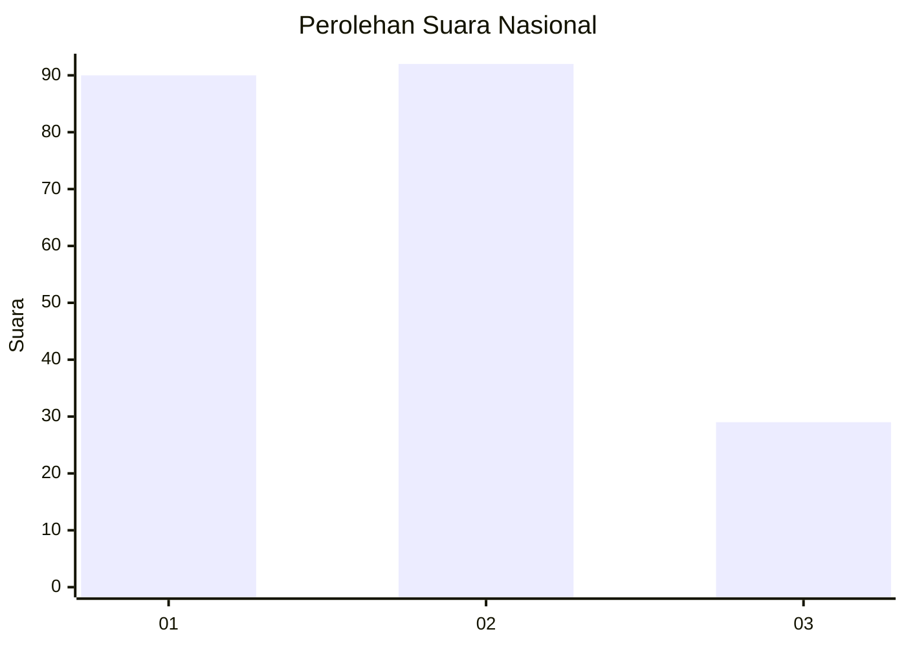
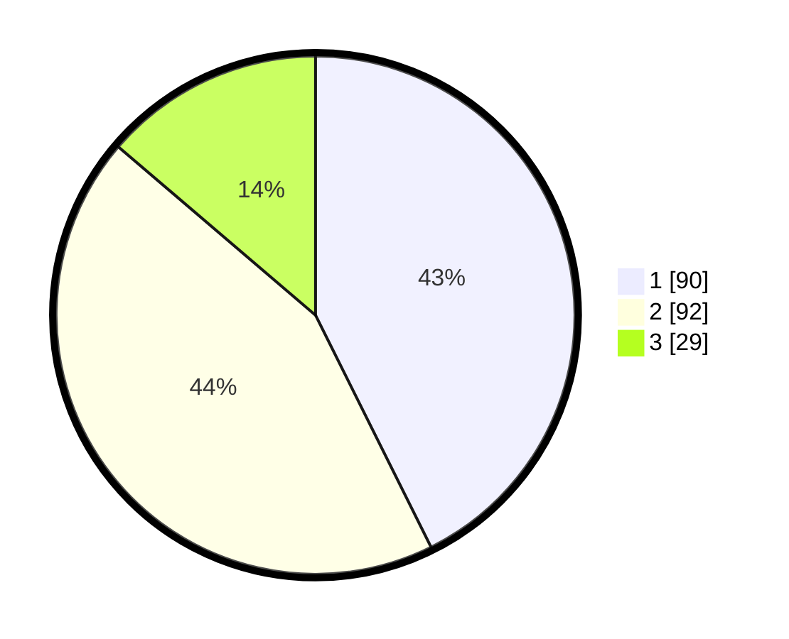

# Hasil

## Grafik

## Tabel

| No.    | Nama Paslon    | Suara | Suara (raw) | Persentase |
|:------ |:-------------- | -----:| -----------:| ----------:|
| 100025 | ANIES MUHAIMIN | 90    | [90][p-1]   | 42,65      |
| 100026 | PRABOWO GIBRAN | 92    | [92][p-2]   | 43,60      |
| 100027 | GANJAR MAHFUD  | 29    | [29][p-3]   | 13,74      |

[p-1]: https://github.com/gigit-pemilu/pemilu-2024/blob/main/pilpres/hitung-suara/sub/31-dki-jakarta/sub/73-jakarta-barat/sub/06-kalideres/sub/1002-semanan/sub/139-tps/sub/paslon-1.txt
[p-2]: https://github.com/gigit-pemilu/pemilu-2024/blob/main/pilpres/hitung-suara/sub/31-dki-jakarta/sub/73-jakarta-barat/sub/06-kalideres/sub/1002-semanan/sub/139-tps/sub/paslon-2.txt
[p-3]: https://github.com/gigit-pemilu/pemilu-2024/blob/main/pilpres/hitung-suara/sub/31-dki-jakarta/sub/73-jakarta-barat/sub/06-kalideres/sub/1002-semanan/sub/139-tps/sub/paslon-3.txt

## Foto C Plano

https://sirekap-obj-formc.kpu.go.id/fc4a/pemilu/ppwp/31/73/06/10/02/3173061002139-20240214-225102--88872145-9b7b-4a6e-88d0-b387548476c7.jpg

https://sirekap-obj-formc.kpu.go.id/fc4a/pemilu/ppwp/31/73/06/10/02/3173061002139-20240214-230247--aaf44707-b190-4dcb-98b6-794b714a1d09.jpg

https://sirekap-obj-formc.kpu.go.id/fc4a/pemilu/ppwp/31/73/06/10/02/3173061002139-20240214-230422--52d28630-2621-4774-bdb7-fb9a5d037676.jpg

## Metadata

| Key        | Value               |
| ---------- | ------------------- |
| Time Stamp | 2024-02-17 17:00:04 |

