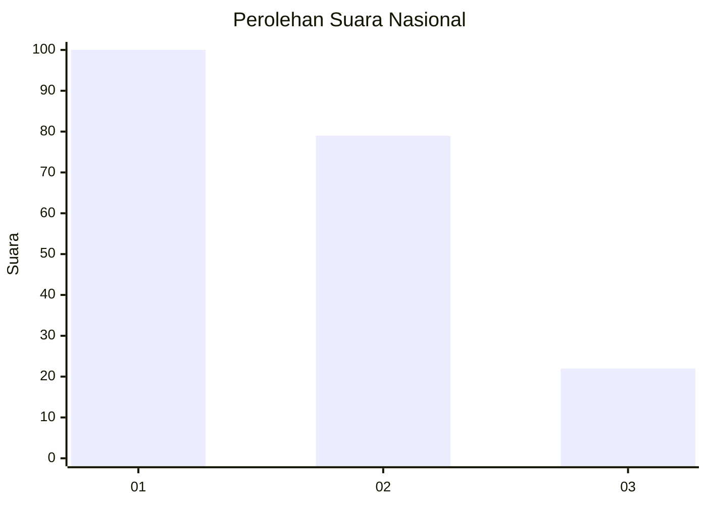
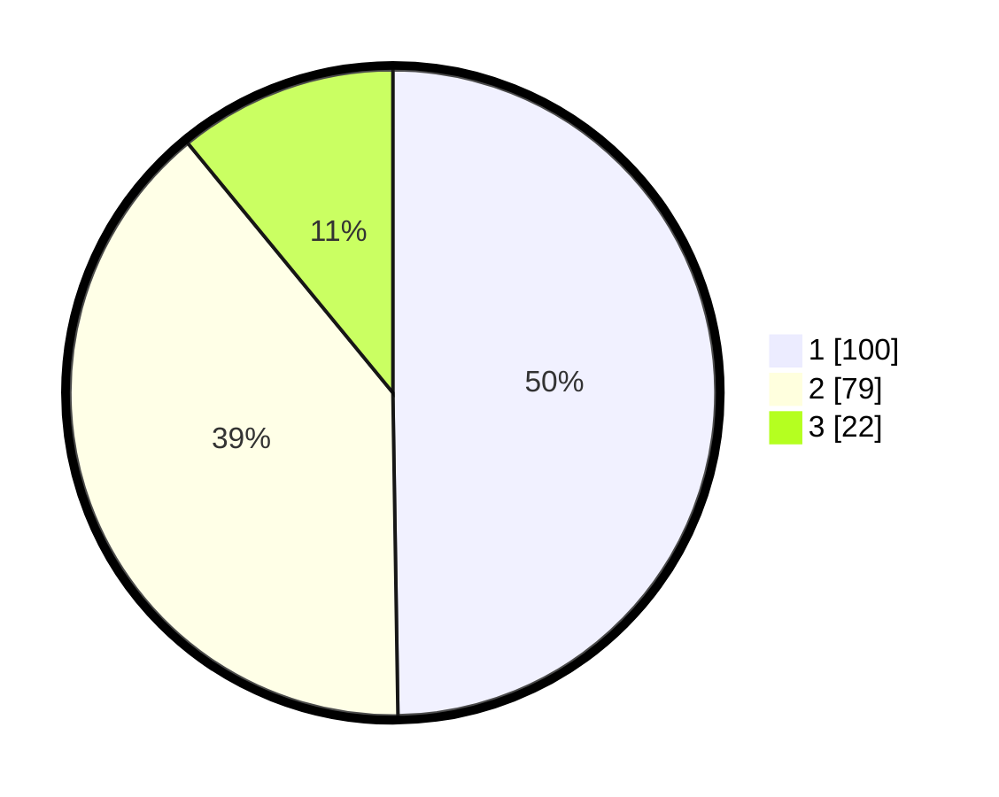

# Hasil

## Grafik

## Tabel

| No.    | Nama Paslon    | Suara | Suara (raw) | Persentase |
|:------ |:-------------- | -----:| -----------:| ----------:|
| 100025 | ANIES MUHAIMIN | 100   | [100][p-1]  | 49,75      |
| 100026 | PRABOWO GIBRAN | 79    | [79][p-2]   | 39,30      |
| 100027 | GANJAR MAHFUD  | 22    | [22][p-3]   | 10,95      |

[p-1]: https://github.com/gigit-pemilu/pemilu-2024/blob/main/pilpres/hitung-suara/sub/31-dki-jakarta/sub/73-jakarta-barat/sub/06-kalideres/sub/1002-semanan/sub/146-tps/sub/paslon-1.txt
[p-2]: https://github.com/gigit-pemilu/pemilu-2024/blob/main/pilpres/hitung-suara/sub/31-dki-jakarta/sub/73-jakarta-barat/sub/06-kalideres/sub/1002-semanan/sub/146-tps/sub/paslon-2.txt
[p-3]: https://github.com/gigit-pemilu/pemilu-2024/blob/main/pilpres/hitung-suara/sub/31-dki-jakarta/sub/73-jakarta-barat/sub/06-kalideres/sub/1002-semanan/sub/146-tps/sub/paslon-3.txt

## Foto C Plano

https://sirekap-obj-formc.kpu.go.id/6ca4/pemilu/ppwp/31/73/06/10/02/3173061002146-20240214-221300--3fb8d98e-e9a1-4c98-a66f-bbf07bbf9dec.jpg

https://sirekap-obj-formc.kpu.go.id/6ca4/pemilu/ppwp/31/73/06/10/02/3173061002146-20240214-220741--7d291e5a-4c2a-4b1f-a1f9-0e8f855dc3d8.jpg

https://sirekap-obj-formc.kpu.go.id/6ca4/pemilu/ppwp/31/73/06/10/02/3173061002146-20240214-220414--d88cf10f-3a7c-4844-8311-429bdb07240d.jpg

## Metadata

| Key        | Value               |
| ---------- | ------------------- |
| Time Stamp | 2024-02-17 17:30:00 |

