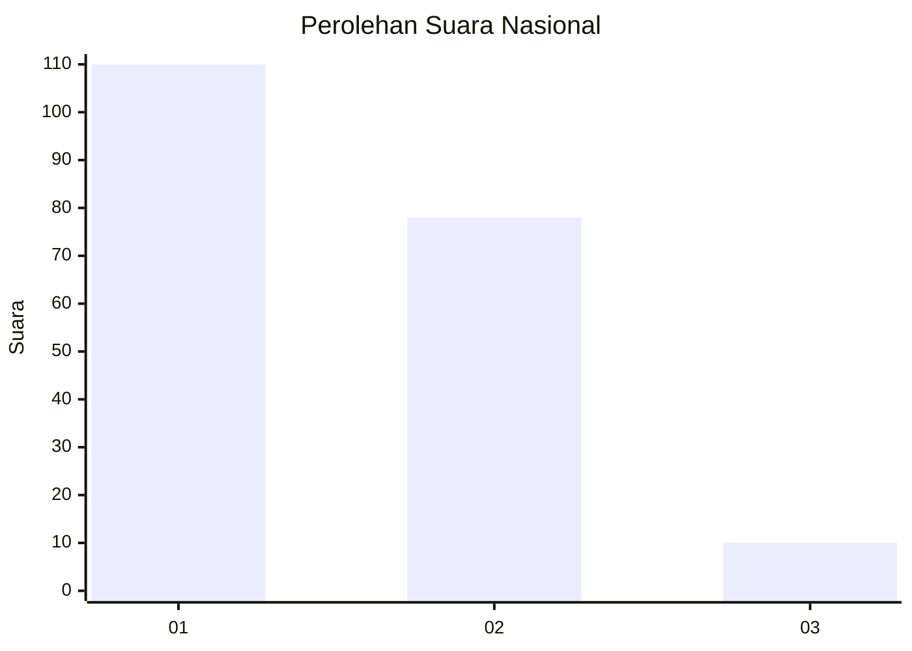
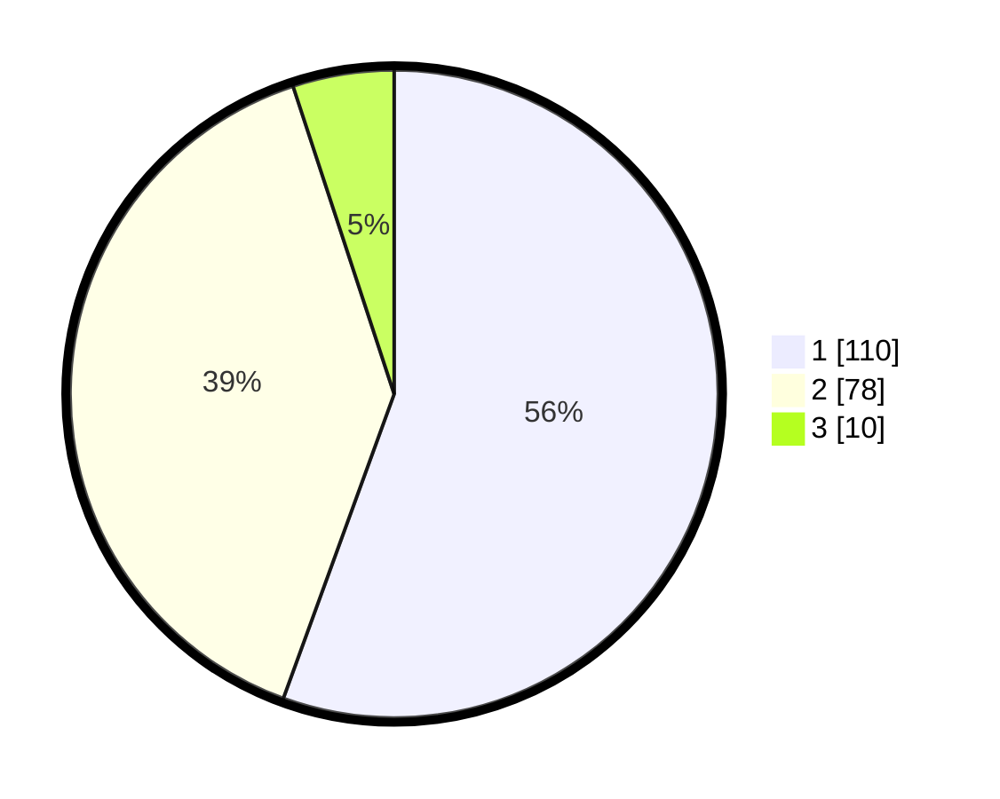

# Hasil

## Grafik

## Tabel

| No.    | Nama Paslon    | Suara | Suara (raw) | Persentase |
|:------ |:-------------- | -----:| -----------:| ----------:|
| 100025 | ANIES MUHAIMIN | 110   | [110][p-1]  | 55,56      |
| 100026 | PRABOWO GIBRAN | 78    | [78][p-2]   | 39,39      |
| 100027 | GANJAR MAHFUD  | 10    | [10][p-3]   | 5,05       |

[p-1]: https://github.com/gigit-pemilu/pemilu-2024/blob/main/pilpres/hitung-suara/sub/31-dki-jakarta/sub/73-jakarta-barat/sub/06-kalideres/sub/1002-semanan/sub/157-tps/sub/paslon-1.txt
[p-2]: https://github.com/gigit-pemilu/pemilu-2024/blob/main/pilpres/hitung-suara/sub/31-dki-jakarta/sub/73-jakarta-barat/sub/06-kalideres/sub/1002-semanan/sub/157-tps/sub/paslon-2.txt
[p-3]: https://github.com/gigit-pemilu/pemilu-2024/blob/main/pilpres/hitung-suara/sub/31-dki-jakarta/sub/73-jakarta-barat/sub/06-kalideres/sub/1002-semanan/sub/157-tps/sub/paslon-3.txt

## Foto C Plano

https://sirekap-obj-formc.kpu.go.id/90da/pemilu/ppwp/31/73/06/10/02/3173061002157-20240214-224419--cdb7f332-42a3-4626-bc12-00629ea14e43.jpg

https://sirekap-obj-formc.kpu.go.id/90da/pemilu/ppwp/31/73/06/10/02/3173061002157-20240214-225001--adb51723-1baa-4ee6-b29b-ecbf65ca7130.jpg

https://sirekap-obj-formc.kpu.go.id/90da/pemilu/ppwp/31/73/06/10/02/3173061002157-20240214-225124--b54d9e2c-7c9e-44c3-be45-79da45e31dc8.jpg

## Metadata

| Key        | Value               |
| ---------- | ------------------- |
| Time Stamp | 2024-02-16 22:01:00 |

