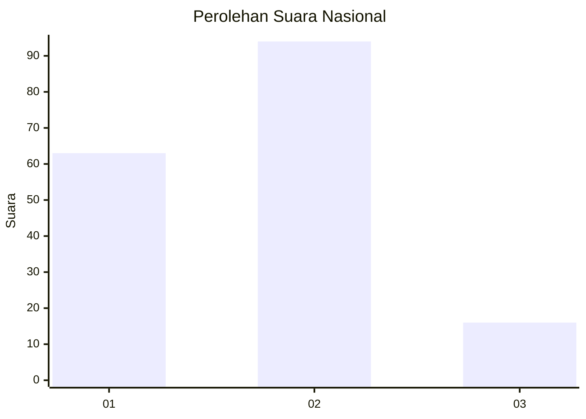

# Hasil

## Grafik

## Tabel

| No.    | Nama Paslon    | Suara | Suara (raw) | Persentase |
|:------ |:-------------- | -----:| -----------:| ----------:|
| 100025 | ANIES MUHAIMIN | 63    | [63][p-1]   | 36,42      |
| 100026 | PRABOWO GIBRAN | 94    | [94][p-2]   | 54,34      |
| 100027 | GANJAR MAHFUD  | 16    | [16][p-3]   | 9,25       |

[p-1]: https://github.com/gigit-pemilu/pemilu-2024/blob/main/pilpres/hitung-suara/sub/31-dki-jakarta/sub/73-jakarta-barat/sub/06-kalideres/sub/1002-semanan/sub/159-tps/sub/paslon-1.txt
[p-2]: https://github.com/gigit-pemilu/pemilu-2024/blob/main/pilpres/hitung-suara/sub/31-dki-jakarta/sub/73-jakarta-barat/sub/06-kalideres/sub/1002-semanan/sub/159-tps/sub/paslon-2.txt
[p-3]: https://github.com/gigit-pemilu/pemilu-2024/blob/main/pilpres/hitung-suara/sub/31-dki-jakarta/sub/73-jakarta-barat/sub/06-kalideres/sub/1002-semanan/sub/159-tps/sub/paslon-3.txt

## Foto C Plano

https://sirekap-obj-formc.kpu.go.id/6105/pemilu/ppwp/31/73/06/10/02/3173061002159-20240214-210346--ae1490c4-4695-47bd-8347-8c158632f057.jpg

https://sirekap-obj-formc.kpu.go.id/6105/pemilu/ppwp/31/73/06/10/02/3173061002159-20240214-210658--40270d7e-48f2-4830-a211-1e5f2e657d82.jpg

https://sirekap-obj-formc.kpu.go.id/6105/pemilu/ppwp/31/73/06/10/02/3173061002159-20240214-210756--609deac1-1a86-430b-8943-82aa8023014d.jpg

## Metadata

| Key        | Value               |
| ---------- | ------------------- |
| Time Stamp | 2024-02-17 17:30:00 |

