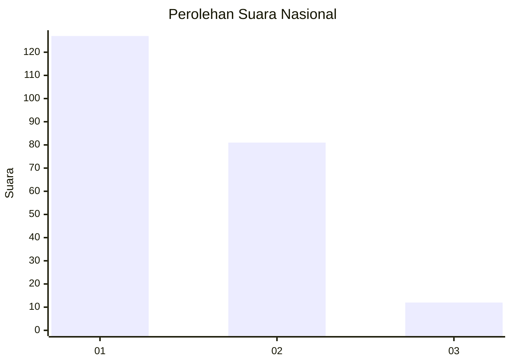
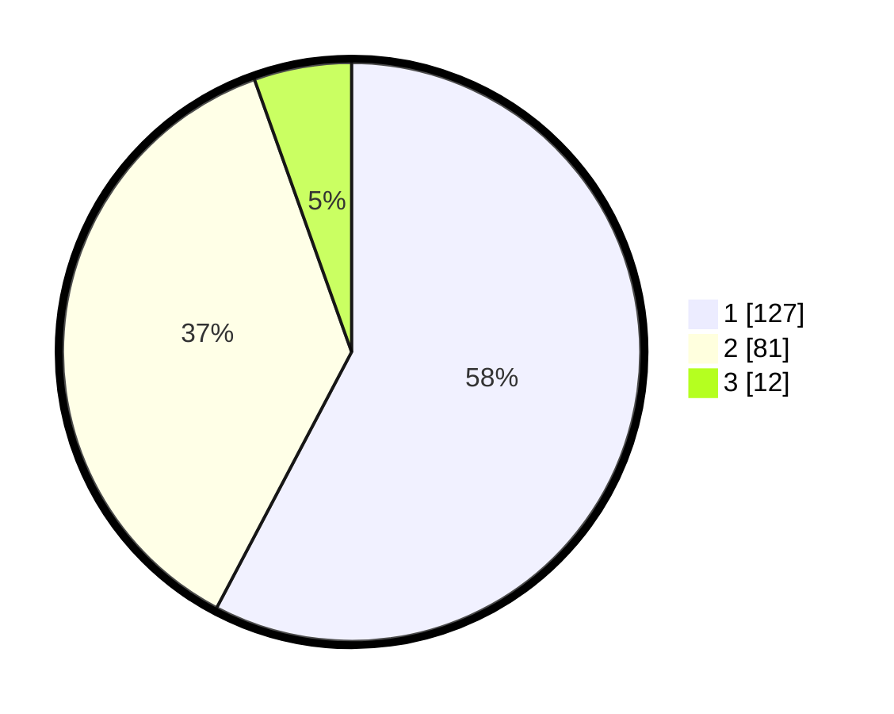

# Hasil

## Grafik

## Tabel

| No.    | Nama Paslon    | Suara | Suara (raw) | Persentase |
|:------ |:-------------- | -----:| -----------:| ----------:|
| 100025 | ANIES MUHAIMIN | 127   | [127][p-1]  | 57,73      |
| 100026 | PRABOWO GIBRAN | 81    | [81][p-2]   | 36,82      |
| 100027 | GANJAR MAHFUD  | 12    | [12][p-3]   | 5,45       |

[p-1]: https://github.com/gigit-pemilu/pemilu-2024/blob/main/pilpres/hitung-suara/sub/31-dki-jakarta/sub/73-jakarta-barat/sub/06-kalideres/sub/1002-semanan/sub/182-tps/sub/paslon-1.txt
[p-2]: https://github.com/gigit-pemilu/pemilu-2024/blob/main/pilpres/hitung-suara/sub/31-dki-jakarta/sub/73-jakarta-barat/sub/06-kalideres/sub/1002-semanan/sub/182-tps/sub/paslon-2.txt
[p-3]: https://github.com/gigit-pemilu/pemilu-2024/blob/main/pilpres/hitung-suara/sub/31-dki-jakarta/sub/73-jakarta-barat/sub/06-kalideres/sub/1002-semanan/sub/182-tps/sub/paslon-3.txt

## Foto C Plano

https://sirekap-obj-formc.kpu.go.id/a226/pemilu/ppwp/31/73/06/10/02/3173061002182-20240214-220212--9ae6c3b2-94d9-4ccf-81b9-fa1f1b8a5990.jpg

https://sirekap-obj-formc.kpu.go.id/a226/pemilu/ppwp/31/73/06/10/02/3173061002182-20240214-220514--b87bffad-9724-4ee8-93b1-8b00d5cbbede.jpg

https://sirekap-obj-formc.kpu.go.id/a226/pemilu/ppwp/31/73/06/10/02/3173061002182-20240214-220924--1a240a47-e2f5-426c-b418-4bd6a0bddf24.jpg

## Metadata

| Key        | Value               |
| ---------- | ------------------- |
| Time Stamp | 2024-02-17 18:00:00 |

