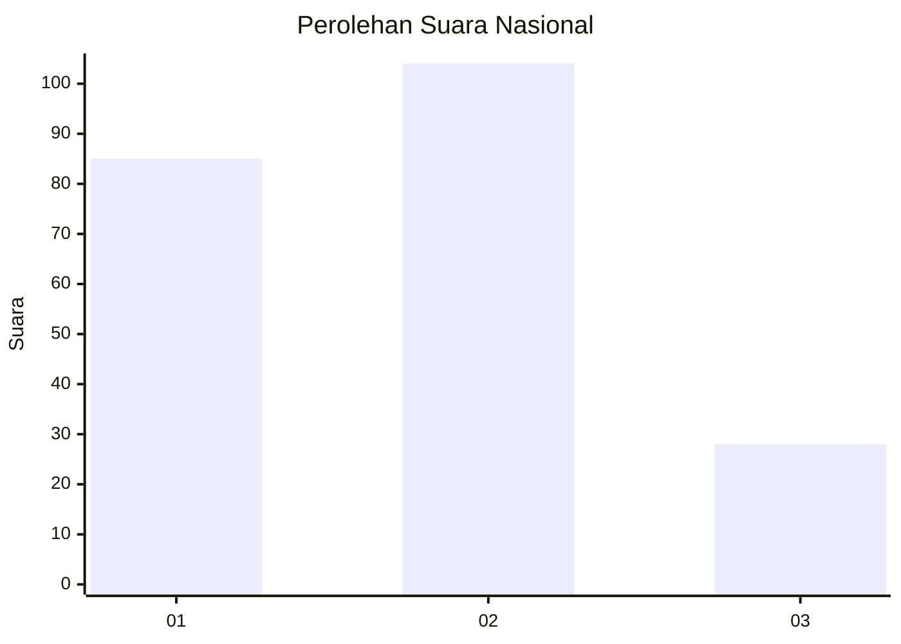
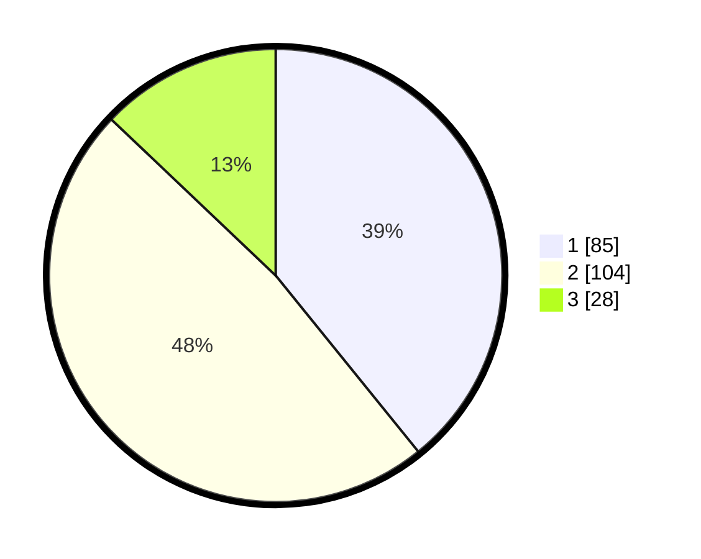

# Hasil

## Grafik

## Tabel

| No.    | Nama Paslon    | Suara | Suara (raw) | Persentase |
|:------ |:-------------- | -----:| -----------:| ----------:|
| 100025 | ANIES MUHAIMIN | 85    | [85][p-1]   | 39,17      |
| 100026 | PRABOWO GIBRAN | 104   | [104][p-2]  | 47,93      |
| 100027 | GANJAR MAHFUD  | 28    | [28][p-3]   | 12,90      |

[p-1]: https://github.com/gigit-pemilu/pemilu-2024/blob/main/pilpres/hitung-suara/sub/31-dki-jakarta/sub/73-jakarta-barat/sub/06-kalideres/sub/1002-semanan/sub/191-tps/sub/paslon-1.txt
[p-2]: https://github.com/gigit-pemilu/pemilu-2024/blob/main/pilpres/hitung-suara/sub/31-dki-jakarta/sub/73-jakarta-barat/sub/06-kalideres/sub/1002-semanan/sub/191-tps/sub/paslon-2.txt
[p-3]: https://github.com/gigit-pemilu/pemilu-2024/blob/main/pilpres/hitung-suara/sub/31-dki-jakarta/sub/73-jakarta-barat/sub/06-kalideres/sub/1002-semanan/sub/191-tps/sub/paslon-3.txt

## Foto C Plano

https://sirekap-obj-formc.kpu.go.id/7dfd/pemilu/ppwp/31/73/06/10/02/3173061002191-20240214-233748--18cce596-911a-47e5-b9f0-bcf5501ac891.jpg

https://sirekap-obj-formc.kpu.go.id/7dfd/pemilu/ppwp/31/73/06/10/02/3173061002191-20240214-233834--870dda03-9dcb-4ee0-8930-39812514ff77.jpg

https://sirekap-obj-formc.kpu.go.id/7dfd/pemilu/ppwp/31/73/06/10/02/3173061002191-20240214-233932--9a95f766-a1e2-4808-be7e-eecc628b6a0a.jpg

## Metadata

| Key        | Value               |
| ---------- | ------------------- |
| Time Stamp | 2024-02-16 22:01:00 |

