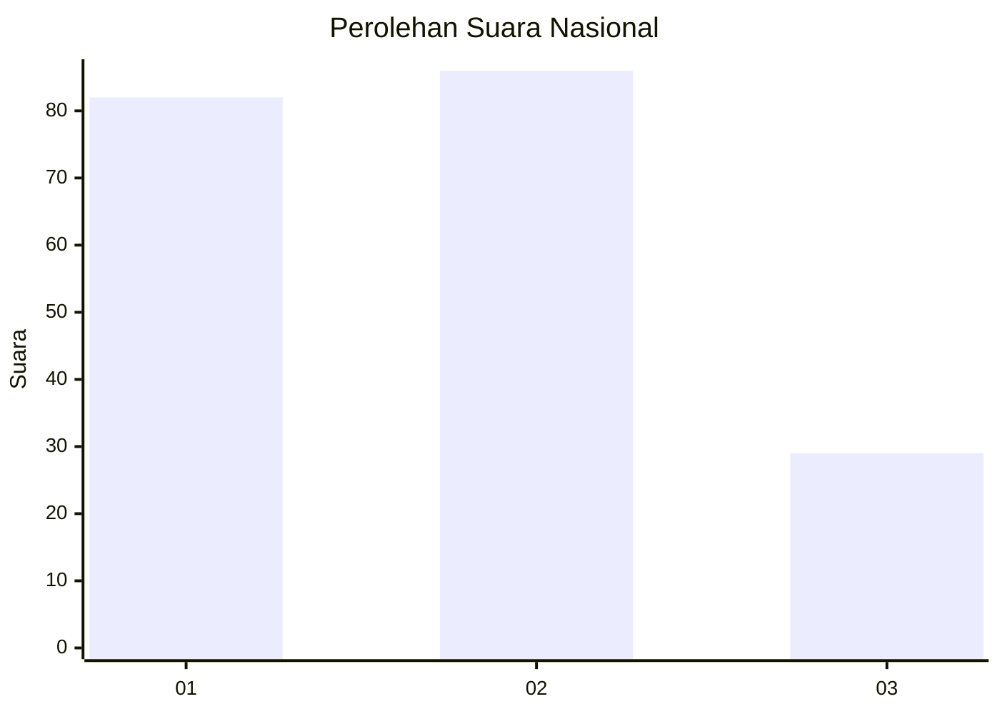
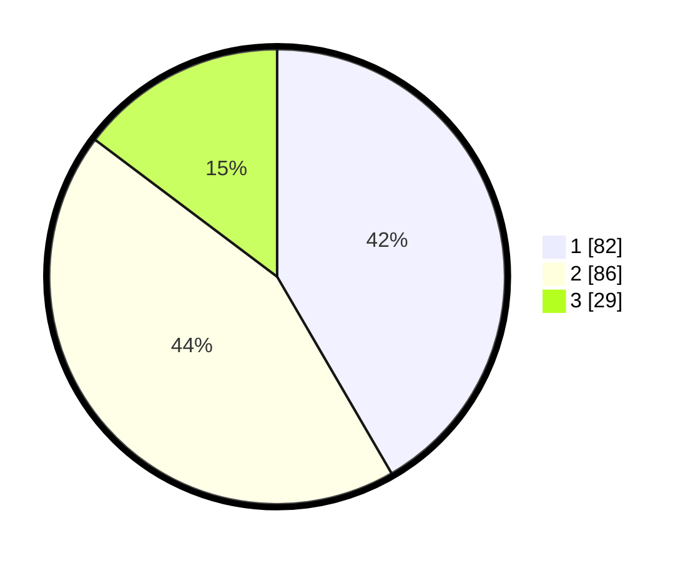

# Hasil

## Grafik

## Tabel

| No.    | Nama Paslon    | Suara | Suara (raw) | Persentase |
|:------ |:-------------- | -----:| -----------:| ----------:|
| 100025 | ANIES MUHAIMIN | 82    | [82][p-1]   | 41,62      |
| 100026 | PRABOWO GIBRAN | 86    | [86][p-2]   | 43,65      |
| 100027 | GANJAR MAHFUD  | 29    | [29][p-3]   | 14,72      |

[p-1]: https://github.com/gigit-pemilu/pemilu-2024/blob/main/pilpres/hitung-suara/sub/31-dki-jakarta/sub/73-jakarta-barat/sub/06-kalideres/sub/1002-semanan/sub/195-tps/sub/paslon-1.txt
[p-2]: https://github.com/gigit-pemilu/pemilu-2024/blob/main/pilpres/hitung-suara/sub/31-dki-jakarta/sub/73-jakarta-barat/sub/06-kalideres/sub/1002-semanan/sub/195-tps/sub/paslon-2.txt
[p-3]: https://github.com/gigit-pemilu/pemilu-2024/blob/main/pilpres/hitung-suara/sub/31-dki-jakarta/sub/73-jakarta-barat/sub/06-kalideres/sub/1002-semanan/sub/195-tps/sub/paslon-3.txt

## Foto C Plano

https://sirekap-obj-formc.kpu.go.id/1bd8/pemilu/ppwp/31/73/06/10/02/3173061002195-20240214-223220--86a8eb58-ba7f-4977-841b-bd512f632f01.jpg

https://sirekap-obj-formc.kpu.go.id/1bd8/pemilu/ppwp/31/73/06/10/02/3173061002195-20240214-222148--7e4ed621-887c-4b80-adb8-a2f78700d58b.jpg

https://sirekap-obj-formc.kpu.go.id/1bd8/pemilu/ppwp/31/73/06/10/02/3173061002195-20240214-222317--212207fd-5b5d-407d-8357-9882564dc6cc.jpg

## Metadata

| Key        | Value               |
| ---------- | ------------------- |
| Time Stamp | 2024-02-16 22:01:00 |

