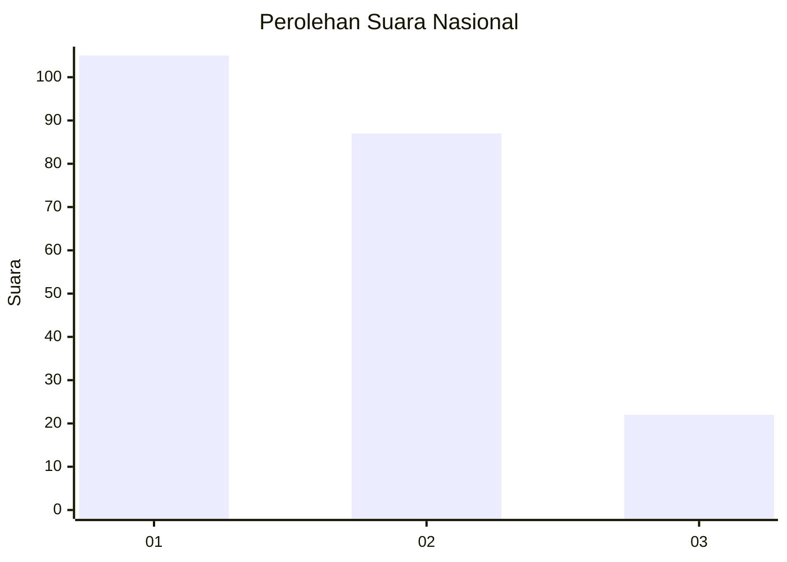
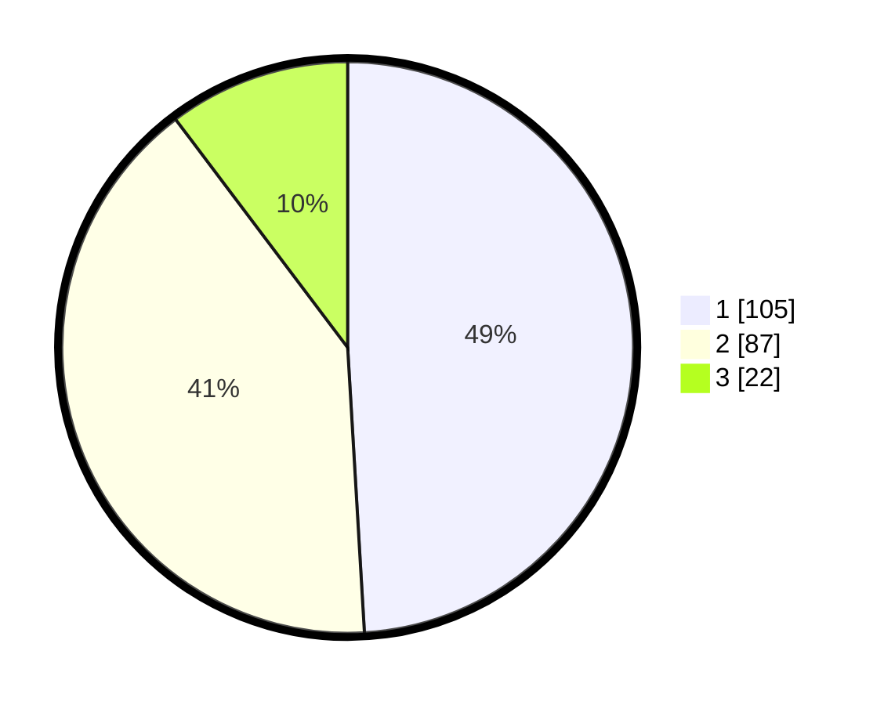

# Hasil

## Grafik

## Tabel

| No.    | Nama Paslon    | Suara | Suara (raw) | Persentase |
|:------ |:-------------- | -----:| -----------:| ----------:|
| 100025 | ANIES MUHAIMIN | 105   | [105][p-1]  | 49,07      |
| 100026 | PRABOWO GIBRAN | 87    | [87][p-2]   | 40,65      |
| 100027 | GANJAR MAHFUD  | 22    | [22][p-3]   | 10,28      |

[p-1]: https://github.com/gigit-pemilu/pemilu-2024/blob/main/pilpres/hitung-suara/sub/31-dki-jakarta/sub/73-jakarta-barat/sub/06-kalideres/sub/1002-semanan/sub/199-tps/sub/paslon-1.txt
[p-2]: https://github.com/gigit-pemilu/pemilu-2024/blob/main/pilpres/hitung-suara/sub/31-dki-jakarta/sub/73-jakarta-barat/sub/06-kalideres/sub/1002-semanan/sub/199-tps/sub/paslon-2.txt
[p-3]: https://github.com/gigit-pemilu/pemilu-2024/blob/main/pilpres/hitung-suara/sub/31-dki-jakarta/sub/73-jakarta-barat/sub/06-kalideres/sub/1002-semanan/sub/199-tps/sub/paslon-3.txt

## Foto C Plano

https://sirekap-obj-formc.kpu.go.id/a84b/pemilu/ppwp/31/73/06/10/02/3173061002199-20240215-021643--2ac7a702-ca4c-4da0-9f81-d2d7fc3e3824.jpg

https://sirekap-obj-formc.kpu.go.id/a84b/pemilu/ppwp/31/73/06/10/02/3173061002199-20240215-021721--4f4c9ca8-752e-4e61-9500-614b0f43858f.jpg

https://sirekap-obj-formc.kpu.go.id/a84b/pemilu/ppwp/31/73/06/10/02/3173061002199-20240215-021557--c1b7653a-7be7-4ec0-a891-3dce03036335.jpg

## Metadata

| Key        | Value               |
| ---------- | ------------------- |
| Time Stamp | 2024-02-17 18:30:00 |

