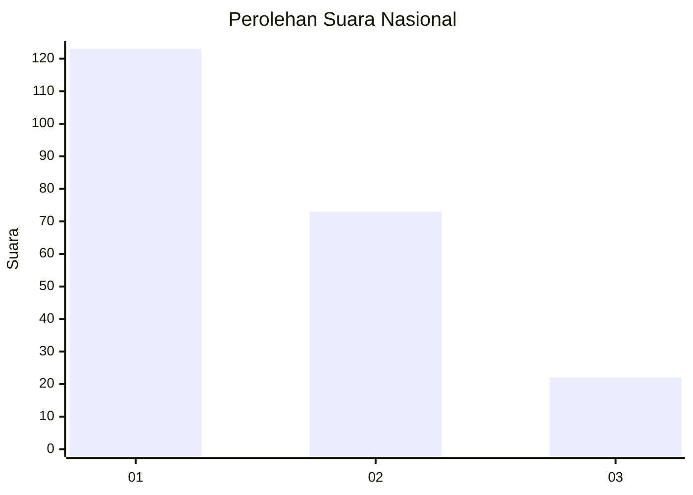
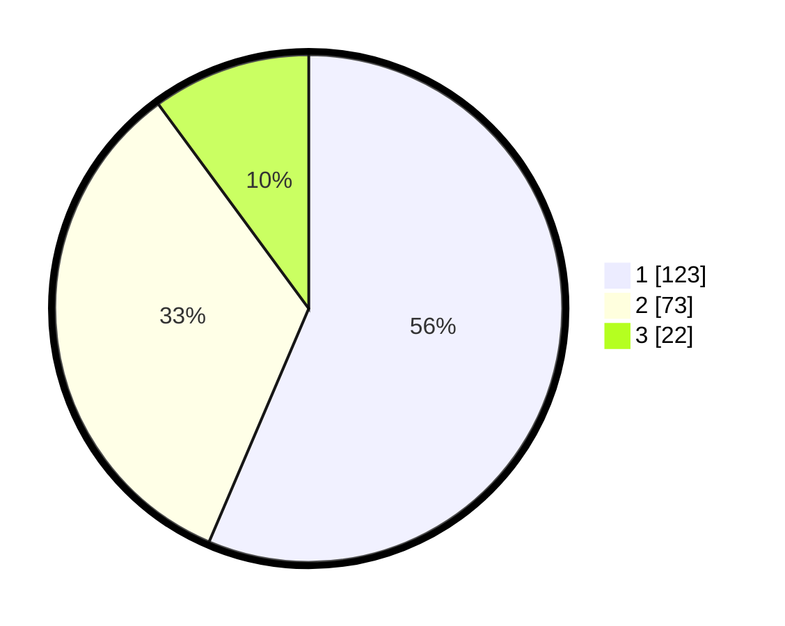

# Hasil

## Grafik

## Tabel

| No.    | Nama Paslon    | Suara | Suara (raw) | Persentase |
|:------ |:-------------- | -----:| -----------:| ----------:|
| 100025 | ANIES MUHAIMIN | 123   | [123][p-1]  | 56,42      |
| 100026 | PRABOWO GIBRAN | 73    | [73][p-2]   | 33,49      |
| 100027 | GANJAR MAHFUD  | 22    | [22][p-3]   | 10,09      |

[p-1]: https://github.com/gigit-pemilu/pemilu-2024/blob/main/pilpres/hitung-suara/sub/31-dki-jakarta/sub/73-jakarta-barat/sub/06-kalideres/sub/1002-semanan/sub/214-tps/sub/paslon-1.txt
[p-2]: https://github.com/gigit-pemilu/pemilu-2024/blob/main/pilpres/hitung-suara/sub/31-dki-jakarta/sub/73-jakarta-barat/sub/06-kalideres/sub/1002-semanan/sub/214-tps/sub/paslon-2.txt
[p-3]: https://github.com/gigit-pemilu/pemilu-2024/blob/main/pilpres/hitung-suara/sub/31-dki-jakarta/sub/73-jakarta-barat/sub/06-kalideres/sub/1002-semanan/sub/214-tps/sub/paslon-3.txt

## Foto C Plano

https://sirekap-obj-formc.kpu.go.id/3e1e/pemilu/ppwp/31/73/06/10/02/3173061002214-20240214-224703--b5e44c95-29c0-41e6-8634-4cb27ae8a212.jpg

https://sirekap-obj-formc.kpu.go.id/3e1e/pemilu/ppwp/31/73/06/10/02/3173061002214-20240214-224820--55294ea6-54a0-44b2-b2d1-11201f959061.jpg

https://sirekap-obj-formc.kpu.go.id/3e1e/pemilu/ppwp/31/73/06/10/02/3173061002214-20240214-224925--b905fe5e-7b4c-4fe4-b769-7c1d6bc03d2a.jpg

## Metadata

| Key        | Value               |
| ---------- | ------------------- |
| Time Stamp | 2024-02-17 19:30:00 |

