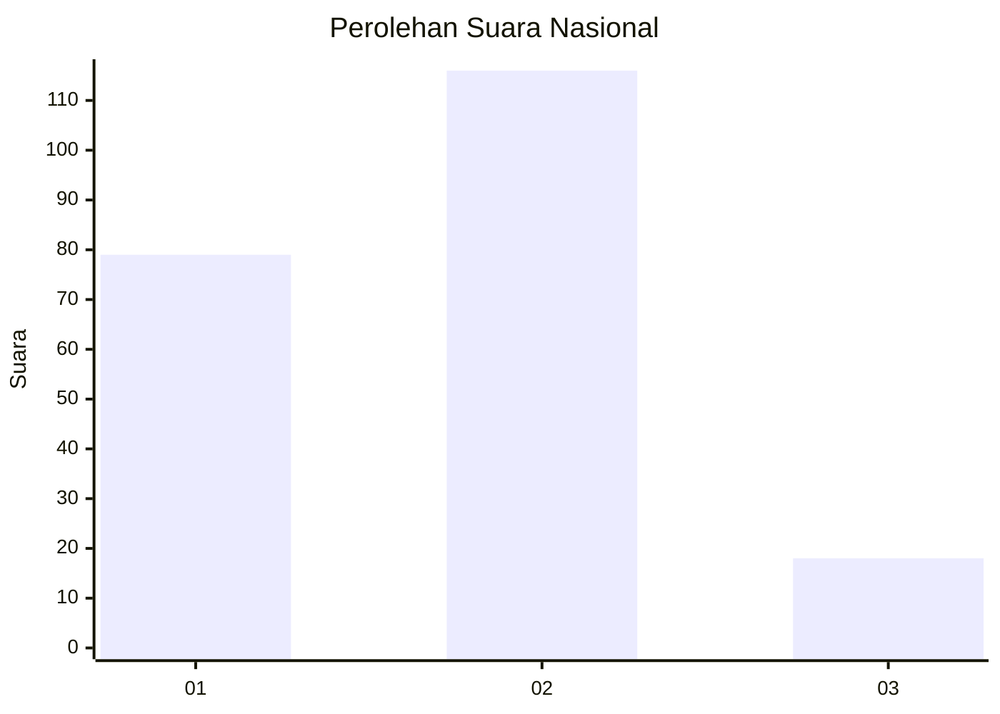

# Hasil

## Grafik

## Tabel

| No.    | Nama Paslon    | Suara | Suara (raw) | Persentase |
|:------ |:-------------- | -----:| -----------:| ----------:|
| 100025 | ANIES MUHAIMIN | 79    | [79][p-1]   | 37,09      |
| 100026 | PRABOWO GIBRAN | 116   | [116][p-2]  | 54,46      |
| 100027 | GANJAR MAHFUD  | 18    | [18][p-3]   | 8,45       |

[p-1]: https://github.com/gigit-pemilu/pemilu-2024/blob/main/pilpres/hitung-suara/sub/31-dki-jakarta/sub/73-jakarta-barat/sub/06-kalideres/sub/1003-tegal-alur/sub/023-tps/sub/paslon-1.txt
[p-2]: https://github.com/gigit-pemilu/pemilu-2024/blob/main/pilpres/hitung-suara/sub/31-dki-jakarta/sub/73-jakarta-barat/sub/06-kalideres/sub/1003-tegal-alur/sub/023-tps/sub/paslon-2.txt
[p-3]: https://github.com/gigit-pemilu/pemilu-2024/blob/main/pilpres/hitung-suara/sub/31-dki-jakarta/sub/73-jakarta-barat/sub/06-kalideres/sub/1003-tegal-alur/sub/023-tps/sub/paslon-3.txt

## Foto C Plano

https://sirekap-obj-formc.kpu.go.id/2283/pemilu/ppwp/31/73/06/10/03/3173061003023-20240214-224802--8a02299f-e9b2-40df-ae0d-4474cbe675cf.jpg

https://sirekap-obj-formc.kpu.go.id/2283/pemilu/ppwp/31/73/06/10/03/3173061003023-20240214-224926--3648db35-ab20-4104-972d-4efe10e30c50.jpg

https://sirekap-obj-formc.kpu.go.id/2283/pemilu/ppwp/31/73/06/10/03/3173061003023-20240214-225711--5dff138e-6258-48d7-bf7e-869104249194.jpg

## Metadata

| Key        | Value               |
| ---------- | ------------------- |
| Time Stamp | 2024-02-16 16:25:10 |

